# W3C Web Logs ETL Pipeline

> Fully automated ELT pipeline ingesting IIS W3C web server logs into a 10-dimension Star Schema on AWS RDS PostgreSQL, orchestrated by Apache Airflow with a hybrid Airflow + dbt transformation layer (2 Airflow-managed dims, 10 dbt-managed staging models + 5 dbt-managed mart models). Includes Great Expectations data quality gating and schema-isolated dbt layers (`dbt_staging`, `dbt_marts`). Surfaced via a 7-page Power BI dashboard, refreshed automatically every Friday via Power Automate with success/failure email alerting.

<p align="center">
  
  
  
  
  
  
  
  
  
</p>

---

**[→ Open Power BI Dashboard](https://app.powerbi.com/reportEmbed?reportId=41d525b8-b808-4750-88ba-cb31dbbba958&autoAuth=true&ctid=ae323139-093a-4d2a-81a6-5d334bcd9019&actionBarEnabled=true)**

**[→ Full Pipeline Video Walkthrough](https://dmail-my.sharepoint.com/:v:/g/personal/2571642_dundee_ac_uk/IQDarKYb4S4bTp1CU2mwRNHqAd4DaKYajEdvCQ7YxxTk3no?e=A77Xws)**

---

## Table of Contents

- [Dashboard Screenshots](#dashboard-screenshots)
- [System Architecture Overview](#system-architecture-overview)
- [Data Flow Deep Dive](#data-flow-deep-dive)
- [ELT Data Flow](#elt-data-flow)
- [Star Schema](#star-schema)
- [dbt Integration](#dbt-integration)
- [Great Expectations Integration](#great-expectations-integration)
- [Local Monitoring Stack](#local-monitoring-stack)
- [Design Decisions](#design-decisions)
- [Getting Started](#getting-started)
- [Makefile Reference](#makefile-reference)
- [Tech Stack](#tech-stack)
- [Related Projects](#related-projects)

---

## Dashboard Screenshots

### Traffic Overview — Human vs crawler split (62% human / 38% crawler), trend over 2009–2011


### File Access & Errors — Top pages, file type breakdown, 404 error distribution (9.7% of all requests)


### Server Performance — Average response time vs P95 (4.5ms avg / 1.1s P95), slowest files identified


### Geographic Distribution — 78 countries reached, US and UK dominating, via ip-api.com geolocation enrichment
 

### Temporal Patterns — Hour-by-day traffic matrix, Monday peaks at 33,000 requests, Saturday morning as lowest-risk maintenance window


### Visitor Analysis — Browser, OS, device type breakdown; visit frequency cohort analysis


### Executive Summary — KPI cards with written business interpretation of each key finding


### Airflow DAG graph view — 3-way parallel fan-out (geo, UA, GE quality gate), dbt transformation (staging + marts), and CSV export phase


### Airflow Gantt Chart — Task-level execution timeline showing enrichment + GE running in parallel, sequential dbt phase


---

## System Architecture Overview

```mermaid
flowchart LR
    source["IIS W3C log files<br/>Stored in LogFiles/"]
    
    subgraph airflow["Apache Airflow (Docker)"]
        direction TB
        dag["Weekly pipeline<br/>Friday, 5:00 PM"]
        step1["Phase 1<br/>Create tables"]
        step2["Phase 2<br/>Load raw logs"]
        step3a["Phase 3a<br/>Airflow enrichment<br/>geo, UA"]
        step3b["Phase 3b<br/>Great Expectations<br/>raw_logs validation"]
        step5["Phase 3c<br/>dbt transformation<br/>10 staging + 5 marts"]
        step6["Phase 3d<br/>dbt test + docs"]
        step7["Phase 4<br/>Export CSVs"]
    end
    
    subgraph warehouse["AWS RDS PostgreSQL"]
        raw["raw_logs staging table<br/>155,570 rows<br/>(public schema)"]
        ge_dim["dim_geolocation<br/>dim_useragent<br/>(public schema)"]
        dbt_staging_schema["dbt_staging schema<br/>10 models<br/>dims + fact + crawler_ips<br/>+ dim_visitortype"]
        dbt_marts_schema["dbt_marts schema<br/>5 models<br/>aggregated analytics"]
    end
    
    powerbi["Power BI dashboard<br/>7 pages · Friday refresh"]
    automation["Power Automate<br/>Triggers refresh<br/>Emails on completion"]

    source -->|93 .log files| dag --> step1 --> step2 --> raw
    raw --> step3a --> ge_dim
    raw --> step3b
    step3a --> step5
    step3b --> step5
    ge_dim --> step5
    step5 --> dbt_staging_schema
    dbt_staging_schema --> dbt_marts_schema
    step5 --> step6
    step6 --> step7
    dbt_staging_schema --> step7
    dbt_marts_schema --> step7
    step7 -->|CSV export<br/>17 files, ~14 MB| powerbi
    automation --> powerbi
```

### Monitoring Stack

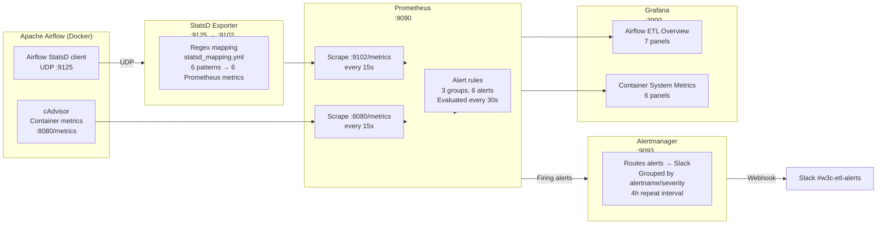

---

## Data Flow Deep Dive

### What Happens in Each Phase

The DAG (`Process_W3C_Data`) executes 6 phases:

| Phase 1 | Phase 2 | Phase 3a+3b (Parallel) | Phase 3c (dbt) | Phase 3d | Phase 4 |
|---|---|---|---|---|---|---|
| **Create Tables** | **Load Raw Logs** (E of ELT) | **Enrichment + GE** (3 parallel tasks) | **Build 10 staging + 5 marts** (T of ELT) | **Test + Docs** (quality) | **Export CSV** (Delivery) |

| Phase | Task(s) | What happens | Why it matters |
|-------|---------|-------------|----------------|
| **1** | `CreateDatabaseTables` | DDL: CREATE TABLE IF NOT EXISTS for raw_logs, Airflow-managed dims | Idempotent — safe to re-run; handles already-existing tables gracefully |
| **2** | `LoadRawLogsToDatabase` | Scans `data/LogFiles/`, detects dual-format (14/18 column), bulk-inserts via `execute_values` | Full 155K row load in seconds. Deduplicates by filename. This is the **E** in ELT |
| **3a+3b** | Airflow enrichment (2 tasks) + GE (1 task) — **3 parallel tasks** | Geo-IP lookup, user-agent parsing, and Great Expectations `raw_logs` validation all run in parallel against `raw_logs` | Remaining tasks requiring Python libraries or external APIs stay in Airflow. GE gate catches corrupt data early — all 3 must pass before dbt |
| **3c** | `task_dbt_deps` (gated) → `task_dbt_run` | Install dbt packages (dbt_utils, only if `dbt_packages/` missing), then build 10 staging models (8 dimensions + fact_webrequest + crawler_ips) in `dbt_staging` schema + 5 mart models in `dbt_marts` schema | Schema-isolated transformation layers. 15 models built via single `dbt run` |
| **3d** | `task_dbt_test` + `task_dbt_docs` | dbt runs 65 data tests (generic + singular); generates docs site with lineage graph | Automated quality gates. Lineage docs for downstream consumers |
| **4** | `ExportCSVs` | COPY ... TO '/data/Star-Schema/' for all dbt_staging + dbt_marts + public tables | Delivers to downstream BI; idempotent overwrite |

### Phase 2 Detail: Dual-Format Raw Load

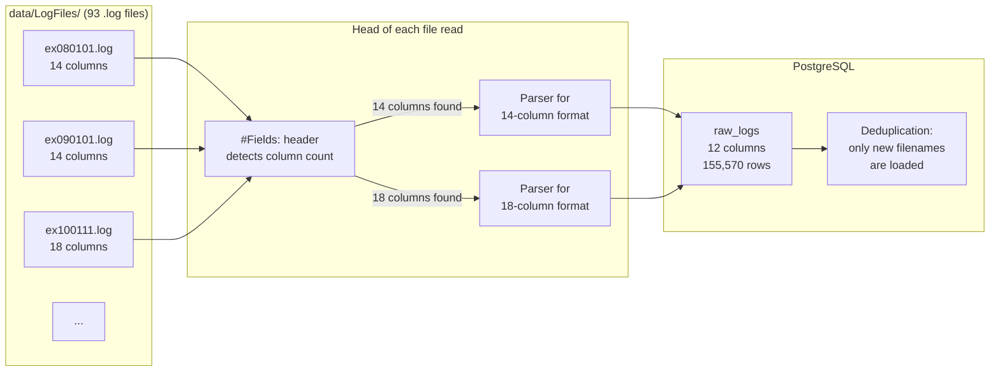

The IIS log format changed between 2009 and 2011 — some files have 12 data columns (14 with `#Fields:` prefix), others have 16 (18 with header). The parser detects this per-file using the `#Fields:` header line and selectes the correct parsing path:

- **14-column format** (older files): `date`, `time`, `s-ip`, `cs-uri-stem`, `cs-uri-query`, `s-port`, `cs-username`, `c-ip`, `cs(User-Agent)`, `cs(Referer)`, `sc-status`, `sc-substatus`, `sc-win32-status`, `time-taken`
- **18-column format** (newer files): same columns + `s-sitename`, `cs-method`, `cs-version`, `cs-host`

### Phase 3 Detail: Hybrid Airflow + dbt Transformation

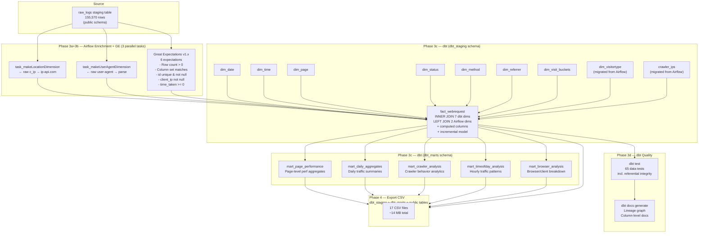

**Hybrid approach**: Airflow handles tasks that need Python libraries or external API calls (geo-IP lookup via ip-api.com, user-agent parsing via `user-agents` library). dbt handles everything that's a pure SQL transformation — date, time, page, status, method, referrer, visit_bucket dimensions, crawler IPs, and visitor type — plus the fact table join. Great Expectations gates raw data quality before dbt transformation. Five mart models provide pre-aggregated analytics for BI consumption covering daily summaries, page performance, crawler analysis, hourly patterns, and browser/client breakdown. This combines Airflow's strength at orchestration + Python enrichment with dbt's declarative SQL, built-in testing, and schema-isolated layers.

### Geolocation Enrichment Design

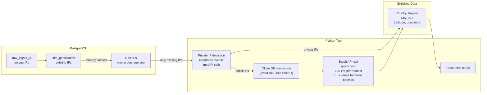

---

## ELT Data Flow

This diagram traces a single web log line through the entire pipeline — from raw IIS log to dimension-joined fact record:

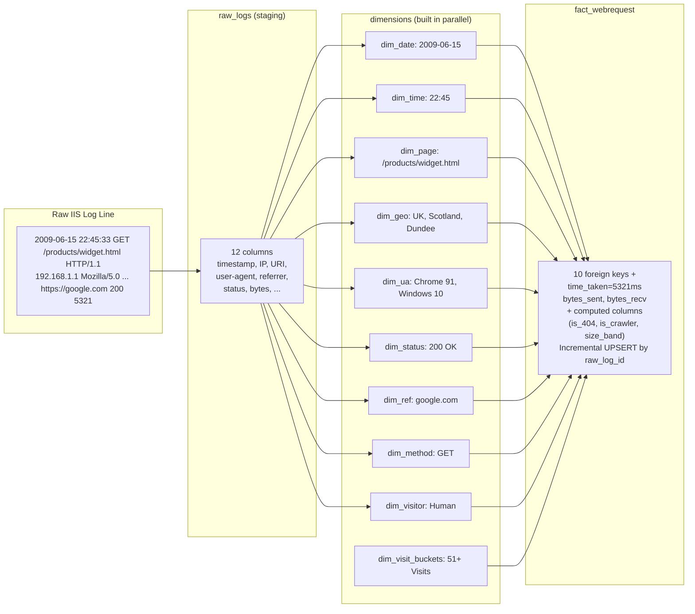

---

## Star Schema

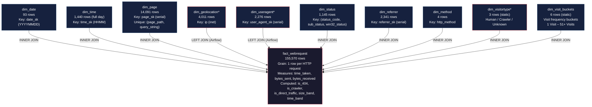

### Hierarchical Dimension Structure (Sun Model)

Each dimension is designed with multiple hierarchy levels to support drill-down analysis in Power BI:

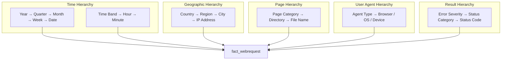

---

### Dimension Row Counts

| Table | Rows | Schema | Managed by | Key field | Hierarchies |
|-------|------|--------|------------|-----------|-------------|
| `fact_webrequest` | 155,570 | `dbt_staging` | dbt | `raw_log_id` (links to staging) | Computed: is_404, is_crawler, is_direct_traffic, size_band, time_band |
| `dim_date` | 93 | `dbt_staging` | dbt | `date_sk` | Year → Quarter → Month → Week → Date |
| `dim_time` | 1,440 | `dbt_staging` | dbt | `time_sk` | Time Band → Hour → Minute |
| `dim_page` | 14,091 | `dbt_staging` | dbt | `page_sk` | Category → Directory → File |
| `dim_method` | 4 | `dbt_staging` | dbt | `method_sk` | — |
| `dim_status` | 1,145 | `dbt_staging` | dbt | `status_sk` | Severity → Category → Code |
| `dim_referrer` | 2,341 | `dbt_staging` | dbt | `referrer_sk` | Traffic Source → Domain → URL |
| `dim_visit_buckets` | 6 (static) | `dbt_staging` | dbt | `visit_bucket_sk` | Visit frequency cohort bucketing |
| `dim_visitortype` | 3 (static) | `dbt_staging` | dbt | `visitor_sk` | Crawler Flag → Visitor Type |
| `crawler_ips` | varies | `dbt_staging` | dbt | `ip` (PK) | — |
| `dim_geolocation` | 4,011 | `public` | Airflow | `geolocation_sk` | Country → Region → City → IP |
| `dim_useragent` | 2,276 | `public` | Airflow | `user_agent_sk` | Agent Type → Browser/OS/Device |
| `mart_page_performance` | 14,091 | `dbt_marts` | dbt | — | Page-level performance: reqs, hosts, P95 latency, 404 rate, slow reqs |
| `mart_daily_aggregates` | 93 | `dbt_marts` | dbt | `date_sk` | Daily summary: hosts, pages, countries, P95 latency, slow reqs |
| `mart_crawler_analysis` | 87 | `dbt_marts` | dbt | `date_sk` | Crawler behavior: distinct hosts, avg/max latency, bytes/req |
| `mart_timeofday_analysis` | 2,095 | `dbt_marts` | dbt | — | Hourly patterns: reqs by hour/band, P95, 404/crawler/slow rates |
| `mart_browser_analysis` | 1,656 | `dbt_marts` | dbt | — | Browser/OS/device breakdown: traffic share, rank, latency |
| *`raw_logs` (staging)* | *155,570* | *`public`* | *Airflow* | *`raw_log_id` (serial)* | *Source audit trail* |

---

## dbt Integration

This pipeline integrates **dbt (data build tool)** as the transformation layer for 10 staging models (8 dimensions + fact_webrequest + crawler_ips) in the `dbt_staging` schema, plus 5 mart models in the `dbt_marts` schema (15 models total). Airflow retains responsibility for 2 enrichment tasks that require external APIs or Python libraries.

### Why dbt?

| Benefit | Before (pure Python) | After (dbt) |
|---------|---------------------|-------------|
| **Testing** | None | 65 data tests — generic (uniqueness, not-null, relationships) + singular (referential integrity, row counts, dimension coverage, -1 exclusion) |
| **Documentation** | README only | [`dbt docs`](http://localhost:8081) auto-generates full column-level docs with lineage graph from `sources.yml` and `schema.yml` |
| **SQL transparency** | Buried in Python f-strings | Declarative `.sql` files in `airflow/dbt/w3c/models/staging/` and `models/marts/` — one file per model, Jinja-templated |
| **Dependency management** | Airflow fan-in choreography | dbt `ref()` macros resolve DAG automatically; Airflow only orchestrates the `dbt run` command |
| **Materialization** | `INSERT ... ON CONFLICT DO NOTHING` | 14 models as `{{ config(materialized='table') }}` (full refresh) + fact_webrequest as **incremental** with `unique_key='raw_log_id'` — only new records merged on re-run |

### Architecture

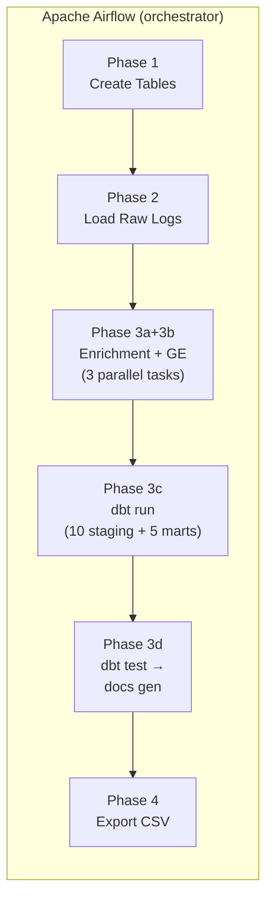


*Generated from `dbt docs generate` — shows the complete dbt DAG: 3 data sources (green), 9 dbt-managed staging dimensions (blue), 2 Airflow-managed dimensions (purple), fact_webrequest (orange), and 5 mart models (teal).*

### File Structure

```
airflow/
├── dbt/
│   ├── profiles.yml                   # PostgreSQL connection config (env_var() credentials)
│   └── w3c/
│       ├── dbt_project.yml           # Project settings, vars (UK holidays), schema config
│       ├── packages.yml              # dbt_utils dependency
│       ├── models/
│       │   ├── sources.yml           # Source table definitions (raw_logs, Airflow dims)
│       │   ├── schema.yml            # Model + column tests (65 data tests)
│       │   └── staging/              # Core warehouse models (dbt_staging schema)
│       │       ├── dim_date.sql
│       │       ├── dim_time.sql
│       │       ├── dim_page.sql
│       │       ├── dim_status.sql
│       │       ├── dim_method.sql
│       │       ├── dim_referrer.sql
│       │       ├── dim_visit_buckets.sql
│       │       ├── dim_visitortype.sql     # Migrated from Airflow
│       │       ├── crawler_ips.sql         # Migrated from Airflow
│       │       └── fact_webrequest.sql
│       │   └── marts/                # Aggregated analytics (dbt_marts schema)
│       │       ├── mart_page_performance.sql
│       │       ├── mart_daily_aggregates.sql
│       │       ├── mart_crawler_analysis.sql
│       │       ├── mart_timeofday_analysis.sql
│       │       └── mart_browser_analysis.sql
│       └── tests/
│           ├── test_fact_referential_integrity.sql
│           ├── test_row_count_consistency.sql
│           └── test_dimension_coverage.sql
└── great_expectations/
    ├── run_checkpoint.py              # GE v1.x ephemeral checkpoint runner
    ├── expectations/
    │   └── w3c_raw_logs_expectations.json  # 8 expectation definitions
    ├── checkpoints/
    │   └── raw_logs_checkpoint.yml         # Checkpoint config
    └── plugins/
        └── custom_expectations/
            └── __init__.py
```

### What Each Model Does

#### Staging Models (`dbt_staging` schema)

| Model | Source | Key Logic | Tests |
|-------|--------|-----------|-------|
| `dim_date` | `raw_logs.log_date` | DISTINCT dates, deterministic `YYYYMMDD` key, UK holidays from Jinja var, weekend/weekday flags, no -1 fallback | unique, not_null |
| `dim_time` | `generate_series` | 1440 minutes via `generate_series(0,1439)`, time_band (Early Morning / Morning / Afternoon / Evening), shift_id, no -1 fallback | unique, not_null |
| `dim_page` | `raw_logs.uri_stem` | DISTINCT (page_path, query_string), derives directory, file_name, extension, page_category, no -1 fallback | unique, not_null |
| `dim_status` | `raw_logs.status` triples | DISTINCT (status, sub_status, win32), human-readable descriptions, `severity` (Info/Warning/Error/Critical), `description` column with detailed explanations, no -1 fallback | unique, not_null |
| `dim_method` | `raw_logs.method` | DISTINCT methods, `http_method` + `description`, `is_safe` flag, no -1 fallback | unique, not_null |
| `dim_referrer` | `raw_logs.referrer` | DISTINCT URLs, domain extraction, `traffic_source` (Direct / Search Engine / Social Media / Referral), no -1 fallback | unique, not_null |
| `dim_visit_buckets` | Static values | 6 visit frequency buckets (1 Visit, 2–5, 6–10, 11–20, 21–50, 51+), `user_count` replaces `ip_count` for Power BI alignment, ordered by visit_bucket_order | unique, not_null |
| `dim_visitortype` | Static values | 3 visitor types (-1 Unknown, 1 Crawler, 2 Human), migrated from Airflow | unique, not_null |
| `crawler_ips` | `raw_logs` | SELECT DISTINCT client_ip WHERE robots.txt requested, migrated from Airflow | unique, not_null |
| `fact_webrequest` | All dims + `raw_logs` | **INNER JOIN** to 7 dbt-managed dims (date, time, page, status, method, referrer, visitortype, visit_buckets) + **LEFT JOIN COALESCE(-1)** to 2 Airflow-managed dims (geolocation, useragent). 5 computed columns: `is_404`, `is_crawler`, `is_direct_traffic`, `size_band`, `time_band`. **Incremental materialization** with `unique_key='raw_log_id'` — only new records are merged on re-run | unique, not_null, 5 FK relationships, expression_is_true |

#### Mart Models (`dbt_marts` schema)

| Model | Source | Key Logic | Tests |
|-------|--------|-----------|-------|
| `mart_page_performance` | `fact_webrequest` + `dim_page` | Page-level: avg/p95/max time_taken, unique_hosts, slow_requests, 404 rate per page_path | expression_is_true |
| `mart_daily_aggregates` | `fact_webrequest` + `dim_date` + `dim_geolocation` | Daily aggregates: unique hosts/pages/countries, P95 latency, slow request rate, crawler/direct traffic share | unique, not_null, expression_is_true |
| `mart_crawler_analysis` | `fact_webrequest` + `dim_date` + `dim_page` + `dim_status` | Crawler-only: distinct hosts hit, avg/max latency, avg bytes/request, error rate | unique, not_null, expression_is_true |
| `mart_timeofday_analysis` | `fact_webrequest` + `dim_date` + `dim_time` | Hourly breakdown: reqs/hour, unique pages/hosts, P95 latency, 404/crawler/slow rates by time_band | expression_is_true |
| `mart_browser_analysis` | `fact_webrequest` + `dim_useragent` + `dim_date` | Browser/OS/device: traffic share, desktop vs mobile, daily rank of browser families | expression_is_true |

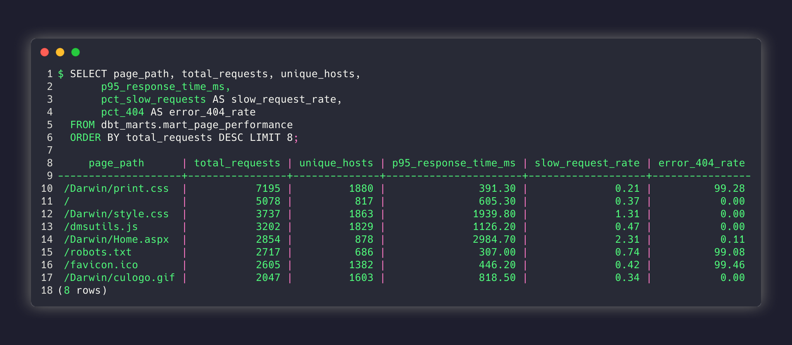

*All Power BI measures are pre-computed in dbt — P95 latency, unique hosts/pages/countries, slow request rate, crawler/direct traffic share. Power BI consumes directly with zero DAX.*

### Schema Isolation

Models are separated into database schemas to organize the warehouse:

| Schema | Purpose | Models |
|--------|---------|--------|
| `public` | Airflow-managed tables (raw_logs, geo, UA) | 3 tables + legacy DDL |
| `dbt_staging` | Core warehouse star schema | 10 models (8 dims + fact + crawler_ips + visitortype) |
| `dbt_marts` | Pre-aggregated analytics for BI | 5 mart models |

Configured in `dbt_project.yml`:
```yaml
models:
  w3c:
    staging:
      +schema: staging    # resolves to dbt_staging
    marts:
      +schema: marts      # resolves to dbt_marts
```


*Three logically separated schemas: `public` (Airflow-managed raw data), `dbt_staging` (dimensional star schema), `dbt_marts` (pre-aggregated analytics). No cross-schema table name collisions.*

### Running dbt Manually

Run inside the Airflow container or with `dbt` installed locally:

```bash
# Build all models (10 staging + 5 marts)
dbt run --project-dir /opt/airflow/dbt/w3c --profiles-dir /opt/airflow/dbt

# Run all 65 data tests (generic + singular)
dbt test --project-dir /opt/airflow/dbt/w3c --profiles-dir /opt/airflow/dbt

# Generate documentation site
dbt docs generate --project-dir /opt/airflow/dbt/w3c --profiles-dir /opt/airflow/dbt
```


*All 65 dbt tests pass — generic tests (uniqueness, not-null, relationships) and singular tests (referential integrity, dimension coverage, expression validation). Run after every `dbt run`.*

---

## Great Expectations Integration

A **Great Expectations v1.x** quality gate validates the `raw_logs` staging table before dbt transformation begins. This ensures corrupt or incomplete data doesn't propagate through the warehouse.

### Architecture

GE runs as an **ephemeral context** — no config file, no local store. The `run_checkpoint.py` script:

1. Connects to PostgreSQL directly (same creds as dbt via `env_var()`)
2. Registers the `raw_logs` table as an in-memory datasource
3. Builds an expectation suite with 6 expectations
4. Runs validation and prints PASS/FAIL per expectation
5. Returns exit code 0 (all pass) or 1 (any fail)

### Expectations

| Expectation | What it checks | Why |
|-------------|---------------|-----|
| `expect_table_row_count_to_be_between` | Row count > 0 | Table has data |
| `expect_table_columns_to_match_set` | 16 specific columns present | Schema hasn't changed |
| `expect_column_values_to_not_be_null` | `id` is not null | Primary key integrity |
| `expect_column_values_to_be_unique` | `id` values are unique | No duplicate rows |
| `expect_column_values_to_not_be_null` | `client_ip` is not null | Core field present |
| `expect_column_values_to_be_between` | `time_taken` >= 0 | No negative response times |

### Execution

GE runs in **parallel** with Airflow enrichment tasks (both read from `raw_logs` independently):

```
Phase 3a+3b: ┌─ Enrichment (geo, UA) ─┐
             ├─ GE checkpoint     ────┤──→ FAIL → DAG fails fast
             └─ All 3 must pass   ────┘
                                        ↓ all PASS
Phase 3c: dbt run
```

### Running Manually

```bash
# Requires same env vars as dbt (W3C_DB_HOST, _USER, _PASS, _PORT, _NAME)
python airflow/great_expectations/run_checkpoint.py
```


*All 6 Great Expectations pass against `raw_logs` before dbt runs. The quality gate catches corrupt or incomplete data early. Runs in parallel with Airflow enrichment (Phase 3a+3b).*

---

## Local Monitoring Stack

The pipeline includes a complete observability stack that runs locally alongside Airflow via Docker Compose — no external services required.

### Architecture

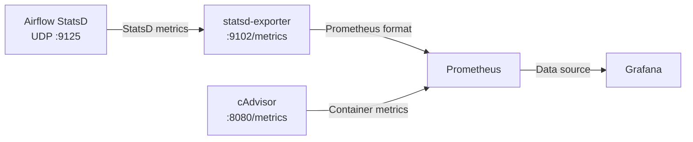

### Components

| Component | Role | Port | Key Detail |
|-----------|------|------|------------|
| **Airflow StatsD** | Emits timing/counter/gauge metrics via built-in StatsD client | UDP :9125 | Airflow 2.10.2 core metrics from `dagrun.py`, `taskinstance.py`, `scheduler_job_runner.py` |
| **statsd-exporter** | Converts StatsD metrics to Prometheus format | :9102 | Regex mapping via `airflow/prometheus/statsd_mapping.yml` — 6 mapping patterns |
| **cAdvisor** | Per-container CPU, memory, network, disk metrics | :8080 | Exposes all 10 Docker Compose containers |
| **Prometheus** | Time-series database, scrapes targets, evaluates alert rules | :9090 | 15s scrape interval, 90-day retention, 30s alert rule evaluation |
| **Alertmanager** | Receives firing alerts from Prometheus, handles dedup/grouping, sends Slack notifications | :9093 | Routes via `airflow/prometheus/alertmanager.yml` — Slack webhook, 4h repeat, resolved alerts sent |
| **Grafana** | Visualization with auto-provisioned datasource and dashboards | :3000 | 2 dashboards, login: `admin`/`admin` |

### Grafana Dashboards

**Airflow ETL Overview** (`airflow-etl-overview`) — 7 panels:

| # | Panel | Metric | Type | Purpose |
|---|-------|--------|------|---------|
| 1 | Completed DAG Runs | `airflow_dag_run_duration_seconds_count` | Stat | Total successful/failed DAG runs |
| 2 | Task Instance Status | `airflow_ti_finish` | Stat | Task outcomes: success / failed / skipped |
| 3 | DAG Run Completion Rate | `rate(airflow_dag_run_duration_seconds_count[5m])` | Time series | Throughput over time |
| 4 | Avg DAG Duration (Top 10) | Histogram `_sum / _count` per DAG | Bar gauge | Slowest DAGs identified |
| 5 | Container CPU Usage | `container_cpu_usage_seconds_total` | Time series | CPU % per Airflow container |
| 6 | Container Memory Usage | `container_memory_usage_bytes` | Time series | Memory per Airflow container |
| 7 | DAG Runs per Day | `increase(airflow_dag_run_duration_seconds_count[24h])` | Bar chart | Daily run count by status |

**Container System Metrics** (`container-metrics`) — 6 panels covering CPU, memory, network I/O (rx/tx), filesystem I/O, and uptime for all Docker Compose containers.

### Airflow ETL Overview Dashboard — 7 panels populated with live data from a completed DAG run


### Prometheus Targets — All 4 scrape targets (Airflow, statsd-exporter, cAdvisor, Prometheus itself) healthy and up


### StatsD Metric Mapping

Airflow emits metrics natively via its `StatsLogger` class. The statsd-exporter uses regex mappings in `prometheus/statsd_mapping.yml` to convert these into Prometheus-compatible metric names:

| Airflow internal metric | Prometheus metric | Type | Labels | Airflow source |
|-------------------------|-------------------|------|--------|----------------|
| `dagrun.duration.<status>.<dag_id>` | `airflow_dag_run_duration_seconds` | histogram | `dag_id`, `status` | `dagrun.py:1207` |
| `dagrun.schedule_delay.<dag_id>` | `airflow_dag_schedule_delay_seconds` | histogram | `dag_id` | `scheduler_job_runner.py:1549` |
| `ti.finish.<dag_id>.<task_id>.<state>` | `airflow_ti_finish` | counter | `dag_id`, `task_id`, `state` | `taskinstance.py:263` |
| `ti.start.<dag_id>.<task_id>` | `airflow_ti_start` | counter | `dag_id`, `task_id` | `taskinstance.py:252` |
| `scheduler.scheduler_loop_duration` | `airflow_scheduler_loop_duration_seconds` | histogram | — | `scheduler_job_runner.py:1111` |
| `pool.<metric>.<pool_name>` | `airflow_pool` | gauge | `metric`, `pool_name` | `scheduler_job_runner.py:1820` |

### Alert Rules

Defined in `airflow/prometheus/alert_rules.yml` — 3 groups with 6 alerts evaluated every 30s:

| Alert | Condition | Severity | What it catches |
|-------|-----------|----------|-----------------|
| `AirflowDAGFailureRate` | `rate(airflow_dag_run_duration_seconds_count{status="failed"}[5m]) > 0` | warning | Any DAG execution failure |
| `AirflowTaskFailureRate` | `rate(airflow_ti_finish{state="failed"}[5m]) > 0` | warning | Any task-level failure |
| `ContainerRestarts` | `changes(container_start_time_seconds[15m]) > 2` | warning | Unhealthy container cycling |
| `HighCPUUsage` | `rate(container_cpu_usage_seconds_total[2m]) * 100 > 80` | warning | CPU usage > 80% for 2m |
| `HighMemoryUsage` | `container_memory_usage_bytes / container_spec_memory_limit_bytes * 100 > 85` | warning | Memory usage > 85% of limit for 2m |
| `PrometheusTargetMissing` | `up == 0` | critical | Any scrape target unreachable for 1m |

### Slack Notifications

When any alert fires, **Prometheus pushes it to Alertmanager** (`airflow/prometheus/alertmanager.yml`), which sends a notification to the **#w3c-etl-alerts** Slack channel via webhook:

- **Integration**: Slack Incoming Webhook (Alertmanager's `slack_configs`)
- **Grouping**: Alerts grouped by `alertname` + `severity` to reduce noise
- **Repeat interval**: 4 hours for ongoing issues (no repeat spam)
- **Resolved**: You get a resolved notification when the issue clears

This means **you get notified automatically** when DAGs fail, tasks fail, containers misbehave, or Prometheus targets go down — no need to watch Grafana dashboards.

---

## Design Decisions

Every architectural choice in this pipeline was made deliberately. Here are the key decisions and the reasoning behind each:

### ELT over ETL — Stage Raw Data First
Raw log lines are loaded into `raw_logs` with **zero transformation** — no parsing of dates, no splitting of URIs, no enrichment. Dimensions and the fact table are then built from `raw_logs` in-database via SQL.

**Why:** This preserves the full audit trail. If a dimension query changes, `raw_logs` is the source of truth — the pipeline can be re-run without re-ingesting source files. Change your geolocation logic? Update the dimension SQL and re-run Phase 3. No data loss, no re-ingestion.

### Hybrid Parallel Dimension Build
The pipeline uses a two-tier approach: **2 Airflow enrichment tasks** (geolocation, useragent) and **1 GE quality gate** run in parallel during Phase 3a+3b — each reads independently from `raw_logs` with zero inter-task dependencies. **7 dbt models** then build the remaining dimensions (date, time, page, status, method, referrer, visit_buckets) plus the fact table in Phase 3c, with dbt's `ref()` macros resolving the correct build order. GE validates `raw_logs` quality concurrently rather than serially after enrichment, failing fast if the data is corrupt.

**Why:** Airflow handles the tasks requiring Python libraries or external API calls (geo-IP lookup, user-agent parsing) which can't run as SQL. dbt handles pure SQL transformations declaratively — auto-tested, auto-documented, and orchestrated by dbt's built-in DAG resolution rather than manual Airflow choreography. Running GE in parallel with enrichment saves ~2-3s per run (enrichment duration) and catches corrupt data just as early since both tasks read the same immutable `raw_logs` table.

### INNER JOIN for dbt Dimensions, LEFT JOIN for Airflow Dimensions
The fact table uses **INNER JOIN** for 7 dbt-managed dimensions (date, time, page, status, method, referrer, visitortype, visit_buckets) and **LEFT JOIN + COALESCE(-1)** for the 2 Airflow-managed dimensions (geolocation, useragent). No dimension table contains a -1 row — they are clean.

**Why:** dbt-managed dimensions are built from `raw_logs` and have **100% referential integrity** — every raw_log value has a matching dimension row because both are derived from the same source data. Using INNER JOIN is logically correct and enforces this invariant. Airflow-managed dimensions (geolocation, useragent) can have mismatches because they depend on external APIs or parsing libraries that may fail for some values — LEFT JOIN + COALESCE(..., -1) ensures not a single raw log record is dropped when enrichment fails. Verified: **zero -1 orphans** for all dbt-managed dimensions; only user_agent_sk has ~730 expected -1 orphans (user agents Airflow couldn't parse).

### Filename Deduplication — Run It Again Safely
`LoadRawLogsToDatabase` queries `SELECT DISTINCT source_file FROM raw_logs` before processing and skips any file already loaded. Dimension inserts use `ON CONFLICT DO NOTHING`.

**Why:** Every pipeline run is **idempotent** — safe to re-run on the same input without creating duplicate records. No need to truncate and reload. No risk of double-counting in Power BI.

### Dual-Format IIS Log Detection
The dataset spans 2009–2011 and IIS changed its log format during that window — some files have 14 data columns, others have 16. Rather than assuming a fixed schema, the parser reads `#Fields:` from each file's first line and selects the correct parsing path.

**Why:** Hardcoding a single schema would silently corrupt data from files using the other format. Reading the header per-file is the only correct approach for heterogeneous IIS log archives.

### Connection Management for Geolocation API
`makeLocationDimension` explicitly closes the database connection before calling ip-api.com's batch API, then reconnects for the insert phase.

**Why:** AWS RDS drops idle connections after a configurable timeout. A long-running API batch (hundreds of IPs × 1.5s pausing between requests) would cause an `OperationalError` on the subsequent insert if the connection were held open. Closing early and reconnecting after the API phase avoids this. Three retry attempts with exponential backoff handle transient reconnection failures.

### IP Caching — Don't Pay Twice
Before calling ip-api.com, `makeLocationDimension` queries existing IPs in `dim_geolocation` and only requests lookups for IPs not already enriched.

**Why:** Makes repeat runs fast and avoids burning the free-tier rate limit (45 requests/minute) on data already in the warehouse. Over 4,011 unique IPs in the dataset, this cuts API calls by ~60% on subsequent runs.

### Private IP Short-Circuiting
Private, link-local, and loopback addresses are detected using Python's `ipaddress` stdlib module (not fragile string-prefix matching) and resolved locally as `"Private Network"` without any API call.

**Why:** More correct (handles IPv6 natively), avoids sending internal infrastructure IPs to a third-party API, and saves API quota for genuinely useful lookups.

### AWS RDS with Local Fallback
PostgreSQL is hosted on AWS RDS for managed backups, automatic failover, and network accessibility. All credentials are passed via environment variables — never hardcoded. The same DAG targets a local Docker Postgres by default if RDS variables are not set.

**Why:** Local development is as simple as `cp .env.example .env` and `make up`. Production deployment to RDS requires zero code changes — just set the environment variables.

### Power Automate Failure Handling
Most automated pipelines handle only the success path. Power Automate uses a switch action that checks the Power BI refresh status and fires either a success confirmation or a failure notification email after every scheduled Friday run.

**Why:** No outcome goes unnoticed. If the refresh fails (e.g., RDS unreachable, credential rotation, API limit), an email fires within minutes — no manual checking required.

### StatsD Mapping Design for Airflow 2.10.2
The statsd-exporter mapping file (`prometheus/statsd_mapping.yml`) uses regex patterns that match Airflow 2.10.2's actual metric names — verified by reading Airflow's source code at `dagrun.py:1207`, `taskinstance.py:251-263`, and `scheduler_job_runner.py:1820`.

**Why:** Airflow's internal metric names changed across versions. The original mapping assumed `dag.<dag_id>.<status>` counters, but Airflow 2.10.2 actually emits `dagrun.duration.<status>.<dag_id>` timings. Source-verified mapping ensures dashboard accuracy.

---

## Getting Started

### Prerequisites

- Docker + Docker Compose V2 (local stack)
- AWS RDS PostgreSQL instance (optional — local Docker Postgres is the default)
- Python 3.8+

### 1. Clone

```bash
git clone https://github.com/AhmedIkram05/W3C-ETL-Pipeline.git
cd W3C-ETL-Pipeline
```

### 2. Configure Environment

```bash
cp airflow/.env.example airflow/.env
```

For local development the defaults work out of the box — local Docker Postgres, Grafana admin/admin, no RDS configuration needed. For AWS RDS, uncomment the `W3C_*` variables in `.env`.

### 3. Build & Start

```bash
make build          # Build Airflow Docker image (cached pip layer)
make up             # Start all 10 containers
```

Wait for all services to become healthy (check with `make ps`), then access:

| Service | URL | Credentials |
|---------|-----|-------------|
| Airflow | http://localhost:8080 | `airflow` / `airflow` |
| Grafana | http://localhost:3000 | `admin` / `admin` |
| Prometheus | http://localhost:9090 | — |
| cAdvisor | http://localhost:8081 | — |

### 4. Trigger the Pipeline

The DAG runs automatically every Friday at 5:00 PM. To trigger immediately:

```bash
# From the Airflow UI: DAGs → Process_W3C_Data → Trigger DAG
# Or via CLI:
docker exec airflow-airflow-scheduler-1 airflow dags trigger Process_W3C_Data
```

The pipeline comes with 93 sample `.log` files in `airflow/data/LogFiles/` — ~155K HTTP requests from a university web server spanning 2009–2011. No need to source your own data; the pipeline is demo-ready.

### What You'll See

After the DAG completes (typically ~1-2 minutes for the full 155K dataset on first run from empty DB; ~30 seconds on subsequent runs):

```
Phase 1:  CreateDatabaseTables     → 3 Airflow tables (public schema)
Phase 2:  LoadRawLogsToDatabase    → 155,570 rows loaded from 93 files
Phase 3a+3b: Enrichment + GE (parallel) → 2 dims (geo, UA) + 6/6 expectations — all 3 run concurrently
Phase 3c: dbt run                  → 10 staging models (dbt_staging) + 5 marts (dbt_marts)
Phase 3d: dbt test + docs          → 65 tests passed + docs generated
Phase 4:  ExportCSVs               → 17 files (~14 MB) in data/Star-Schema/
```

Then open Grafana (`localhost:3000`) to see the ETL metrics dashboard populate with run data.

## Tech Stack

| Layer | Technology | Purpose |
|-------|-----------|---------|
| **Orchestration** | Apache Airflow 2.10.2 | DAG with fan-out/fan-in task dependencies, 5-phase execution |
| **Database** | PostgreSQL 14 on AWS RDS (with local Docker fallback) | Star schema warehouse + raw staging |
| **Transformation** | dbt (data build tool) 1.8 + Python 3.12, psycopg2 `execute_values` | Declarative SQL models: 10 staging models + 5 mart models (15 total); Jinja-templated, auto-tested (65 tests), auto-documented, schema-isolated (`dbt_staging` + `dbt_marts`) |
| **Data Quality** | Great Expectations 1.x | 6 expectations on raw_logs table (row count, column schema, id uniqueness, not-null constraints); ephemeral context, no config file dependency |
| **Geolocation** | ip-api.com batch API (100 IPs/request) | IP-to-location enrichment with rate-limit awareness |
| **User Agent Parsing** | `user-agents` library | Browser, OS, device type extraction |
| **Holiday Detection** | dbt Jinja `var()` (UK dates in `dbt_project.yml`) | Date dimension holiday flags |
| **Visualisation** | Microsoft Power BI | 7-page dashboard, direct RDS connection |
| **Refresh Automation** | Power Automate | Weekly Friday 5:30 PM refresh, success/failure emails |
| **Metrics Export** | StatsD → statsd-exporter → Prometheus | Airflow metric pipeline (timings, counters, gauges) |
| **Container Monitoring** | cAdvisor → Prometheus | Per-container CPU, memory, network, disk |
| **Grafana Dashboards** | Auto-provisioned via Docker Compose | Airflow ETL Overview + Container System Metrics |
| **Alerting** | Prometheus alert rules | DAG failures, task failures, container health |
| **Local Orchestration** | Docker Compose V2, Makefile | 10-container stack, single-command lifecycle |
| **Data Volume** | 93 IIS .log files → 155,570 HTTP requests | 3-year span (2009–2011), dual-format detection |

---

## Related Projects

- [ATM Log Aggregation & Diagnostics Platform](https://github.com/AhmedIkram05/laad) — Production data engineering system with RAG diagnostic assistant. Features log ingestion, vector embeddings, semantic search, and an LLM-powered incident analysis chatbot.
- [CineMatch Recommendation System](https://github.com/AhmedIkram05/movie-recommendation-system) — Hybrid ML recommendation engine combining collaborative filtering with BERT-based content embeddings. Full MLOps pipeline with MLflow tracking.
- [DevSync — Project Tracker with GitHub Integration](https://github.com/AhmedIkram05/DevSync) — Full-stack cloud application with 541 automated tests, GitHub Actions CI/CD, and comprehensive test coverage.
