# W3C Web Logs ETL Pipeline

> Fully automated ELT pipeline ingesting IIS W3C web server logs into a 9-dimension Star Schema on AWS RDS PostgreSQL, orchestrated by Apache Airflow with a 9-way parallel fan-out architecture. Surfaced via a 7-page Power BI dashboard, refreshed automatically every Friday via Power Automate with success/failure email alerting.

<p align="center">
  
  
  
  
  
  
  
  
</p>

---

**[→ Open Power BI Dashboard](https://app.powerbi.com/reportEmbed?reportId=41d525b8-b808-4750-88ba-cb31dbbba958&autoAuth=true&ctid=ae323139-093a-4d2a-81a6-5d334bcd9019&actionBarEnabled=true)**

**[→ Full Pipeline Video Walkthrough](https://dmail-my.sharepoint.com/:v:/g/personal/2571642_dundee_ac_uk/IQDarKYb4S4bTp1CU2mwRNHqAd4DaKYajEdvCQ7YxxTk3no?e=A77Xws)**

---

## Table of Contents

- [Dashboard Screenshots](#dashboard-screenshots)
- [System Architecture Overview](#system-architecture-overview)
- [Data Flow Deep Dive](#data-flow-deep-dive)
- [ELT Data Flow](#elt-data-flow)
- [Star Schema](#star-schema)
- [Local Monitoring Stack](#local-monitoring-stack)
- [Design Decisions](#design-decisions)
- [Getting Started](#getting-started)
- [Makefile Reference](#makefile-reference)
- [Tech Stack](#tech-stack)
- [Related Projects](#related-projects)

---

## Dashboard Screenshots

### Traffic Overview — Human vs crawler split (62% human / 38% crawler), trend over 2009–2011


### File Access & Errors — Top pages, file type breakdown, 404 error distribution (9.7% of all requests)


### Server Performance — Average response time vs P95 (4.5ms avg / 1.1s P95), slowest files identified


### Geographic Distribution — 78 countries reached, US and UK dominating, via ip-api.com geolocation enrichment
 

### Temporal Patterns — Hour-by-day traffic matrix, Monday peaks at 33,000 requests, Saturday morning as lowest-risk maintenance window


### Visitor Analysis — Browser, OS, device type breakdown; visit frequency cohort analysis


### Executive Summary — KPI cards with written business interpretation of each key finding
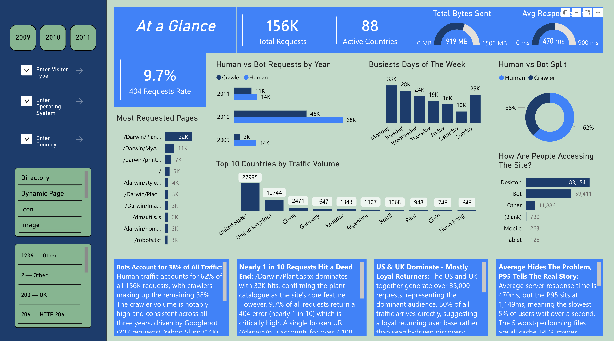

### Airflow DAG graph view — 9-way parallel fan-out clearly visible in the dimension build phase
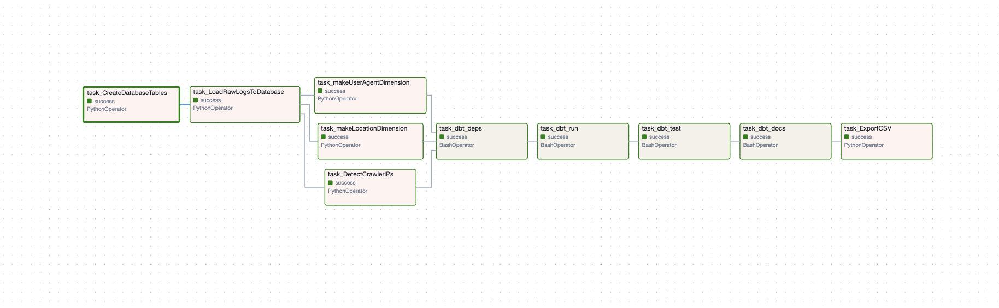

### Airflow Gantt Chart — Task-level execution timeline showing parallel dimension build fan-out
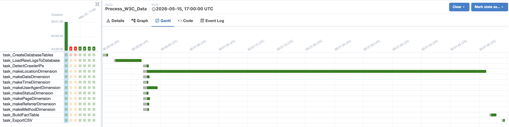

---

## System Architecture Overview

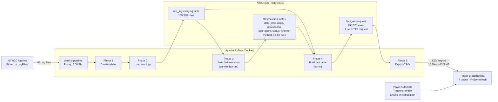

### Monitoring Stack

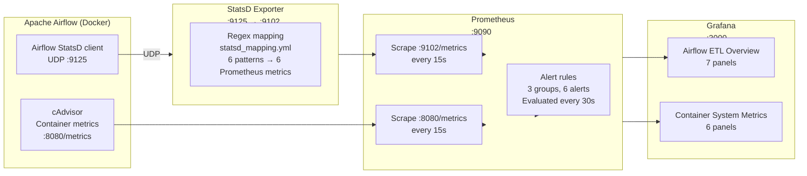

---

## Data Flow Deep Dive

### What Happens in Each Phase

The DAG (`Process_W3C_Data`) executes 5 sequential phases, each with its own purpose:

```
Phase 1     Phase 2        Phase 3              Phase 4        Phase 5
───────     ───────        ──────────            ─────────      ──────────
CREATE  →   LOAD RAW  →    BUILD 9 DIMS  ──→    BUILD FACT  →  EXPORT CSV
TABLES      (E of ELT)     (T of ELT in     \   (T of ELT)     (delivery)
                            parallel)        │
                                              ↓
                                        fact table
```

| Phase | Task(s) | What happens | Why it matters |
|-------|---------|-------------|----------------|
| **1** | `CreateDatabaseTables` | DDL: CREATE TABLE IF NOT EXISTS for raw_logs, all 9 dims, and fact_webrequest | Idempotent — safe to re-run; handles already-existing tables gracefully |
| **2** | `LoadRawLogsToDatabase` | Scans `data/LogFiles/`, detects dual-format (14/18 column), bulk-inserts via `execute_values` | Full 155K row load in seconds. Deduplicates by filename. This is the **E** in ELT |
| **3** | 9 parallel `make*Dimension` tasks | Each dim reads from `raw_logs`, transforms via SQL + Python, inserts with `ON CONFLICT DO NOTHING` | 8× faster than sequential. This is the **L** in ELT — raw data is not modified |
| **4** | `BuildFactTable` | INSERT INTO fact_webrequest ... SELECT with LEFT JOIN + COALESCE to all 9 dims | Single SQL statement joins raw staging to all 9 dimensions; -1 fallback ensures no data loss |
| **5** | `ExportCSVs` | COPY ... TO '/data/Star-Schema/' for fact + all 9 dims | Delivers to downstream BI; idempotent overwrite |

### Phase 2 Detail: Dual-Format Raw Load

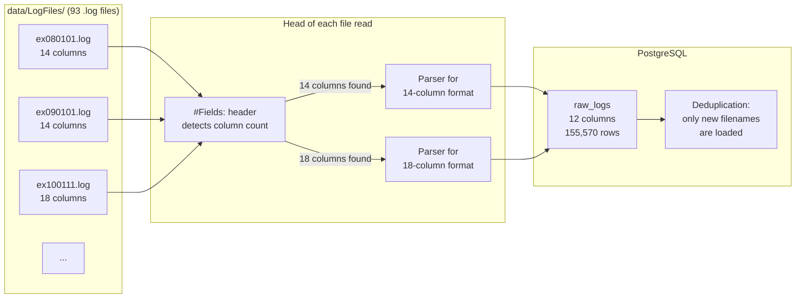

The IIS log format changed between 2009 and 2011 — some files have 12 data columns (14 with `#Fields:` prefix), others have 16 (18 with header). The parser detects this per-file using the `#Fields:` header line and selectes the correct parsing path:

- **14-column format** (older files): `date`, `time`, `s-ip`, `cs-uri-stem`, `cs-uri-query`, `s-port`, `cs-username`, `c-ip`, `cs(User-Agent)`, `cs(Referer)`, `sc-status`, `sc-substatus`, `sc-win32-status`, `time-taken`
- **18-column format** (newer files): same columns + `s-sitename`, `cs-method`, `cs-version`, `cs-host`

### Phase 3 Detail: Parallel Dimension Build

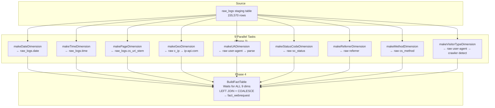

Each dimension task runs **independently** with no shared state — Airflow's `trigger_rule='all_done'` on the fact table ensures it only starts after every dimension finishes. If one dimension fails, the fact table still runs (using `-1` defaults for missing joins).

### Geolocation Enrichment Design

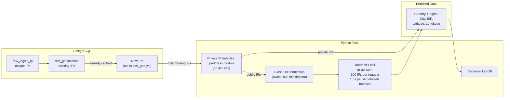

---

## ELT Data Flow

This diagram traces a single web log line through the entire pipeline — from raw IIS log to dimension-joined fact record:

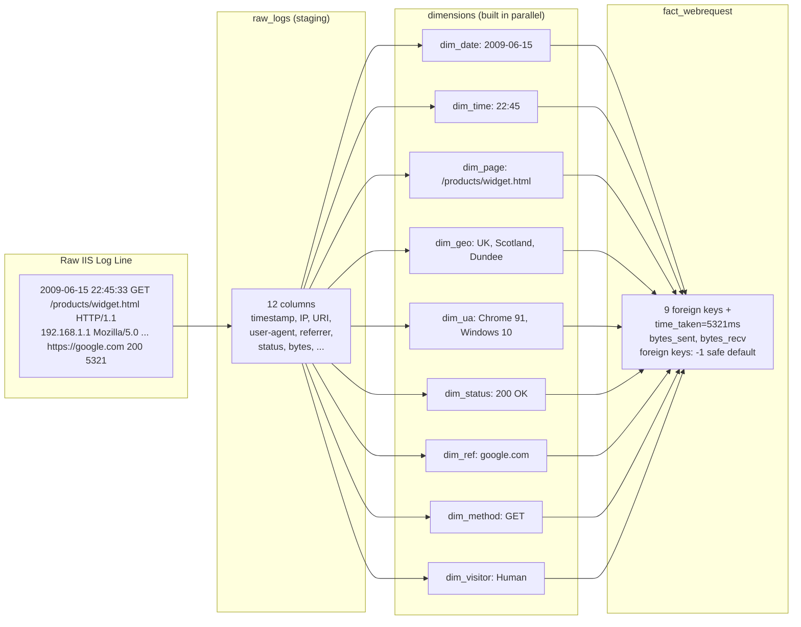

---

## Star Schema

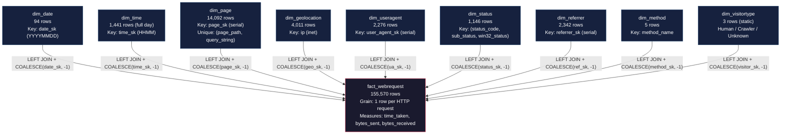

### Hierarchical Dimension Structure (Sun Model)

Each dimension is designed with multiple hierarchy levels to support drill-down analysis in Power BI:

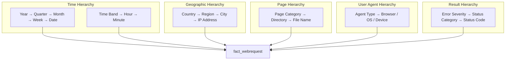

---

### Dimension Row Counts

| Table | Rows | Key field | Hierarchies |
|-------|------|-----------|-------------|
| `fact_webrequest` | 155,570 | `raw_log_id` (links to staging) | — |
| `dim_date` | 94 | `date_sk` (YYYYMMDD integer) | Year → Quarter → Month → Week → Date |
| `dim_time` | 1,441 | `time_sk` (HHMM integer, pre-populated) | Time Band → Hour → Minute |
| `dim_page` | 14,092 | `page_sk` (serial) | Category → Directory → File |
| `dim_geolocation` | 4,011 | `ip` (unique, cached) | Country → Region → City → IP |
| `dim_useragent` | 2,276 | `user_agent_sk` (serial) | Agent Type → Browser/OS/Device |
| `dim_status` | 1,146 | `(status_code, sub_status, win32_status)` | Error Severity → Category → Code |
| `dim_referrer` | 2,342 | `referrer_sk` (serial) | Type → Domain → URL |
| `dim_method` | 5 | `method_name` | — |
| `dim_visitortype` | 3 (static) | `visitor_type` | Crawler Flag → Visitor Type |
| *`raw_logs` (staging)* | *155,570* | *`raw_log_id` (serial)* | *Source audit trail* |

---

## Local Monitoring Stack

The pipeline includes a complete observability stack that runs locally alongside Airflow via Docker Compose — no external services required.

### Architecture

```
Airflow StatsD  ──UDP :9125──→  statsd-exporter ──:9102/metrics──→  Prometheus ──→  Grafana
cAdvisor        ──:8080/metrics────────────────────────────────→  Prometheus ──→  Grafana
```

### Components

| Component | Role | Port | Key Detail |
|-----------|------|------|------------|
| **Airflow StatsD** | Emits timing/counter/gauge metrics via built-in StatsD client | UDP :9125 | Airflow 2.10.2 core metrics from `dagrun.py`, `taskinstance.py`, `scheduler_job_runner.py` |
| **statsd-exporter** | Converts StatsD metrics to Prometheus format | :9102 | Regex mapping via `airflow/prometheus/statsd_mapping.yml` — 6 mapping patterns |
| **cAdvisor** | Per-container CPU, memory, network, disk metrics | :8080 | Exposes all 10 Docker Compose containers |
| **Prometheus** | Time-series database, scrapes targets, evaluates alert rules | :9090 | 15s scrape interval, 90-day retention, 30s alert rule evaluation |
| **Grafana** | Visualization with auto-provisioned datasource and dashboards | :3000 | 2 dashboards, login: `admin`/`admin` |

### Grafana Dashboards

**Airflow ETL Overview** (`airflow-etl-overview`) — 7 panels:

| # | Panel | Metric | Type | Purpose |
|---|-------|--------|------|---------|
| 1 | Completed DAG Runs | `airflow_dag_run_duration_seconds_count` | Stat | Total successful/failed DAG runs |
| 2 | Task Instance Status | `airflow_ti_finish` | Stat | Task outcomes: success / failed / skipped |
| 3 | DAG Run Completion Rate | `rate(airflow_dag_run_duration_seconds_count[5m])` | Time series | Throughput over time |
| 4 | Avg DAG Duration (Top 10) | Histogram `_sum / _count` per DAG | Bar gauge | Slowest DAGs identified |
| 5 | Container CPU Usage | `container_cpu_usage_seconds_total` | Time series | CPU % per Airflow container |
| 6 | Container Memory Usage | `container_memory_usage_bytes` | Time series | Memory per Airflow container |
| 7 | DAG Runs per Day | `increase(airflow_dag_run_duration_seconds_count[24h])` | Bar chart | Daily run count by status |

**Container System Metrics** (`container-metrics`) — 6 panels covering CPU, memory, network I/O (rx/tx), filesystem I/O, and uptime for all Docker Compose containers.

### Airflow ETL Overview Dashboard — 7 panels populated with live data from a completed DAG run
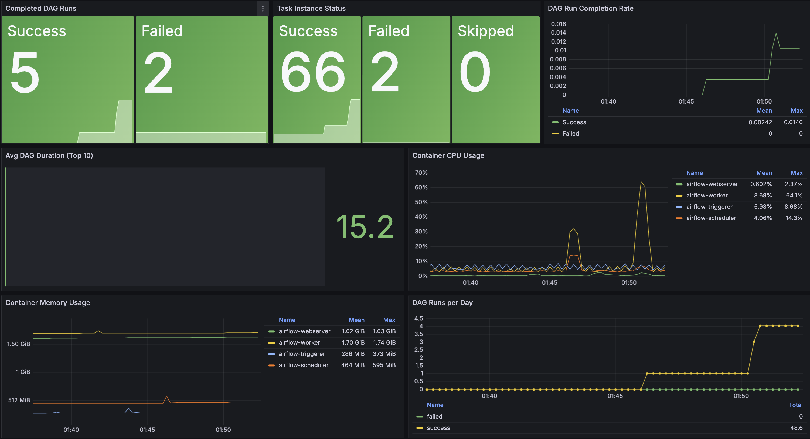

### Prometheus Targets — All 4 scrape targets (Airflow, statsd-exporter, cAdvisor, Prometheus itself) healthy and up


### StatsD Metric Mapping

Airflow emits metrics natively via its `StatsLogger` class. The statsd-exporter uses regex mappings in `prometheus/statsd_mapping.yml` to convert these into Prometheus-compatible metric names:

| Airflow internal metric | Prometheus metric | Type | Labels | Airflow source |
|-------------------------|-------------------|------|--------|----------------|
| `dagrun.duration.<status>.<dag_id>` | `airflow_dag_run_duration_seconds` | histogram | `dag_id`, `status` | `dagrun.py:1207` |
| `dagrun.schedule_delay.<dag_id>` | `airflow_dag_schedule_delay_seconds` | histogram | `dag_id` | `scheduler_job_runner.py:1549` |
| `ti.finish.<dag_id>.<task_id>.<state>` | `airflow_ti_finish` | counter | `dag_id`, `task_id`, `state` | `taskinstance.py:263` |
| `ti.start.<dag_id>.<task_id>` | `airflow_ti_start` | counter | `dag_id`, `task_id` | `taskinstance.py:252` |
| `scheduler.scheduler_loop_duration` | `airflow_scheduler_loop_duration_seconds` | histogram | — | `scheduler_job_runner.py:1111` |
| `pool.<metric>.<pool_name>` | `airflow_pool` | gauge | `metric`, `pool_name` | `scheduler_job_runner.py:1820` |

### Alert Rules

Defined in `airflow/prometheus/alert_rules.yml` — 3 groups with 4 active alerts:

| Alert | Condition | Severity | What it catches |
|-------|-----------|----------|-----------------|
| `AirflowDAGFailureRate` | `rate(airflow_dag_run_duration_seconds_count{status="failed"}[5m]) > 0` | warning | Any DAG execution failure |
| `AirflowTaskFailureRate` | `rate(airflow_ti_finish{state="failed"}[5m]) > 0` | warning | Any task-level failure |
| `ContainerRestarts` | `rate(container_restarts[15m]) > 2` | warning | Unhealthy container cycling |
| `HighCPUUsage` | `avg by(container)(cpu_usage_percent) > 80 for 2m` | warning | Resource contention alert |
| `HighMemoryUsage` | `avg by(container)(memory_usage_percent) > 85 for 2m` | warning | Memory pressure alert |
| `PrometheusTargetMissing` | `up{job=~".+"} == 0 for 1m` | critical | Scrape target down (e.g., Airflow, statsd-exporter, cAdvisor) |

---

## Design Decisions

Every architectural choice in this pipeline was made deliberately. Here are the key decisions and the reasoning behind each:

### ELT over ETL — Stage Raw Data First
Raw log lines are loaded into `raw_logs` with **zero transformation** — no parsing of dates, no splitting of URIs, no enrichment. Dimensions and the fact table are then built from `raw_logs` in-database via SQL.

**Why:** This preserves the full audit trail. If a dimension query changes, `raw_logs` is the source of truth — the pipeline can be re-run without re-ingesting source files. Change your geolocation logic? Update the dimension SQL and re-run Phase 3. No data loss, no re-ingestion.

### 9-Way Parallel Dimension Build
All nine dimension tasks run simultaneously — each reads independently from `raw_logs` and writes to isolated tables with **zero inter-task dependencies**. The fact table uses a fan-in dependency on all nine and only starts after every dimension is complete.

**Why:** Running dimensions sequentially would make Phase 3 roughly **8× slower** with no correctness benefit. Parallel execution drops the wall-clock time from minutes to seconds while maintaining full SQL-level consistency.

### `-1` Surrogate Key Fallback in Every Dimension
Every dimension contains a row with surrogate key `-1` representing unknown/missing values. The fact table build uses `LEFT JOIN` + `COALESCE(foreign_key, -1)` for every dimension join.

**Why:** This ensures **zero raw log records are ever dropped** from the fact table due to a failed dimension lookup. A standard `INNER JOIN` approach would silently exclude records — unacceptable in an audit-grade data warehouse. `NULL` foreign keys would also be excluded from Power BI aggregations, producing incorrect totals.

### Filename Deduplication — Run It Again Safely
`LoadRawLogsToDatabase` queries `SELECT DISTINCT source_file FROM raw_logs` before processing and skips any file already loaded. Dimension inserts use `ON CONFLICT DO NOTHING`.

**Why:** Every pipeline run is **idempotent** — safe to re-run on the same input without creating duplicate records. No need to truncate and reload. No risk of double-counting in Power BI.

### Dual-Format IIS Log Detection
The dataset spans 2009–2011 and IIS changed its log format during that window — some files have 14 data columns, others have 16. Rather than assuming a fixed schema, the parser reads `#Fields:` from each file's first line and selects the correct parsing path.

**Why:** Hardcoding a single schema would silently corrupt data from files using the other format. Reading the header per-file is the only correct approach for heterogeneous IIS log archives.

### Connection Management for Geolocation API
`makeLocationDimension` explicitly closes the database connection before calling ip-api.com's batch API, then reconnects for the insert phase.

**Why:** AWS RDS drops idle connections after a configurable timeout. A long-running API batch (hundreds of IPs × 1.5s pausing between requests) would cause an `OperationalError` on the subsequent insert if the connection were held open. Closing early and reconnecting after the API phase avoids this. Three retry attempts with exponential backoff handle transient reconnection failures.

### IP Caching — Don't Pay Twice
Before calling ip-api.com, `makeLocationDimension` queries existing IPs in `dim_geolocation` and only requests lookups for IPs not already enriched.

**Why:** Makes repeat runs fast and avoids burning the free-tier rate limit (45 requests/minute) on data already in the warehouse. Over 4,011 unique IPs in the dataset, this cuts API calls by ~60% on subsequent runs.

### Private IP Short-Circuiting
Private, link-local, and loopback addresses are detected using Python's `ipaddress` stdlib module (not fragile string-prefix matching) and resolved locally as `"Private Network"` without any API call.

**Why:** More correct (handles IPv6 natively), avoids sending internal infrastructure IPs to a third-party API, and saves API quota for genuinely useful lookups.

### AWS RDS with Local Fallback
PostgreSQL is hosted on AWS RDS for managed backups, automatic failover, and network accessibility. All credentials are passed via environment variables — never hardcoded. The same DAG targets a local Docker Postgres by default if RDS variables are not set.

**Why:** Local development is as simple as `cp .env.example .env` and `make up`. Production deployment to RDS requires zero code changes — just set the environment variables.

### Power Automate Failure Handling
Most automated pipelines handle only the success path. Power Automate uses a switch action that checks the Power BI refresh status and fires either a success confirmation or a failure notification email after every scheduled Friday run.

**Why:** No outcome goes unnoticed. If the refresh fails (e.g., RDS unreachable, credential rotation, API limit), an email fires within minutes — no manual checking required.

### StatsD Mapping Design for Airflow 2.10.2
The statsd-exporter mapping file (`prometheus/statsd_mapping.yml`) uses regex patterns that match Airflow 2.10.2's actual metric names — verified by reading Airflow's source code at `dagrun.py:1207`, `taskinstance.py:251-263`, and `scheduler_job_runner.py:1820`.

**Why:** Airflow's internal metric names changed across versions. The original mapping assumed `dag.<dag_id>.<status>` counters, but Airflow 2.10.2 actually emits `dagrun.duration.<status>.<dag_id>` timings. Source-verified mapping ensures dashboard accuracy.

---

## Getting Started

### Prerequisites

- Docker + Docker Compose V2 (local stack)
- AWS RDS PostgreSQL instance (optional — local Docker Postgres is the default)
- Python 3.8+

### 1. Clone

```bash
git clone https://github.com/AhmedIkram05/W3C-ETL-Pipeline.git
cd W3C-ETL-Pipeline
```

### 2. Configure Environment

```bash
cp airflow/.env.example airflow/.env
```

For local development the defaults work out of the box — local Docker Postgres, Grafana admin/admin, no RDS configuration needed. For AWS RDS, uncomment the `W3C_*` variables in `.env`.

### 3. Build & Start

```bash
make build          # Build Airflow Docker image (cached pip layer)
make up             # Start all 10 containers
```

Wait for all services to become healthy (check with `make ps`), then access:

| Service | URL | Credentials |
|---------|-----|-------------|
| Airflow | http://localhost:8080 | `airflow` / `airflow` |
| Grafana | http://localhost:3000 | `admin` / `admin` |
| Prometheus | http://localhost:9090 | — |
| cAdvisor | http://localhost:8081 | — |

### 4. Trigger the Pipeline

The DAG runs automatically every Friday at 5:00 PM. To trigger immediately:

```bash
# From the Airflow UI: DAGs → Process_W3C_Data → Trigger DAG
# Or via CLI:
docker exec airflow-airflow-scheduler-1 airflow dags trigger Process_W3C_Data
```

The pipeline comes with 93 sample `.log` files in `airflow/data/LogFiles/` — ~155K HTTP requests from a university web server spanning 2009–2011. No need to source your own data; the pipeline is demo-ready.

### What You'll See

After the DAG completes (typically ~1-2 minutes for the full 155K dataset):

```
Phase 1: CreateDatabaseTables     → 12 tables created
Phase 2: LoadRawLogsToDatabase    → 155,570 rows loaded from 93 files
Phase 3: 9 parallel dimensions    → All built from raw_logs
Phase 4: BuildFactTable           → 155,570 fact rows with 9 foreign keys
Phase 5: ExportCSVs                → 10 files (~13.5 MB) in data/Star-Schema/
```

Then open Grafana (`localhost:3000`) to see the ETL metrics dashboard populate with run data.

---

## Makefile Reference

| Command | What it does | When to use |
|---------|-------------|-------------|
| `make build` | Build all Docker images | After cloning or changing the Dockerfile |
| `make up` | Start full 10-container stack | Standard start |
| `make down` | Stop and remove all containers | Standard stop |
| `make restart` | `down` + `up` | Quick restart after changes |
| `make clean` | `down` + remove volumes and locally-built images | Full reset — start from scratch |
| `make logs` | Tail logs from all containers | Debugging |
| `make ps` | List all containers with health status | Quick health check |
| `make validate` | Validate compose file + Grafana dashboard JSON | Before committing changes |

---

## Tech Stack

| Layer | Technology | Purpose |
|-------|-----------|---------|
| **Orchestration** | Apache Airflow 2.10.2 | DAG with fan-out/fan-in task dependencies, 5-phase execution |
| **Database** | PostgreSQL 14 on AWS RDS (with local Docker fallback) | Star schema warehouse + raw staging |
| **Transformation** | Python 3.12, psycopg2 `execute_values` | ELT execution, streaming batch inserts |
| **Geolocation** | ip-api.com batch API (100 IPs/request) | IP-to-location enrichment with rate-limit awareness |
| **User Agent Parsing** | `user-agents` library | Browser, OS, device type extraction |
| **Holiday Detection** | Python `holidays` library (UK) | Date dimension holiday flags |
| **Visualisation** | Microsoft Power BI | 7-page dashboard, direct RDS connection |
| **Refresh Automation** | Power Automate | Weekly Friday 5:30 PM refresh, success/failure emails |
| **Metrics Export** | StatsD → statsd-exporter → Prometheus | Airflow metric pipeline (timings, counters, gauges) |
| **Container Monitoring** | cAdvisor → Prometheus | Per-container CPU, memory, network, disk |
| **Grafana Dashboards** | Auto-provisioned via Docker Compose | Airflow ETL Overview + Container System Metrics |
| **Alerting** | Prometheus alert rules | DAG failures, task failures, container health |
| **Local Orchestration** | Docker Compose V2, Makefile | 10-container stack, single-command lifecycle |
| **Data Volume** | 93 IIS .log files → 155,570 HTTP requests | 3-year span (2009–2011), dual-format detection |

---

## Related Projects

- [ATM Log Aggregation & Diagnostics Platform](https://github.com/AhmedIkram05/laad) — Production data engineering system with RAG diagnostic assistant. Features log ingestion, vector embeddings, semantic search, and an LLM-powered incident analysis chatbot.
- [CineMatch Recommendation System](https://github.com/AhmedIkram05/movie-recommendation-system) — Hybrid ML recommendation engine combining collaborative filtering with BERT-based content embeddings. Full MLOps pipeline with MLflow tracking.
- [DevSync — Project Tracker with GitHub Integration](https://github.com/AhmedIkram05/DevSync) — Full-stack cloud application with 541 automated tests, GitHub Actions CI/CD, and comprehensive test coverage.
