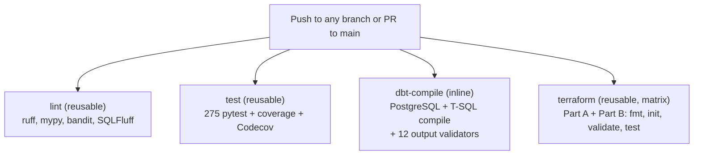
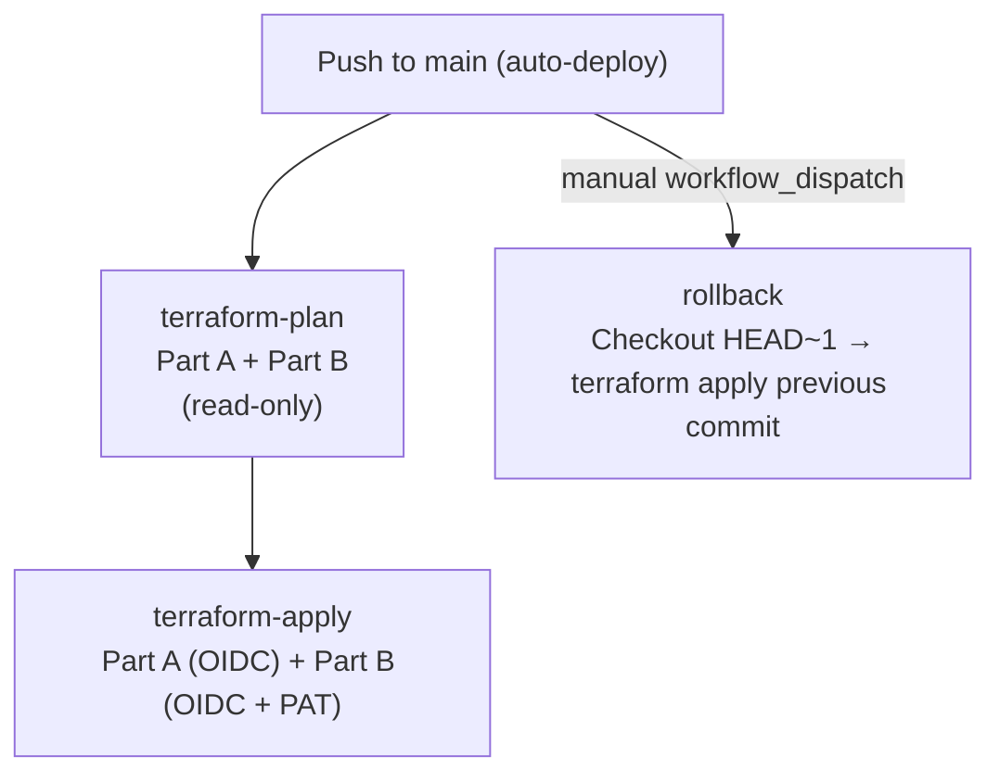

# W3C Web Logs ETL Pipeline

> Serverless Databricks DLT ingests 93 W3C IIS log files through a Bronze → Silver medallion architecture in Unity Catalog, exports 153,377 enriched rows to Azure SQL in 45 seconds, transforms via dbt (16 models, dual-dialect T-SQL/PostgreSQL) into a star schema, and serves 18 Power BI‑ready CSV exports - all orchestrated by Apache Airflow with Terraform‑managed infrastructure, OIDC‑secured CI/CD, and Grafana observability. A Docker Compose stack mirrors the pipeline locally for development and CI.

<p align="center">
  
  
  
  
  
  
  
  
  
  
  
  
  
  
</p>

<p align="center">
  <a href="https://github.com/AhmedIkram05/w3c-etl-pipeline/actions/workflows/ci.yml"></a>
  
  <a href="https://codecov.io/gh/AhmedIkram05/w3c-etl-pipeline"></a>
  
  <a href="https://app.powerbi.com/reportEmbed?reportId=41d525b8-b808-4750-88ba-cb31dbbba958&autoAuth=true&ctid=ae323139-093a-4d2a-81a6-5d334bcd9019"></a>
</p>

<iframe title="W3C ETL Dashboard" width="1140" height="541.25" src="https://app.powerbi.com/reportEmbed?reportId=41d525b8-b808-4750-88ba-cb31dbbba958&autoAuth=true&ctid=ae323139-093a-4d2a-81a6-5d334bcd9019" frameborder="0" allowFullScreen="true"></iframe>

---

## Table of Contents

- [Architecture Overview](#architecture-overview)
- [Engineering Highlights](#engineering-highlights)
- [Key Metrics at a Glance](#key-metrics-at-a-glance)
- [Media & Demos](#media--demos)
- [Component Deep Dives](#component-deep-dives)
  - [Azure Databricks DLT (Bronze → Silver)](#1-azure-databricks-dlt-bronze--silver)
  - [Azure SQL & JDBC Export](#2-azure-sql--jdbc-export)
  - [dbt & the T-SQL Migration](#3-dbt--the-t-sql-migration)
  - [Terraform Infrastructure as Code](#4-terraform-infrastructure-as-code)
  - [CI/CD Pipeline](#5-cicd-pipeline)
  - [Monitoring & Observability](#6-monitoring--observability)
  - [Testing Strategy](#7-testing-strategy)
- [Design Decisions](#design-decisions)
- [Quick Start](#quick-start)
- [Related Projects](#related-projects)

---

## Architecture Overview

The pipeline follows a **Bronze → Silver → Azure SQL → dbt → Power BI** medallion architecture on Azure, with a Databricks DLT serverless pipeline doing the heavy lifting.

```mermaid
flowchart LR
    classDef source fill:#3b82f6,color:#fff,stroke:#1e40af
    classDef ingest fill:#10b981,color:#fff,stroke:#047857
    classDef dlt fill:#8b5cf6,color:#fff,stroke:#6d28d9
    classDef sql fill:#f59e0b,color:#fff,stroke:#d97706
    classDef dbtclass fill:#ef4444,color:#fff,stroke:#dc2626
    classDef bi fill:#ec4899,color:#fff,stroke:#db2777

    source["93 W3C IIS log files<br/>2009–2011"]:::source

    adls["ADLS Gen2<br/>raw-logs container"]:::ingest

    bronze["DLT Bronze (serverless)<br/>w3c_etl_databricks.bronze.bronze_raw_logs<br/>Custom W3C parser UDF • 14/18-field detection<br/>7 @dlt.expect_or_drop quality checks<br/>153,380 rows • 0 dropped<br/>Partitioned by log_date"]:::dlt

    silver["DLT Silver (serverless)<br/>w3c_etl_databricks.silver.silver_enriched_logs<br/>7 MaxMind GeoIP fields (maxminddb pure Python)<br/>5 computed fields • 31 columns total<br/>153,377 rows • 30+ countries<br/>Dedup: left_anti join on source_file"]:::dlt

    jdbc["JDBC Export (notebook_task)<br/>pymssql batch executemany<br/>BATCH_SIZE=5000 • 4-attempt retry<br/>~45s for 153,377 rows"]:::sql

    azsql["Azure SQL (serverless GP_S_Gen5, 1 vCore)<br/>dbo.raw_enriched - 31 columns<br/>Auto-pause 60 min idle"]:::sql

    dims["Airflow: export_dimensions<br/>MERGE upsert on geo_hash / ua_hash<br/>→ dim_geolocation (1,585 rows)<br/>→ dim_useragent (2,040 rows)<br/>Fires Dataset trigger"]:::dbtclass

    dbt["dbt - 16 models • 118 tests<br/>10 staging + 6 marts<br/>Dual-dialect T-SQL / PostgreSQL<br/>Runs on Databricks serverless via<br/>self-bootstrapping notebooks"]:::dbtclass

    csv["18 CSV exports<br/>Star-Schema/ directory"]:::bi

    powerbi["Power BI<br/>7-page dashboard<br/>Weekly auto-refresh"]:::bi

    source -->|"ABFSS path"| adls
    adls -->|"Auto Loader"| bronze
    bronze -->|"spark.table()"| silver
    silver -->|"collect() + pymssql"| jdbc
    jdbc --> azsql
    azsql --> dims
    dims -->|"Dataset trigger"| dbt
    dbt --> csv
    csv --> powerbi
```



<details>
<summary><b>Docker Dev Environment</b> - A Docker Compose stack (PySpark 4.0.2 + PostgreSQL 13 + Airflow 2.10.2) mirrors this pipeline locally for development and CI testing. 17 services, one `docker compose up -d`. <a href="#quick-start">→ Quick Start</a></summary>
&nbsp;
The Docker pipeline follows the same Bronze → Silver → Warehouse pattern using PySpark jobs (SparkSubmitOperator), local Delta Lake directories, a PostgreSQL warehouse, and the same dbt models (PostgreSQL dialect). It is not a production data platform - it exists for fast iteration and CI verification without cloud costs.
</details>

---

## Engineering Highlights

| Area | Highlight | Why It Matters |
|---|---|---|
| **Serverless DLT** | All Databricks compute runs on serverless - no VMs, no clusters, auto-scales to zero when idle. | **Zero infrastructure management.** The pipeline costs ~$0 when idle and never requires cluster tuning. |
| **GeoIP Enrichment** | 7 MaxMind fields (country → ISP) from a single consolidated struct UDF using `maxminddb` pure Python. 3.5× faster than 7 separate UDFs. | **Serverless DLT can't install compiled C libraries.** Pure Python `maxminddb` side-steps this limitation while a lazy singleton pattern avoids PicklingError in distributed execution. |
| **45-Second JDBC Export** | 153,377 rows from Silver to Azure SQL in 45 seconds - 8–9× faster than the initial 413s implementation. | **Databricks serverless only supports JDBC reads, not writes.** Pure Python `pymssql` + `tuple(row)` (not `asDict()`) + Spark-side pre-filter before `collect()` were the breakthrough optimisations. |
| **T-SQL Dual-Dialect dbt** | All 16 models compile against both PostgreSQL (dev/CI) and T-SQL (Azure SQL/prod) via inline `` branches - no separate `_azure.sql` files. | **One model, two databases.** 18 macros + 2 dispatch overrides abstract PostgreSQL syntax (`::casts`, `EXTRACT`, `SPLIT_PART`, `ILIKE`, `MD5`) behind Jinja wrappers. |
| **118 dbt Data Tests** | 46 `not_null` · 18 `unique` · 20 `accepted_values` · 10 `relationships` (FK) · 24 `expression_is_true` - enforcing business invariants across all 16 models. | **Production-grade data quality.** Tests catch referential integrity failures, negative response times, out-of-range percentages, and dedup key collisions before data reaches Power BI. |
| **Terraform with OIDC** | Part A (4 modules: networking, datalake, databricks, warehouse) + Part B (24 resources: DLT pipelines, Workflows, UC schemas, secrets). Full OIDC Workload Identity Federation - no static Azure credentials. | **Zero touch deployment.** One `terraform apply` provisions the entire Azure estate including the GitHub→Azure auth chain. The CI/CD pipeline authenticates via token exchange, not client secrets. |
| **3 Grafana Dashboards** | 23 panels across Airflow ETL Overview (7), Container System Metrics (6), and Pipeline Health (10) - with 8 Prometheus alert rules, 2 Azure Monitor alerts, and 3 action groups (P1/P2/P3). | **Observability from day one.** Airflow StatsD → Prometheus → Grafana pipeline means every DAG run, task duration, and data freshness metric is tracked. |

---

## Key Metrics at a Glance

| Category | Metric | Value |
|---|---|---|
| **Source** | W3C IIS log files | **93 files** (2009–2011) |
| **Bronze** | Rows ingested | **153,380** (7 quality expectations, **0 dropped**) |
| **Silver** | Enriched rows | **153,377** (31 columns, 7 GeoIP + 5 computed) |
| **GeoIP** | Countries resolved | **30+** across 6 continents |
| **GeoIP** | Known-country coverage | **99.99%** |
| **Export** | Silver → Azure SQL | **~45 seconds** (pymssql batch executemany) |
| **Warehouse** | Azure SQL database | GP_S_Gen5 serverless, 1 vCore, auto-pause 60 min |
| **dbt models** | Total | **16** (10 staging + 6 marts) |
| **dbt macros** | T-SQL compatibility | **18** macros + **2** dispatch overrides |
| **dbt data tests** | All models | **118** (46 not_null + 18 unique + 20 accepted_values + 10 relationships + 24 expression_is_true) |
| **pytest** | Total / CI | **305 tests** / **275 in CI** (17 files, 81+ classes) |
| **Terraform** | HCL assertions | **9** (3 Part A + 6 Part B) + **39** Python tests |
| **CI/CD** | Workflow files | **7** (4 CI + 1 CD + 1 CodeQL + 1 auto-merge) |
| **CI/CD** | Job stages | **9 CI + 3 CD** |
| **IaC** | Terraform modules | **4** (networking, datalake, databricks, warehouse) |
| **IaC** | Azure resources managed | **30+** across 2 Terraform parts |
| **Observability** | Grafana dashboards | **3** (23 panels) |
| **Observability** | Alert rules | **8** Prometheus + **2** Azure Monitor + **3** action groups |
| **Cost** | Budget controls | **$50 warning / $100 hard cap** |
| **Cost** | Monthly estimate | **~$0–100/mo** (serverless auto-scales to zero) |
| **CSV exports** | Power BI-ready | **18 files** (~36 MB) |
| **Power Automate** | Refresh schedule | **Friday 17:30** weekly with success/failure email |

---

## Demos

### Pipeline Run - End-to-End

<!-- MEDIA: Manual - Databricks Workflow run showing Bronze → Silver → JDBC Export all green (3 serverless tasks, ~7 min total) -->
<!-- MEDIA: Manual - Airflow DAG graph view for w3c_spark_ingestion_azure with successful runs and Dataset trigger flow -->

### Grafana Dashboards

<!-- MEDIA: Manual - Grafana Pipeline Health dashboard (10 panels: Bronze 153,380 / Silver 153,377 / Export 153,377 row counts, pipeline status, 8 alert rules) -->

### dbt Lineage & Documentation

<!-- MEDIA: Manual - dbt docs lineage graph showing all 16 models (10 staging → 6 marts) with ref() dependencies and test coverage badges -->

### Power BI

<!-- MEDIA: Manual - Power BI dashboard (7 pages) showing key analytics: daily requests trend, top 10 countries map, browser market share, crawler traffic analysis, time-of-day heatmap -->

### CI/CD Pipeline

<!-- MEDIA: Manual - GitHub Actions CI run showing 4 parallel jobs (lint, test, dbt-compile, terraform) all green -->
<!-- MEDIA: Manual - GitHub Actions CD run showing terraform-plan → terraform-apply → smoke-test all passing -->

### Azure SQL Data Landing

<!-- MEDIA: Manual - Azure SQL query result: `SELECT COUNT(*) FROM dbo.raw_enriched` → 153,377 rows landed -->

---

## Component Deep Dives

### 1. Azure Databricks DLT (Bronze → Silver)

#### Bronze DLT Pipeline

The Bronze layer ingests **93 real W3C IIS log files** from ADLS Gen2 via Auto Loader (`binaryFile` format, `maxFilesPerTrigger=10`, `includeExistingFiles=true`). A custom per-file UDF reads the full binary content, detects the `#Fields:` header to determine **14-field vs 18-field IIS format**, and parses every non-comment data line using `rsplit()` field-counting to handle unquoted user-agent strings.

**7 quality expectations** (`@dlt.expect_or_drop`):

| Expectation | Expression | Rows Dropped |
|---|---|---|
| `valid_log_date` | `log_date IS NOT NULL` | 0 |
| `valid_status` | `status BETWEEN 100 AND 599` | 0 |
| `valid_client_ip` | `client_ip IS NOT NULL AND client_ip != '-'` | 0 |
| `valid_method` | `method IN ('GET','POST','HEAD','PUT','DELETE','OPTIONS','TRACE')` | 0 |
| `valid_uri_stem` | `uri_stem IS NOT NULL` | 0 |
| `valid_user_agent` | `user_agent IS NOT NULL AND user_agent != '-'` | 0 |
| `valid_bytes` | `(bytes_sent IS NULL OR bytes_sent >= 0) AND (bytes_recv IS NULL OR bytes_recv >= 0)` | 0 |

**Result:** **153,380 rows**, **0 dropped** - all 7 quality expectations pass on real production IIS data.

| Attribute | Value |
|---|---|
| Pipeline ID | `a6ea62d3-5f3a-4f53-ae8b-4bfb156703ad` |
| Type | Serverless DLT (Advanced) |
| Channel | `PREVIEW` |
| Table | `w3c_etl_databricks.bronze.bronze_raw_logs` |
| Partition | `log_date` |
| Delta properties | ChangeDataFeed, autoOptimize, autoCompact, DeletionVectors |
| Storage | Unity Catalog managed (not external) |

#### Silver DLT Pipeline

The Silver layer reads from Bronze via `spark.table()`, enriches each row with MaxMind GeoIP data, computes 5 derived fields, and applies quality expectations.

**GeoIP Enrichment - Key Decisions:**

- **Library:** `maxminddb==2.8.*` (pure Python) - NOT `geoip2` which requires compiled `libmaxminddb` unavailable on serverless DLT
- **Performance:** 1 consolidated struct UDF (6 fields from 1 City DB call) + 1 scalar UDF (ISP from ASN DB) - **3.5× faster** than 7 separate UDFs
- **Pattern:** Lazy singleton `_ensure_geo_reader()` to avoid PicklingError - `maxminddb.Reader` is not serialisable, so UDFs reference helper *functions* (serialisable by name), not reader *instances*
- **Path:** `/Volumes/w3c_etl_databricks/bronze/w3c_data/` - NOT `/dbfs/Volumes/` (FUSE mount inaccessible on serverless executors)

**7 GeoIP Fields:**

| Field | Source | Method |
|---|---|---|
| `country` | City DB → `country.names.en` | Consolidated struct UDF |
| `region` | City DB → `subdivisions[0].names.en` | Consolidated struct UDF |
| `city` | City DB → `city.names.en` | Consolidated struct UDF |
| `latitude` | City DB → `location.latitude` | Consolidated struct UDF |
| `longitude` | City DB → `location.longitude` | Consolidated struct UDF |
| `postcode` | City DB → `postal.code` | Consolidated struct UDF |
| `isp` | ASN DB → `autonomous_system_organization` | Separate scalar UDF |

**5 Computed Fields:**

| Field | Logic | Example Values |
|---|---|---|
| `page_category` | URI stem pattern matching | Static Asset / API / Admin / Homepage / Content |
| `referrer_domain` | URL domain extraction | google.com / facebook.com / (direct) |
| `traffic_type` | Referrer domain classification | Direct / Search / Social / Referral |
| `is_crawler` | UA keyword matching | bot, spider, crawler, curl, python-requests |
| `size_band` | Response size bucketing | < 1KB / 1–10KB / 10–100KB / 100KB–1MB / > 1MB |

**Top Countries Resolved (30+ total):**

| Country | Rows | Country | Rows |
|---|---|---|---|
| 🇺🇸 United States | 56,548 | 🇨🇦 Canada | 5,063 |
| 🇬🇧 United Kingdom | 31,818 | 🇩🇪 Germany | 4,232 |
| 🇷🇺 Russia | 11,387 | 🇧🇷 Brazil | 2,948 |
| 🇨🇳 China | 6,737 | 🇫🇷 France | 2,756 |
| 🇦🇷 Argentina | 6,631 | 🇮🇳 India | 2,507 |

**Dedup:** `left_anti` join on `source_file` - wrapped in `try/except` for the first pipeline run when Silver doesn't exist yet.

**Result:** **153,377 rows** (3 dropped by `valid_country` - private/reserved IPs with no GeoIP match), **31 columns**, **30+ countries**.

---

### 2. Azure SQL & JDBC Export

The JDBC export bridges Databricks Silver → Azure SQL. This is the most performance-critical stage because **Databricks serverless (Spark Connect) only supports JDBC reads, not writes**. Spark's `df.write.jdbc` is unavailable.

**Why pymssql:**
- Pure Python driver - no JVM libraries or Maven coordinates
- Works as a job environment dependency on serverless
- `cursor.executemany()` with `BATCH_SIZE=5000`

**Performance Journey - 413s → 45s (8–9× improvement):**

| # | Issue | Before | After | Impact |
|---|---|---|---|---|
| 1 | `.cache()` unsupported on serverless | `new_data_df.cache()` failed with `[NOT_SUPPORTED_WITH_SERVERLESS]` | `collect()` first, then `len(rows)` - removes both `.cache()` and redundant `.count()` scan | Fixed initial crash + saved one full scan |
| 2 | `collect()` before Spark-side filter | All 153K rows collected to driver, then filtered in Python | Filter `~col("source_file").isin(loaded_files)` **before** `collect()` | On incremental: ~0 rows vs 153K. Prevents OOM. |
| 3 | Wasteful `export_df.count()` | `total_rows = export_df.count()` scanned entire Silver table | Removed | ~10s saved per run |
| 4 | `asDict()` serialization | `row.asDict()` - 31 keys × 153K rows = 4.7M dict allocations | `tuple(row)` - no dict overhead | ~50s saved on initial run |

**Architecture:**
1. Connect to Azure SQL with 4-attempt exponential backoff (`15 × 2ⁿ` - covers serverless cold-start)
2. Ensure `dbo.raw_enriched` (31-column DDL) and `dbo.raw_enriched_loaded` (tracking table) exist via `IF OBJECT_ID(...) IS NULL`
3. Read Silver → select 31 export columns → cast `is_crawler` string → BIT
4. Query tracking table for already-loaded `source_file` values
5. **Filter in Spark BEFORE `collect()`** - critical for incremental idempotency
6. Batch INSERT via `cursor.executemany()` with `BATCH_SIZE=5000`
7. Update tracking table with new source files

**31 Export Columns:**
- **25 warehouse core:** `log_date`, `log_time`, `server_ip`, `method`, `uri_stem`, `uri_query`, `client_ip`, `user_agent`, `cookie`, `referrer`, `status`, `sub_status`, `win32_status`, `bytes_sent`, `bytes_recv`, `server_port`, `username`, `time_taken`, `source_file`, `postcode`, `page_category`, `referrer_domain`, `traffic_type`, `is_crawler`, `size_band`
- **6 GeoIP:** `country`, `region`, `city`, `latitude`, `longitude`, `isp`

**Dimension Export (Airflow PythonOperator):**

After the JDBC export, Airflow's `export_dimensions` task builds dimensional tables using `MERGE` upsert:

| Table | Natural Key | Rows | Sentinel |
|---|---|---|---|
| `dim_geolocation` | `geo_hash` - SHA-256 of `country\|region\|city\|latitude\|longitude` | **1,585** | `-1`: Unknown |
| `dim_useragent` | `ua_hash` - SHA-256 of parsed UA fields | **2,040** | `-1`: Unknown |

The geo hash is computed **in SQL** via `HASHBYTES('SHA2_256', ...)` inside the MERGE subquery - efficient batch computation. The UA hash is computed **in Python** via `hashlib.sha256()` alongside parsing to avoid extra SQL round-trips. Sentinels use `SET IDENTITY_INSERT ON/OFF` for FK integrity.

---

### 3. dbt & the T-SQL Migration

dbt owns **all SQL transformations** - nothing else writes to the star schema. The project comprises **16 models** across **3 schemas** with **118 data tests**.

**Schema Isolation:**

| Schema | Purpose | Managed By | Number of Tables |
|---|---|---|---|
| `dbo` (Azure) / `public` (PostgreSQL) | Raw ingestion + enrichment dimensions | Airflow + JDBC Export | 4 |
| `dbt_staging` | Core warehouse star schema | dbt | 10 |
| `dbt_marts` | Pre-aggregated BI analytics | dbt | 6 |

**The Dual-Dialect Strategy:**

Every model file uses inline `......` branches. There are **no separate `_azure.sql` files** - dbt would parse both as independent models.

```sql
-- Real example from a dbt model (simplified):
SELECT
    
        CAST(field AS BIGINT) AS metric
    
        field::BIGINT AS metric
    
FROM {{ source('w3c', 'raw_enriched') }}
```

**18 T-SQL Compatibility Macros + 2 Dispatch Overrides:**

| Macro | PostgreSQL Pattern | T-SQL Replacement |
|---|---|---|
| `tsql_cast` | `field::type` | `CAST(field AS type)` |
| `tsql_datepart` | `EXTRACT(YEAR FROM field)` | `DATEPART(year, field)` |
| `tsql_month_name` | `TO_CHAR(field, 'FMMonth')` | `DATENAME(month, field)` |
| `tsql_split_part` | `SPLIT_PART(field, delim, n)` | `CHARINDEX`/`SUBSTRING` expression |
| `tsql_case_insensitive_like` | `field ~* 'pattern'` | `field LIKE 'pattern' COLLATE SQL_Latin1_General_CP1_CI_AS` |
| `tsql_hash_md5` | `MD5(CONCAT(...))` | `CONVERT(VARCHAR(32), HASHBYTES('MD5', CONCAT(...)), 2)` |
| `tsql_generate_series` | `generate_series(0, 23)` | `GENERATE_SERIES(0, 23)` |
| `tsql_percentile_cont` | `PERCENTILE_CONT(...) OVER (...)` | Same syntax (used in separate DISTINCT CTE) |
| `tsql_extract_domain` | `REGEXP_REPLACE(url, pattern)` | Nested `CHARINDEX`/`SUBSTRING` |
| `tsql_true_val` / `tsql_false_val` | `TRUE` / `FALSE` | `1` / `0` |

**Dispatch overrides:** `sqlserver__test_expression_is_true` and `sqlserver__collect_freshness` implement `dbt_utils` functionality for T-SQL.

**Model Lineage:**

```
raw_enriched (source)
  ├── dim_date (93 rows, 22 UK holidays)
  ├── dim_time (1,440 rows, full day in minutes)
  ├── dim_page (~14K paths, file_extension classification)
  ├── dim_status (~1,145 triples, severity labelling)
  ├── dim_method (~5 methods, safe/unsafe classification)
  ├── dim_referrer (~2K URLs, traffic source classification)
  ├── dim_visit_buckets (6 visit frequency buckets)
  ├── dim_visitortype (3 types: Human / Crawler / Unknown)
  ├── crawler_ips (crawler IP tracking table)
  └── fact_webrequest (INCREMENTAL, 12-component MD5 dedup key)
        ├── mart_page_performance (1 row/page_sk, P95 latency)
        ├── mart_daily_aggregates (1 row/date, 15+ KPIs)
        ├── mart_crawler_analysis (1 row/date, crawler-only metrics)
        ├── mart_timeofday_analysis (1 row/date×hour, hourly breakdown)
        ├── mart_browser_analysis (browser market share over time)
        └── mart_country_browser_share (top browser per country per day)
```

**Fact Table Dedup - 12-Component MD5 Key:**

The `fact_webrequest` incremental model deduplicates using a 12-component MD5 hash:

```sql
raw_log_id = MD5(CONCAT(
    source_file, '|', log_time, '|', client_ip, '|',
    user_agent, '|', referrer, '|', uri_stem, '|',
    uri_query, '|', method, '|', status, '|',
    sub_status, '|', win32_status, '|', time_taken
))
```

| Category | Count | Description |
|---|---|---|
| Byte-identical duplicates | 202 | Exact row clones |
| Byte-similar (bytes differ only) | 11 | Same key, different payload - tiebreaker keeps max `time_taken` |
| **Total deduped** | **213** | 155,570 raw → 155,357 unique fact rows |

A singular test (`fact_webrequest_dedup_safety.sql`) regression-tests that no hash bucket contains >1 distinct value for any of the 3 disambiguating fields.

<!-- MEDIA: Silicon capture of `dbt test --profile w3c_azure` showing all 118 data tests passing against Azure SQL - 46 not_null, 18 unique, 20 accepted_values, 10 relationships, 24 expression_is_true -->

**Power BI Semantic Contract:**

The pipeline exports exactly **18 CSV files** - 10 staging tables, 6 marts, and 2 Airflow-managed dimension tables. All fields required for DAX measures (response time, bandwidth, crawler segmentation, device breakdown) are present with correct types.

---

### 4. Terraform Infrastructure as Code

The entire Azure estate is managed as code in **2 Terraform parts** with a shared Azure Blob Storage backend (`tfstatew3cetl`).

**Part A - Core Azure Infrastructure** (4 modules):

| Module | Resources |
|---|---|
| **networking** | Resource Group, VNet (10.0.0.0/16), 2 subnets (Databricks-delegated + SQL), 2 NSGs with security rules |
| **datalake** | ADLS Gen2 Storage Account (Standard LRS, hierarchical namespace), 4 containers (raw-logs, bronze, silver, gold), RBAC assignments |
| **databricks** | Premium Databricks workspace, access connector (SystemAssigned MI), RBAC, 60s propagation wait |
| **warehouse** | Azure SQL Server (v12.0), serverless database (GP_S_Gen5_1, auto-pause 60 min, `prevent_destroy`), firewall rules |

**Part B - Databricks Resources** (24 resources):

| Category | Resources |
|---|---|
| **DLT Pipelines** | Bronze pipeline, Silver pipeline |
| **Workflows** | `w3c-etl-workflow` (3 serverless tasks, daily 2 AM UTC) |
| **Unity Catalog** | 3 schemas (bronze, silver, gold), 1 storage credential, 1 external location, grants |
| **Secrets** | 1 secret scope, 5 secrets (SQL server/db/user/pass, storage key) |
| **Workspace** | 7 notebooks, 2 workspace files (dbt_common.py + dbt project ZIP) |

**Network Topology:**

```
VNet: 10.0.0.0/16 (westus3)
├── snet-databricks: 10.0.1.0/24 → Delegated to Databricks
│   └── NSG: nsg-databricks (5 rules: SSH/HTTPS from AzureCloud, VNet-in, Azure-out, deny Internet)
└── snet-sql: 10.0.2.0/24
    └── NSG: nsg-sql (4 rules: Databricks subnet TCP 1433, VNet-in, Azure-out, deny Internet)
```

**OIDC Workload Identity Federation:**

All Azure authentication uses OIDC - no static secrets:
1. GitHub Actions runner requests an OIDC JWT from `token.actions.githubusercontent.com`
2. JWT is exchanged for an Azure AD access token via a Federated Identity Credential
3. Token grants Contributor on `rg-w3c-etl` scope with subject `repo:AhmedIkram05/w3c-etl-pipeline:environment:azure-dev`

The entire OIDC chain (Azure AD app, service principal, federated credential, role assignment) is managed by `github_oidc.tf` - one `terraform apply` sets up the auth.

**Cost Controls:**

| Control | Threshold | Action |
|---|---|---|
| Budget alert | $50 | Email warning to alert_email_critical |
| Budget hard cap | $100 | Email notification |
| Azure SQL serverless | 60 min idle | Auto-pauses database |
| Databricks | Serverless DLT | Auto-scales to zero - no idle VM costs |

**Terraform Validation (CI):**

| Check | Tool | Runs on Every Push |
|---|---|---|
| HCL formatting | `terraform fmt --check` | ✅ |
| Module resolution | `terraform init -backend=false` | ✅ |
| Config validation | `terraform validate` | ✅ |
| HCL assertions | `terraform test` (9 assertions) | ✅ |
| Python tests | `pytest -m terraform` (39 tests) | ✅ |

<!-- MEDIA: Silicon of `terraform test` passing for Part A (3 assertions: credentials provided, resource names non-empty, alerts configured) and Part B (6 assertions: pipelines exist, workflow exists, UC schemas exist, secret scope exists, outputs defined) -->

---

### 5. CI/CD Pipeline

**7 workflow files** provide **4 CI jobs every push + 3 CD jobs on merge to main** (plus rollback via `workflow_dispatch`), with 3 reusable workflows shared across both.

**CI - Every Push (4 parallel jobs, zero cloud credentials):**



| Job | What It Validates |
|---|---|
| **lint** | ruff lint + format (PEP8), mypy type checking (19 files), bandit security scan, SQLFluff dbt SQL lint |
| **test** | 275 pytest unit tests across all pipeline layers (DLT, JDBC, dimensions, W3C parser, DAG integrity, Terraform) with Codecov coverage |
| **dbt-compile** | dbt compile against PostgreSQL + T-SQL/Azure SQL in dual-service CI containers (PostgreSQL 13 + SQL Server 2022 side-by-side), plus 12 T-SQL output validators |
| **terraform** | `fmt --check`, `init`, `validate`, `terraform test` (9 HCL assertions) across both Part A + Part B matrix |

**CD - Merge to Main (OIDC-scoped deployment):**



| CD Job | Key Details |
|---|---|---|
| **terraform-plan** | Read-only plan. Part A via OIDC. Part B via PAT (skipped for Dependabot). Plan artifacts uploaded for review. |
| **terraform-apply** | Deploys Azure infra (Part A) + Databricks resources (Part B). All auth via OIDC - no `ARM_CLIENT_SECRET`. |
| **rollback** | Manual `workflow_dispatch`. Checks out `HEAD~1` with `fetch-depth: 0`, then terraform apply the previous commit. |

**Pre-commit Hooks (15 local quality gates):**

| Category | Hooks | Purpose |
|---|---|---|
| **Python** | ruff (lint + format), mypy | Style, types, PEP8 compliance |
| **Security** | bandit, detect-private-key, debug-statements | Catch secrets, security hotspots, stray breakpoints |
| **Infrastructure** | check-yaml, check-json, check-toml, check-ast | Syntax validation for config files |
| **Git hygiene** | trailing-whitespace, end-of-file-fixer, check-merge-conflict, check-added-large-files, name-tests-test | Keep commits clean |

**Security Scanning:**
- **bandit** - Every push (CI `lint` job)
- **CodeQL** - Every push + PR + weekly Monday (Python + GitHub Actions)
- **GitGuardian** - Every push (GitHub org-level)

**Dependabot:** 5 ecosystems (pip, GitHub Actions, Terraform Part A, Terraform Part B, Docker) with patch auto-merge for pip dependencies.

---

### 6. Monitoring & Observability

**4-layer observability stack** covering infrastructure, application, data, and cost.

| Layer | Technology | Scope |
|---|---|---|
| **Infrastructure** | Azure Monitor | SQL auto-pause alerts, Databricks job retry alerts |
| **Application** | Prometheus + Alertmanager | Airflow StatsD metrics, container health, Spark executor stats |
| **Data** | Data Freshness Probe | 4 Prometheus gauges: Bronze row count, Silver row count, Azure SQL row count, pipeline status |
| **Visualisation** | Grafana | 3 auto-provisioned dashboards (23 panels total) |

**Grafana Dashboards:**

| Dashboard | Panels | Key Metrics |
|---|---|---|
| **Airflow ETL Overview** | 7 | DAG run duration, task states, dataset events, scheduling delay |
| **Container System Metrics** | 6 | CPU, memory, network I/O per container (cAdvisor → Prometheus) |
| **Pipeline Health** | 10 | Bronze row count (153,380), Silver row count (153,377), Azure SQL row count (153,377), JDBC export latency, 8 Prometheus alert rules, data staleness status |

**Alert Rules (8 Prometheus + 2 Azure Monitor):**

| Rule | Condition | Severity | Action |
|---|---|---|---|
| DAG duration > threshold | `airflow_dag_duration > 600` | P2 | Slack + email |
| Task failure rate | `rate(task_failures[1h]) > 0` | P1 | Slack + email |
| Data staleness warning | No pipeline completion > 6h | P2 | Slack + email |
| Data staleness critical | No pipeline completion > 24h | P1 | Slack + email |
| SQL auto-pause | `cpu_percent < 0.1` for 1 hour | P1 | Email to critical action group |

**Data Freshness Probe:**

A custom Python service (port 8000) exposes 4 Prometheus gauges - one for each pipeline stage's current row count plus an overall status metric. This is scraped every 15 seconds and feeds the Pipeline Health dashboard's primary panels.

---

### 7. Testing Strategy

**5 layers of testing across 6 frameworks:**

| Layer | Framework | Count | Runs In |
|---|---|---|---|
| **Unit tests** | pytest | **305** (275 in CI) | Every push |
| **Data tests** | dbt test | **118** (46 not_null, 18 unique, 20 accepted_values, 10 relationships, 24 expression_is_true) | Merge to main (CD) |
| **IaC validation** | Terraform HCL + Python | **9** assertions + **39** pytest tests | Every push |
| **Static analysis** | ruff, mypy, bandit, SQLFluff | - | Every push (CI `lint`) |
| **Security SAST** | CodeQL, GitGuardian | - | Every push + weekly |

**pytest Breakdown (17 files, 81+ test classes):**

| File | Tests | What It Validates |
|---|---|---|
| `test_dlt_silver.py` | 91 | GeoIP lookup, UA parsing, dedup, enrichment UDFs |
| `test_dlt_bronze.py` | 60 | W3C log parsing, schema enforcement, quality expectations |
| `test_export_dimensions.py` | 41 | Dimension export: type-casting, surrogate keys, MERGE upsert |
| `test_dbt_tsql_migration.py` | 40 | T-SQL macro output: FK columns, data types, CTE patterns |
| `test_export_azure_operators.py` | 35 | ExportToAzureSql / ExportCSVToAzure operator logic |
| `test_jdbc_export_azure.py` | 31 | spark_row construction, connection config, type casts |
| `test_export_dimensions_azure.py` | 29 | Azure-specific: `_parse_user_agent`, bucket assignment |
| `test_transformations.py` | 28 | `page_category`, `extract_top_level_domain`, traffic-light status |
| `test_w3c_parser.py` | 27 | Raw IIS W3C line parsing, edge cases, malformed lines |
| `test_terraform_part_b.py` | 25 | Mock-based Databricks config validation |
| `test_dag_integrity.py` | 23 | Airflow DAG loader: import errors, task graph, required args |
| `test_terraform_part_a.py` | 14 | Mock-based Azure infra config validation |
| `test_integration.py` | 18 | Cross-layer E2E: Spark → PostgreSQL → dbt (requires Docker) |

<!-- MEDIA: Silicon capture of `ruff check --output-format=github .` passing with 0 errors - PEP8, unused imports, naming conventions all clean -->
<!-- MEDIA: Silicon capture of `ruff format --check .` - 49 files already formatted, consistent 120-char line width -->
<!-- MEDIA: Silicon capture of `mypy --ignore-missing-imports tests/` → Success: no issues found in 19 source files -->
<!-- MEDIA: Silicon capture of `pytest --collect-only -q -m "not integration and not dbt_compile"` → 275/305 tests collected (30 deselected - environment-appropriate filtering) -->

**Key Test Design Decisions:**

- **Marker-based filtering:** Tests are tagged (`@integration`, `@dbt_compile`, `@dag_integrity`, `@terraform`) so CI runs only environment-appropriate tests. CI runs **275 tests** (excludes 18 integration + 12 dbt-compile - expected environment gaps).
- **conftest.py** solves PEP 420 namespace shadowing (Airflow's missing `__init__.py`) by surgically adding only specific subdirectories to `sys.path`. Also builds `utils.zip` for PySpark worker serialization - mirroring the production `py_files` pattern.
- **Dual-dialect dbt compile:** CI validates both PostgreSQL + T-SQL compilation in a single job using side-by-side PostgreSQL 13 + SQL Server 2022 containers.

---

## Design Decisions

| Decision | Alternative | Why This Won |
|---|---|---|
| **Serverless DLT over classic clusters** | Classic job clusters with fixed VMs | Zero infrastructure management. Serverless auto-scales to zero when idle - costs $0 between runs. No cluster tuning or VM sizing needed. |
| **`maxminddb` pure Python over `geoip2`** | `geoip2==5.0.1` with compiled `libmaxminddb` | Serverless DLT cannot install compiled C extensions. `maxminddb` is pure Python and works as a simple `environment.dependencies` entry. |
| **Inline `` over `_azure.sql` files** | Separate model files per dialect | dbt would parse both `dim_date.sql` and `dim_date_azure.sql` as independent models, creating duplicate DAG entries. Inline branches keep one source of truth. |
| **dbt runs on Databricks serverless, not Airflow** | Run dbt inside Airflow container with ODBC | Airflow container lacks ODBC 18 driver for Azure SQL. Running dbt on Databricks serverless via `DatabricksSubmitRunOperator` keeps Azure SQL traffic in the Databricks runtime. |
| **pymssql over `df.write.jdbc`** | Spark JDBC writer | Databricks serverless only supports JDBC reads, not writes. `pymssql` is pure Python with no JVM dependencies. |
| **OIDC over static secrets** | `ARM_CLIENT_SECRET`, long-lived PAT tokens | Zero static Azure credentials. The runner never stores or retrieves secrets - it assumes an Azure AD identity via token exchange at runtime. |
| **Terraform-managed OIDC auth chain** | Manual Azure AD CLI commands | One `terraform apply` creates the Azure AD app, service principal, federated credential, and role assignment - no manual CLI steps. |
| **`tuple(row)` over `row.asDict()`** | Dictionary serialization for INSERT | `tuple(row)` saves ~50s per 153K-row export (4.7M fewer dict allocations) via Spark `Row.__iter__` with zero overhead. |
| **Unity Catalog over DBFS paths** | Direct DBFS/ABFSS path references | UC provides governance, cross-catalog reads (`spark.table()` from Bronze → Silver across pipelines), and volume access for GeoIP databases. |
| **Staging + Marts schema isolation** | Single flat schema | `dbt_staging` for the atomic star schema, `dbt_marts` for pre-aggregated BI - prevents naming collisions and enforces the staging/mart boundary in dbt refs. |
| **Datasets over polling or sensors** | Airflow sensors, external task sensors | Dataset-triggered DAGs decouple ingestion from transformation without polling overhead or hard-coded DAG IDs. A `Dataset("mssql://...")` outlet auto-triggers `dbt_marts_azure`. |
| **Single `azure-dev` environment** | Staging + production | Staging/prod adds complexity without portfolio value for a CV project. Auto-approve on merge to main. dbt runs via Dataset trigger after ingestion completes. |
| **`prevent_destroy` on storage + SQL** | Allow destroy on `terraform destroy` | Production data must survive accidental infrastructure teardown. `terraform destroy` will intentionally fail for ADLS Gen2 and Azure SQL - requiring manual confirmation. |

---

## Quick Start

### Prerequisites

- Docker Desktop (for local dev - the 17-container stack)
- `uv` for Python dependency management
- MaxMind license key (free) in `airflow/.env` as `MAXMIND_LICENSE_KEY`

### Local Development

```bash
# Start the 17-container Airflow + Spark + Observability stack
docker compose -f airflow/docker-compose.yaml up -d

# Run dbt (PostgreSQL dialect - local dev)
dbt deps --project-dir airflow/dbt/w3c --profiles-dir airflow/dbt
dbt run  --project-dir airflow/dbt/w3c --profiles-dir airflow/dbt
dbt test --project-dir airflow/dbt/w3c --profiles-dir airflow/dbt

# Run Python tests (without Docker-dependent suites)
uv run pytest tests/ -v --tb=short -m "not integration and not dbt_compile"

# Run linters
uv run ruff check --output-format=github .
uv run mypy --ignore-missing-imports tests/

# Terraform validation (no cloud credentials needed)
cd terraform/part_a && terraform init -backend=false && terraform test
cd terraform/part_b && terraform init -backend=false && terraform test
```

### Production (Azure)

The production pipeline is deployed via GitHub Actions CD on merge to `main`:

```bash
# dbt against Azure SQL (requires AZURE_SQL_* env vars)
dbt compile --project-dir airflow/dbt/w3c --profiles-dir airflow/dbt --profile w3c_azure
dbt run    --project-dir airflow/dbt/w3c --profiles-dir airflow/dbt --profile w3c_azure
dbt test   --project-dir airflow/dbt/w3c --profiles-dir airflow/dbt --profile w3c_azure
```

> **Note:** The full production pipeline (Bronze → Silver → JDBC Export → Dimensions → dbt → CSV) runs on a weekly schedule: Airflow triggers the Databricks Workflow on Fridays at 17:00 UTC. The CD pipeline deploys infrastructure and DAGs only.

---

## Related Projects

| Project | Description | Key Differentiator |
|---|---|---|
| [**LAAD**](https://github.com/AhmedIkram05?tab=repositories) | Automated SQL injection detection pipeline - detects, intercepts, and analyses SQL injection attempts from W3C IIS web logs. | Shares the same W3C IIS log source and Spark/iPython analysis stack but targets security analytics - pattern matching, parameterised query detection, and anomaly scoring. |
| [**DevSync**](https://github.com/AhmedIkram05?tab=repositories) | AI-powered stand-up tool integrating Jira, Linear, GitHub, Slack, and Outlook into a single calendar-driven daily update. | Event-driven architecture with OAuth2 multi-provider integration - demonstrates API aggregation, OAuth state management, and async data synchronisation. |

---

<p align="center">
  <sub>Built with Azure, Databricks, dbt, Airflow, Terraform, Python, SQL, and a lot of pain.</sub>
</p>
