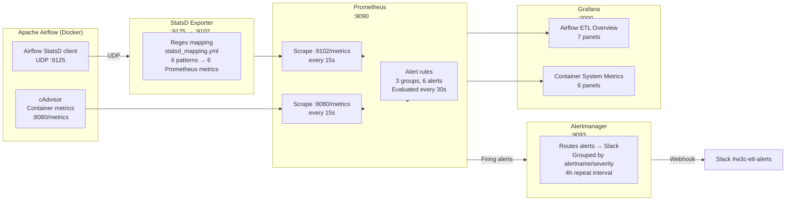
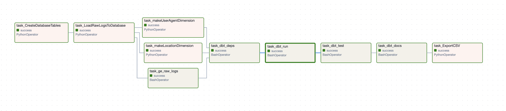
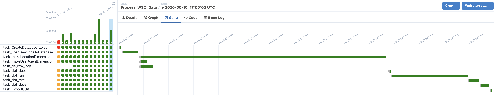
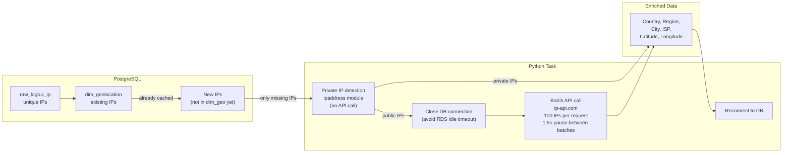
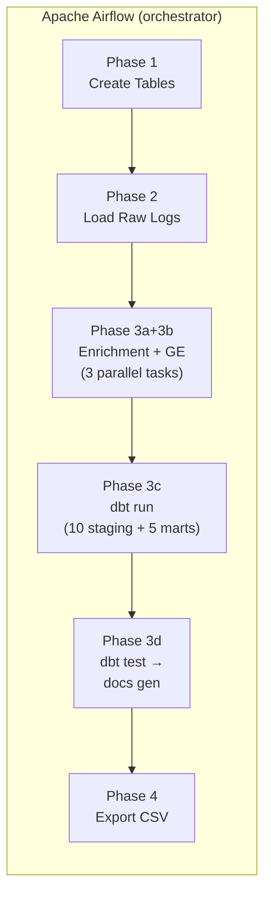
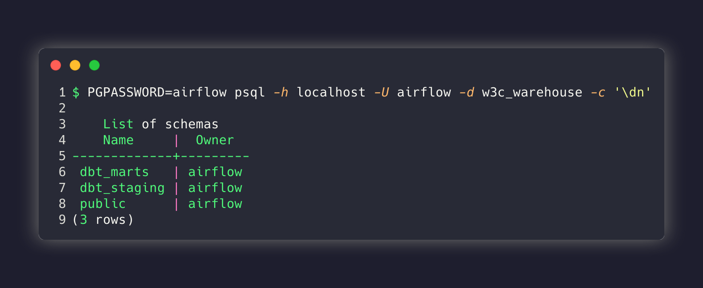
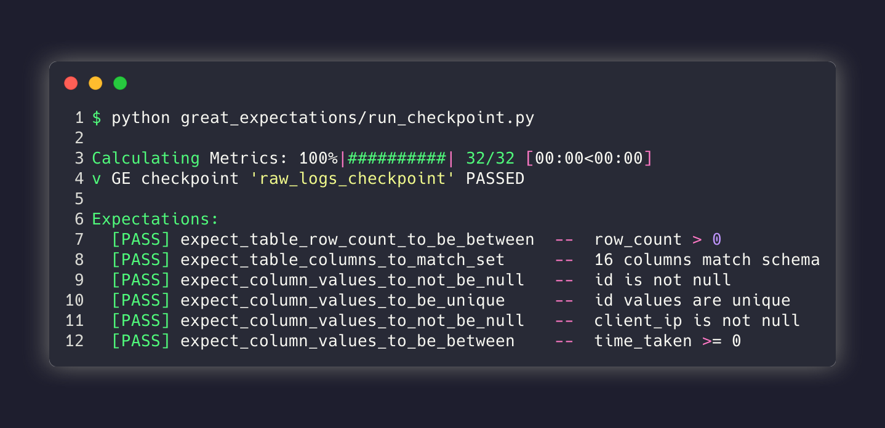

# W3C Web Logs ETL Pipeline

> Fully automated ELT pipeline ingesting IIS W3C web server logs into a star schema on AWS RDS PostgreSQL, orchestrated by Apache Airflow with a hybrid Airflow + dbt transformation layer (2 Airflow-managed dims, 10 dbt-managed staging models + 5 dbt-managed mart models). Includes Great Expectations data quality gating and schema-isolated dbt layers (dbt_staging, dbt_marts). Surfaced via a live 7-page Power BI dashboard, refreshed automatically every Friday via Power Automate with success/failure email alerting.

<p align="center">
  
  
  
  
  
  
  
  
  
</p>

---

## Table of Contents

- [Architecture Overview](#architecture-overview)
- [Engineering Highlights](#engineering-highlights)
- [Key Metrics at a Glance](#key-metrics-at-a-glance)
- [Demos](#demos)
- [Deep Dives](#deep-dives)
  - [Data Flow & Pipeline Architecture](#data-flow--pipeline-architecture)
  - [Star Schema](#star-schema)
  - [dbt Integration](#dbt-integration)
  - [Great Expectations](#great-expectations)
  - [Monitoring Stack](#monitoring-stack)
- [Design Decisions](#design-decisions)
- [Features](#features)
- [Quick Start](#quick-start)
- [Tech Stack](#tech-stack)
- [Related Projects](#related-projects)

## Engineering Highlights

| Area | Decision | Why |
|---|---|---|
| **ETL framework** | Airflow with explicit parallel fan-out | 3 enrichment tasks (geo, UA, GE) run concurrently; single DAG definition handles all sources |
| **Data modeling** | dbt with star schema | 15 models (10 staging + 5 marts) across 3 isolated schemas; full-refresh dimensions |
| **Data quality** | Great Expectations (6) + dbt tests (~72) | GE gates raw_logs; dbt enforces uniqueness & referential integrity across 15 models |
| **Visualization** | Power BI on dedicated dataset | DAX measures computed in-memory, direct query for drill-through |
| **Container strategy** | Docker Compose for full stack | Postgres, Airflow, monitoring - 11 containers, single-command lifecycle |
| **Testing** | dbt test + Great Expectations | Pipeline gates: failing data quality → no load |

## Key Metrics at a Glance

| Metric | Value |
|---|---|
| Web log entries processed | 155,570 (93 .log files, 2009–2011) |
| Dimension tables | 10 |
| Fact tables | 1 (plus 5 mart aggregates) |
| dbt models | 15 (10 staging + 5 marts) |
| Great Expectations | 6 expectations |
| Star schema tables | 12+ |
| Pipeline runtime (full load) | ~1–2 min (first run), ~30 s (subsequent) |
| Power BI measures | 25+ DAX formulas across 7 pages |

---

## Architecture Overview

```mermaid
flowchart LR
    source["IIS W3C log files<br/>Stored in LogFiles/"]
    
    subgraph airflow["Apache Airflow (Docker)"]
        direction TB
        dag["Weekly pipeline<br/>Friday, 5:00 PM"]
        step1["Phase 1<br/>Create tables"]
        step2["Phase 2<br/>Load raw logs"]
        step3a["Phase 3a<br/>Airflow enrichment<br/>geo, UA"]
        step3b["Phase 3b<br/>Great Expectations<br/>raw_logs validation"]
        step5["Phase 3c<br/>dbt transformation<br/>10 staging + 5 marts"]
        step6["Phase 3d<br/>dbt test + docs"]
        step7["Phase 4<br/>Export CSVs"]
    end
    
    subgraph warehouse["AWS RDS PostgreSQL"]
        raw["raw_logs staging table<br/>155,570 rows<br/>(public schema)"]
        ge_dim["dim_geolocation<br/>dim_useragent<br/>(public schema)"]
        dbt_staging_schema["dbt_staging schema<br/>10 models<br/>dims + fact + crawler_ips<br/>+ dim_visitortype"]
        dbt_marts_schema["dbt_marts schema<br/>5 models<br/>aggregated analytics"]
    end
    
    powerbi["Power BI dashboard<br/>7 pages · Friday refresh"]
    automation["Power Automate<br/>Triggers refresh<br/>Emails on completion"]

    source -->|93 .log files| dag --> step1 --> step2 --> raw
    raw --> step3a --> ge_dim
    raw --> step3b
    step3a --> step5
    step3b --> step5
    ge_dim --> step5
    step5 --> dbt_staging_schema
    dbt_staging_schema --> dbt_marts_schema
    step5 --> step6
    step6 --> step7
    dbt_staging_schema --> step7
    dbt_marts_schema --> step7
    step7 -->|CSV export<br/>17 files, ~14 MB| powerbi
    automation --> powerbi
```



### Monitoring Stack



---

## Demos

**Live dashboard:** [→ Open Power BI Dashboard](https://app.powerbi.com/reportEmbed?reportId=41d525b8-b808-4750-88ba-cb31dbbba958&autoAuth=true&ctid=ae323139-093a-4d2a-81a6-5d334bcd9019&actionBarEnabled=true)

**Video walkthrough:** [→ Full Pipeline Demo](https://dmail-my.sharepoint.com/:v:/g/personal/2571642_dundee_ac_uk/IQDarKYb4S4bTp1CU2mwRNHqAd4DaKYajEdvCQ7YxxTk3no?e=A77Xws) - filmed before Grafana, Prometheus, and the container monitoring stack were added; covers AWS, Airflow, Power Automate, and Power BI. (dbt integration and monitoring were added after the video was made.)

### Traffic Overview - 62% human, 38% crawler split over 2009-2011

> Power BI dashboard showing the breakdown of human vs automated crawler traffic across the full 2009-2011 dataset. The donut chart visualizes 62% human traffic and 38% crawler traffic derived from user-agent analysis and robots.txt requests. Filterable by date range to observe crawler activity trends over time.


### File Access - Top pages, file types, and 404 distribution

> Power BI dashboard showing top requested pages, file type distribution, and 404 error analysis across the dataset. The treemap visualizes the most accessed URIs while the 404 panel highlights that 9.7% of all requests resulted in not-found errors, identifying broken links and missing resources.


### Server Performance - Average vs P95 response time with slowest files

> Power BI server performance dashboard comparing average response time (4.5 ms) against P95 latency (1.1 s) across all requests. The slowest files analysis identifies performance bottlenecks, with drill-through capability to investigate individual page load times and identify optimization candidates.


### Geographic Distribution - 78 countries from ip-api.com geo-enrichment

> Power BI geographic dashboard showing the worldwide distribution of website visitors across 78 countries, enriched via ip-api.com batch geolocation. The map visualization clusters traffic by country with bubble size representing request volume, enabling regional traffic pattern analysis.


### Temporal Patterns - Hour-by-day traffic matrix with Monday peaks

> Power BI temporal analysis dashboard showing an hour-by-day traffic matrix heatmap, with peak activity reaching 33K requests on Mondays. The dual-axis chart overlays daily request volume against day-of-week to reveal weekly seasonality patterns in the 2009-2011 dataset.


### Visitors - Browser, OS, device type, and visit frequency breakdown

> Power BI visitor analytics dashboard breaking down traffic by browser, operating system, device type (desktop vs mobile), and visit frequency cohorts. The treemap shows browser market share while the visit frequency histogram reveals whether users are one-time visitors or repeat visitors across the dataset.


### Summary - KPI cards with business interpretation of key findings

> Power BI summary page consolidating all key findings into KPI cards and business-friendly visualizations. Metrics include total requests, unique visitors, crawler percentage, average response time, and top-level interpretations of what the data means for site performance and user behavior.


### Airflow DAG - 3-way parallel fan-out pipeline

> Apache Airflow DAG graph showing the Process_W3C_Data pipeline with 3-way parallel fan-out during Phase 3: geo-IP enrichment, user-agent parsing, and Great Expectations validation run concurrently. After all three complete, dbt transformation and CSV export execute sequentially, completing the full ELT pipeline.



### Gantt Chart - Task-level execution timeline

> Airflow Gantt chart showing the task-level execution timeline of the pipeline. Parallel enrichment tasks (geo, UA, GE) run simultaneously in ~15 seconds, followed by sequential dbt run (~35 seconds), dbt test (~25 seconds), and CSV export (~10 seconds), with total runtime under 2 minutes.



---

## Deep Dives

---

## Data Flow & Pipeline Architecture

### What Happens in Each Phase

The DAG (`Process_W3C_Data`) executes 6 phases:

| Phase | Task(s) | What happens | Why it matters |
|---|---|---|---|
| **1** | `CreateDatabaseTables` | DDL: CREATE TABLE IF NOT EXISTS for raw_logs, Airflow-managed dims | Idempotent - safe to re-run; handles already-existing tables gracefully |
| **2** | `LoadRawLogsToDatabase` | Scans `data/LogFiles/`, detects dual-format (14/18 column), bulk-inserts via `execute_values` | Full 155K row load in seconds. Deduplicates by filename. This is the **E** in ELT |
| **3a+3b** | Airflow enrichment (2 tasks) + GE (1 task) - **3 parallel tasks** | Geo-IP lookup, user-agent parsing, and Great Expectations `raw_logs` validation all run in parallel against `raw_logs` | Tasks needing Python libraries or external APIs stay in Airflow. GE gate catches corrupt data early - all 3 must pass before dbt |
| **3c** | `task_dbt_deps` (gated) → `task_dbt_run` | Install dbt packages, then build 10 staging models (8 dimensions + fact_webrequest + crawler_ips) in `dbt_staging` + 5 mart models in `dbt_marts` | Schema-isolated transformation. 15 models built via single `dbt run` |
| **3d** | `task_dbt_test` + `task_dbt_docs` | dbt runs ~72 data tests (generic + singular); generates docs site with lineage graph | Automated quality gates. Lineage docs for downstream consumers |
| **4** | `ExportCSVs` | COPY ... TO '/data/Star-Schema/' for all dbt_staging + dbt_marts + public tables | Delivers to downstream BI; idempotent overwrite |

The IIS log format changed between 2009 and 2011 - some files have 14 data columns, others have 18. The parser detects this per-file via the `#Fields:` header line and selects the correct parsing path. Files are deduplicated by filename so re-runs are safe.

### Hybrid Airflow + dbt Transformation


**Hybrid approach**: Airflow handles tasks needing Python libraries or external API calls (geo-IP lookup via ip-api.com, user-agent parsing via `user-agents`). dbt handles everything that's pure SQL - date, time, page, status, method, referrer, visit_bucket dimensions, crawler IPs, visitor type - plus the fact table join. Great Expectations gates raw data quality before dbt. Five mart models provide pre-aggregated analytics for BI consumption.

### Geolocation Enrichment Design



---

## Star Schema


### Dimension Tables

| Table | Schema | Managed by | Key field |
| --- | --- | --- | --- |
| `fact_webrequest` | `dbt_staging` | dbt | `raw_log_id` |
| `dim_date` | `dbt_staging` | dbt | `date_sk` (YYYYMMDD) |
| `dim_time` | `dbt_staging` | dbt | `time_sk` (HHMM) |
| `dim_page` | `dbt_staging` | dbt | `page_sk` |
| `dim_method` | `dbt_staging` | dbt | `method_sk` |
| `dim_status` | `dbt_staging` | dbt | `status_sk` |
| `dim_referrer` | `dbt_staging` | dbt | `referrer_sk` |
| `dim_visit_buckets` | `dbt_staging` | dbt | `visit_bucket_sk` |
| `dim_visitortype` | `dbt_staging` | dbt | `visitor_sk` |
| `crawler_ips` | `dbt_staging` | dbt | `ip` (PK) |
| `dim_geolocation`* | `public` | Airflow | `geolocation_sk` |
| `dim_useragent`* | `public` | Airflow | `user_agent_sk` |
| `mart_page_performance` | `dbt_marts` | dbt | - |
| `mart_daily_aggregates` | `dbt_marts` | dbt | `date_sk` |
| `mart_crawler_analysis` | `dbt_marts` | dbt | `date_sk` |
| `mart_timeofday_analysis` | `dbt_marts` | dbt | - |
| `mart_browser_analysis` | `dbt_marts` | dbt | - |

*\* = Airflow-managed enrichment dimensions; LEFT JOIN + COALESCE(-1) in fact table*

---

## dbt Integration

Pipeline integrates **dbt** as the transformation layer for 10 staging models (8 dimensions + fact_webrequest + crawler_ips) in `dbt_staging`, plus 5 mart models in `dbt_marts` (15 models total). Airflow retains 2 enrichment tasks that require external APIs or Python libraries.

### Why dbt

| Benefit | Before (pure Python) | After (dbt) |
| --- | --- | --- |
| **Testing** | None | ~72 data tests - generic + singular |
| **Documentation** | README only | Auto-generated column-level docs with lineage graph |
| **SQL transparency** | Buried in Python f-strings | Declarative `.sql` files, Jinja-templated |
| **Dependency management** | Airflow fan-in choreography | dbt `ref()` macros resolve DAG automatically |
| **Materialization** | `INSERT ... ON CONFLICT` | 14 tables (full refresh) + fact_webrequest (incremental) |

### Architecture



### Model Summary

**Staging Models** (`dbt_staging` schema):

| Model | Source | Key Logic |
| --- | --- | --- |
| `dim_date` | `raw_logs.log_date` | DISTINCT dates, `YYYYMMDD` key, UK holidays, weekend/weekday flags |
| `dim_time` | `generate_series` | 1440 minutes, time_band (Early Morning / Morning / Afternoon / Evening) |
| `dim_page` | `raw_logs.uri_stem` | DISTINCT (page_path, query_string), directory, file_name, extension, category |
| `dim_status` | `raw_logs.status` triples | DISTINCT status codes, severity (Info/Warning/Error/Critical) |
| `dim_method` | `raw_logs.method` | DISTINCT methods, `is_safe` flag |
| `dim_referrer` | `raw_logs.referrer` | DISTINCT URLs, domain, traffic_source classification |
| `dim_visit_buckets` | Static values | 6 visit frequency buckets (1 Visit – 51+ Visits) |
| `dim_visitortype` | Static values | 3 types: Human / Crawler / Unknown (migrated from Airflow) |
| `crawler_ips` | `raw_logs` | IPs requesting robots.txt (migrated from Airflow) |
| `fact_webrequest` | All dims + `raw_logs` | INNER JOIN to 7 dbt dims + LEFT JOIN to 2 Airflow dims; 5 computed columns; incremental materialization |

**Mart Models** (`dbt_marts` schema):

| Model | Key Logic |
|---|---|
| `mart_page_performance` | Page-level: avg/P95 time_taken, unique hosts, 404 rate per page_path |
| `mart_daily_aggregates` | Daily: unique hosts/pages/countries, P95 latency, crawler/direct traffic share |
| `mart_crawler_analysis` | Crawler-only: distinct hosts, avg/max latency, bytes/req, error rate |
| `mart_timeofday_analysis` | Hourly breakdown: reqs, P95, 404/crawler/slow rates by time_band |
| `mart_browser_analysis` | Browser/OS/device: traffic share, desktop vs mobile, daily rank |

### Verification

**dbt Lineage Graph - 15 models across source, staging, and mart layers**

> Auto-generated dbt lineage graph from dbt docs generate showing the complete model DAG. 3 data sources (green) feed into 9 staging dimensions (blue) plus fact_webrequest (orange), with 2 Airflow-managed dims (purple) joining at the fact table. 5 mart models (teal) aggregate from the fact table. Edges represent ref() dependencies resolved automatically by dbt.


*Generated from `dbt docs generate` - shows the complete dbt DAG: 3 data sources (green), 9 staging dimensions (blue), 2 Airflow-managed dims (purple), fact_webrequest (orange), 5 mart models (teal).*

**dbt Test Results - ~72 passing tests across generic and singular suites**

> Full dbt test output showing all ~72 data tests passing after a dbt run. Generic tests (uniqueness, not-null, relationships) enforce column-level constraints defined in schema.yml and sources.yml. Singular tests validate cross-table referential integrity, dimension coverage, and row count consistency. Tests run automatically after every dbt run via Airflow's task_dbt_test operator.


*All ~72 dbt tests pass - generic (uniqueness, not-null, relationships) and singular tests (referential integrity, dimension coverage). Run after every `dbt run`.*

### Schema Isolation

| Schema | Purpose | Models |
|---|---|---|
| `public` | Airflow-managed (raw_logs, geo, UA) | 3 tables |
| `dbt_staging` | Core warehouse star schema | 10 models |
| `dbt_marts` | Pre-aggregated analytics for BI | 5 mart models |

**Schema Isolation - public, dbt_staging, and dbt_marts layers**

> Three-schema architecture visualized: public schema holds Airflow-managed raw_logs and enrichment dimensions, dbt_staging contains the core star schema (10 models: dimensions plus fact_webrequest), and dbt_marts provides pre-aggregated analytics (5 models). This isolation prevents namespace collisions and enables schema-level access control for different consuming applications.



---

## Great Expectations

A **Great Expectations v1.x** quality gate validates `raw_logs` before dbt transformation. It runs as an **ephemeral context** - no config files - connecting directly to PostgreSQL via `run_checkpoint.py`.

| Expectation | Checks |
|---|---|
| `expect_table_row_count_to_be_between` | Row count > 0 |
| `expect_table_columns_to_match_set` | 16 specific columns present |
| `expect_column_values_to_not_be_null` | `id` is not null |
| `expect_column_values_to_be_unique` | `id` values are unique |
| `expect_column_values_to_not_be_null` | `client_ip` is not null |
| `expect_column_values_to_be_between` | `time_taken` >= 0 |

GE runs in **parallel** with Airflow enrichment tasks during Phase 3a+3b - all 3 must pass before dbt proceeds.

**Great Expectations Validation - 6 passing expectations on raw_logs**

> Great Expectations v1.x validation results showing all 6 expectations passing against the raw_logs staging table. Validates row count > 0, column set matches expected schema, id is unique and not null, client_ip is not null, and time_taken is non-negative. Runs as an ephemeral context in parallel with Airflow enrichment tasks - all three must pass before dbt proceeds.



```bash
# Manual run (requires same env vars as dbt):
python airflow/great_expectations/run_checkpoint.py
```

---

## Monitoring Stack

Complete observability stack running locally alongside Airflow via Docker Compose - no external services required.

| Component | Role | Port | Key Detail |
|---|---|---|---|
| **Airflow StatsD** | Emits timing/counter/gauge metrics | UDP :9125 | Airflow 2.10.2 core metrics |
| **statsd-exporter** | StatsD → Prometheus format | :9102 | 6 regex mapping patterns |
| **cAdvisor** | Per-container CPU, memory, network, disk | :8080 | All 10 Docker containers |
| **Prometheus** | Time-series DB, 15s scrape, 30s alert eval | :9090 | 90-day retention |
| **Alertmanager** | Dedup/grouping → Slack webhook | :9093 | 4h repeat, resolved notifications |
| **Grafana** | Auto-provisioned datasource + dashboards | :3000 | Login: `admin`/`admin` |

**Dashboards:**
- **Airflow ETL Overview** - 7 panels: DAG runs, task instances, completion rate, avg duration (top 10), CPU/memory per container, daily run count
- **Container System Metrics** - 6 panels: CPU, memory, network I/O, filesystem I/O, uptime

**Alert Rules** (6 alerts, evaluated every 30s): DAG failure rate, task failure rate, container restarts, high CPU (>80%), high memory (>85%), Prometheus target missing. All routed to Slack **#w3c-etl-alerts** via Alertmanager.

**Grafana ETL Dashboard - 7 panels with Airflow performance and container metrics**

> The Airflow ETL Overview dashboard in Grafana, auto-provisioned with Prometheus as the datasource. Displays 7 panels: DAG run status and duration, task instance success/failure rates, pipeline completion rate, average task duration (top 10), CPU and memory usage per container, and daily run count over a configurable time range. All panels update every 15s from Prometheus scrapes.


**Prometheus Targets - All 4 scrape endpoints healthy**

> Prometheus targets page showing all configured scrape endpoints healthy: statsd-exporter (:9102) for Airflow metrics, cAdvisor (:8080) for container metrics, and Prometheus itself. Green status indicates metrics collection is working correctly with no scrape failures. The 15s scrape interval ensures near real-time monitoring data.


---

## Features

| Feature | What it does | Why it matters |
|---|---|---|---|
| **dbt documentation** | Auto-generated docs + lineage graph | Trace any fact metric back to source column |
| **Schema isolation** | 3 schemas: public, dbt_staging, dbt_marts | Clear separation of concerns; no namespace collisions |
| **Hybrid enrichment** | Airflow for API tasks, dbt for SQL | Best tool for each job |
| **Filename dedup** | Skips already-loaded files on re-run | Safe to re-trigger, no duplicates |
| **Power Automate emails** | Success/failure emails after Friday refresh | Every outcome is notified |
| **Parallel execution** | 3 tasks (geo, UA, GE) run concurrently | Cuts wall-clock time vs sequential |
| **Dual-format detection** | Auto-detects 14 vs 18 column IIS log format | Handles format change across 2009–2011 dataset |

---

## Design Decisions

- **ELT over ETL**: Raw logs load with zero transformation. *Why:* Preserves audit trail - re-run Phase 3 without re-ingesting if dimension logic changes.
- **Hybrid parallel build**: 2 Airflow enrichment tasks + 1 GE gate run in parallel; 7 dbt models build dimensions. *Why:* Best tool for each job - Airflow for Python/API, dbt for declarative SQL with auto-testing.
- **INNER JOIN for dbt dims, LEFT JOIN for Airflow dims**: dbt dims have 100% referential integrity (same source). Airflow dims use LEFT JOIN + COALESCE(-1) for API failures. *Why:* No records dropped; verified zero -1 orphans for dbt dims.
- **Filename deduplication**: Skips already-loaded files via `SELECT DISTINCT source_file`. *Why:* Idempotent - safe to re-run without duplicates.
- **Connection management**: Closes DB connection before ip-api.com batch calls, reconnects after. *Why:* AWS RDS drops idle connections during long API batches.
- **IP caching**: Only queries IPs not yet in `dim_geolocation`. *Why:* Cuts API calls ~60% on re-runs; avoids free-tier rate limit.
- **Dual-format IIS detection**: Reads `#Fields:` per-file to detect 14 vs 18 column format. *Why:* Dataset spans 2009–2011 IIS format change.
- **AWS RDS with local fallback**: Local Docker Postgres by default; RDS via env vars. *Why:* Zero code changes between dev and production.

---

## Quick Start

### Quick Start

```bash
git clone https://github.com/AhmedIkram05/w3c-etl-pipeline.git
cd W3C-ETL-Pipeline
cp airflow/.env.example airflow/.env
make build          # Build Airflow Docker image (cached pip layer)
make up             # Start all 11 containers
```

Wait for services to become healthy (`make ps`), then access:

| Service | URL | Credentials |
|---|---|---|
| Airflow | http://localhost:8080 | `airflow` / `airflow` |
| Grafana | http://localhost:3000 | `admin` / `admin` |
| Prometheus | http://localhost:9090 | - |
| cAdvisor | http://localhost:8081 | - |

### Trigger

The DAG runs automatically every Friday at 5:00 PM - a Power Automate flow then triggers the Power BI dataset refresh and sends success/failure confirmation emails.

**Power Automate Flow - Friday 5:30 PM refresh trigger with email notifications**

> The automated Power Automate flow that triggers the Power BI dataset refresh every Friday at 5:30 PM, after the Airflow DAG completes. The flow sends a success confirmation email on completion or a failure notification with error details if the refresh fails. Configured with retry logic and alert routing to the project team.


To trigger immediately:

```bash
docker exec airflow-airflow-scheduler-1 airflow dags trigger Process_W3C_Data
# or via Apache Airflow on localhost:8080
```

The pipeline includes 93 sample `.log` files (`airflow/data/LogFiles/`, ~155K HTTP requests, 2009–2011). After the DAG completes (~1–2 min first run, ~30 s subsequent), open Grafana at `localhost:3000` to see ETL metrics.

```bash
make test-e2e     # End-to-end: resets DB, triggers DAG, monitors, verifies results
```

---

## Tech Stack

| Layer | Technology | Purpose |
|---|---|---|
| **Orchestration** | Apache Airflow 2.10.2 | DAG with fan-out/fan-in, 5-phase execution |
| **Database** | PostgreSQL 13/14 on AWS RDS (local Docker 13 fallback) | Star schema warehouse + raw staging |
| **Transformation** | dbt 1.8 + Python 3.12, psycopg2 `execute_values` | 10 staging + 5 mart models; ~72 tests; schema-isolated |
| **Data Quality** | Great Expectations 1.x | 6 expectations on raw_logs; ephemeral context |
| **Geolocation** | ip-api.com batch API | IP-to-location with rate-limit awareness |
| **User Agent** | `user-agents` library | Browser, OS, device type extraction |
| **Visualization** | Microsoft Power BI | 7-page dashboard, direct RDS connection |
| **Refresh Automation** | Power Automate | Weekly Friday 5:30 PM refresh, success/failure emails |
| **Monitoring** | StatsD → statsd-exporter → Prometheus → Grafana | Airflow metrics + container monitoring |
| **Alerting** | Prometheus → Alertmanager → Slack | 6 alert rules, 30s evaluation, 4h repeat |
| **Local Orchestration** | Docker Compose V2, Makefile | 11-container stack, single-command lifecycle |

---

## Related Projects

- [ATM Log Aggregation & Diagnostics Platform](https://github.com/AhmedIkram05/laad) - Production data engineering system with RAG diagnostic assistant. Features log ingestion, vector embeddings, semantic search, and an LLM-powered incident analysis chatbot.
- [CineMatch Recommendation System](https://github.com/AhmedIkram05/movie-recommendation-system) - Hybrid ML recommendation engine combining collaborative filtering with BERT-based content embeddings. Full MLOps pipeline with MLflow tracking.
- [DevSync - Project Tracker with GitHub Integration](https://github.com/AhmedIkram05/DevSync) - Full-stack cloud application with 541 automated tests, GitHub Actions CI/CD, and comprehensive test coverage.
