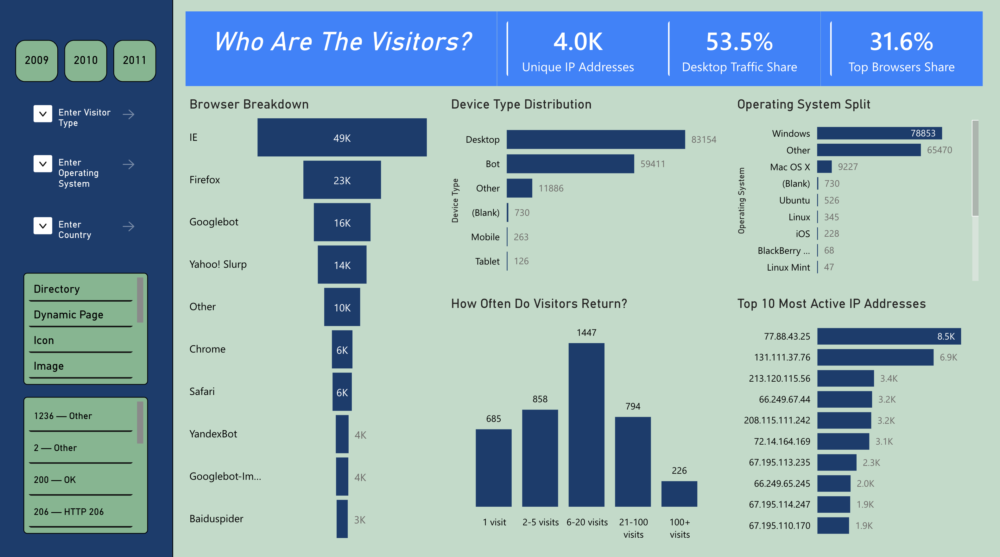
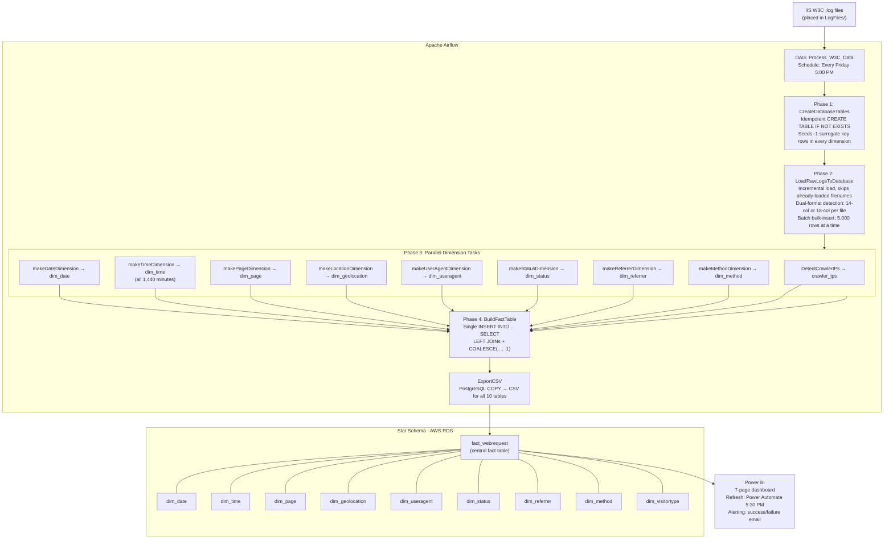
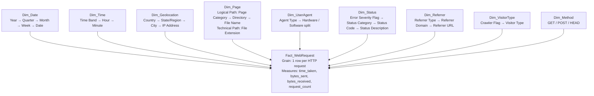

# W3C Web Logs ETL Pipeline

> Fully automated ELT pipeline ingesting IIS W3C web server logs into a 9-dimension Star Schema on AWS RDS PostgreSQL, orchestrated by Apache Airflow with a 9-way parallel fan-out architecture. Surfaced via a 7-page Power BI dashboard, refreshed automatically every Friday via Power Automate with success/failure email alerting.

<p align="center">
  
  
  
  
  
</p>

---

## Live Dashboard

**[→ Open Power BI Dashboard](https://app.powerbi.com/reportEmbed?reportId=41d525b8-b808-4750-88ba-cb31dbbba958&autoAuth=true&ctid=ae323139-093a-4d2a-81a6-5d334bcd9019&actionBarEnabled=true)**

**[→ Full Pipeline Video Walkthrough](https://dmail-my.sharepoint.com/:v:/g/personal/2571642_dundee_ac_uk/IQDarKYb4S4bTp1CU2mwRNHqAd4DaKYajEdvCQ7YxxTk3no?e=A77Xws)**

---

## Dashboard Screenshots

### Traffic Overview - Human vs crawler split (62% human / 38% crawler), trend over 2009–2011


### File Access & Errors - Top pages, file type breakdown, 404 error distribution (9.7% of all requests)


### Server Performance - Average response time vs P95 (4.5ms avg / 1.1s P95), slowest files identified


### Geographic Distribution - 78 countries reached, US and UK dominating, via ip-api.com geolocation enrichment
 

### Temporal Patterns - Hour-by-day traffic matrix, Monday peaks at 33,000 requests, Saturday morning as lowest-risk maintenance window


### Visitor Analysis - Browser, OS, device type breakdown; visit frequency cohort analysis


### Executive Summary - KPI cards with written business interpretation of each key finding


### Airflow DAG graph view - 9-way parallel fan-out clearly visible in the dimension build phase


---

## Architecture



---

## Design Decisions

**ELT over ETL — stage raw data first**
Raw log lines are loaded into `raw_logs` with no transformation. Dimensions and the fact table are then built from `raw_logs` in-database via SQL. This means the full audit trail is always preserved, and transformation logic can be changed and re-run without re-ingesting source files. If a dimension query changes, `raw_logs` is the source of truth — no data is lost.

**9-way parallel dimension build — 8× faster than sequential**
All nine dimension tasks read independently from `raw_logs` and write to isolated tables with no inter-task dependencies. The fact table build uses a fan-in dependency on all nine - it runs only after every dimension is complete. Running dimensions sequentially would have made phase 3 approximately 8× slower with no correctness benefit.

**−1 surrogate key rows in every dimension**
Every dimension table contains a default `-1` row representing unknown or unmatched values. The fact table uses `LEFT JOIN` + `COALESCE(foreign_key, -1)` throughout. This ensures zero raw log records are ever dropped from the fact table due to a failed dimension join. A standard `INNER JOIN` approach would silently exclude records - unacceptable in an audit-grade data warehouse. `NULL` foreign keys would also be excluded from Power BI aggregations, producing incorrect totals.

**Incremental loading with filename deduplication**
`LoadRawLogsToDatabase` queries `SELECT DISTINCT source_file FROM raw_logs` before processing and skips any file already loaded. This makes every pipeline run idempotent - safe to re-run on the same input without creating duplicate records. The same `ON CONFLICT DO NOTHING` pattern is applied to all dimension inserts, making dimension builds idempotent too.

**Dual-format IIS log detection per file**
IIS log format changed over time — the dataset contains both 14-column and 18-column formats. Rather than assuming a fixed schema, the parser reads the `#Fields:` header line from each file and selects the appropriate parsing path. Files with unrecognised field counts are skipped with a warning rather than crashing the pipeline.

**Connection closed before geolocation API calls**
`makeLocationDimension` explicitly closes the database connection before calling the ip-api.com batch API, then reconnects for the insert phase. AWS RDS drops idle connections after a configurable timeout — a long-running API batch (hundreds of IPs × 1.5s pausing) would cause an `OperationalError` on the subsequent insert if the connection were held open. Closing early and reconnecting after the API phase avoids this. Three retry attempts with exponential backoff handle transient reconnection failures.

**IP caching — no repeat API calls**
Before calling ip-api.com, `makeLocationDimension` queries existing IPs in `dim_geolocation` and only requests lookups for IPs not already enriched. This makes repeat runs fast and avoids burning the free-tier rate limit (45 requests/minute) on data already in the warehouse.

**Private IP short-circuiting**
Private, link-local, and loopback addresses are detected using Python's `ipaddress` stdlib module (not fragile string-prefix matching) and resolved locally as `"Private Network"` without any API call. This is both more correct (handles IPv6) and avoids sending internal infrastructure IPs to a third-party API.

**AWS RDS over local Docker PostgreSQL**
PostgreSQL is hosted on AWS RDS for managed backups, automatic failover, and network accessibility from anywhere. All credentials are passed via environment variables (`W3C_DB_HOST`, `W3C_DB_NAME`, `W3C_DB_USER`, `W3C_DB_PASS`) - never hardcoded. The same DAG targets a local Docker Postgres by default if RDS variables are not set, making local development straightforward.

**Power Automate failure handling**
Most automated pipelines handle only the success path. Power Automate is configured with a switch action that checks the refresh status and fires either a success confirmation or a failure notification email after every Friday run. No outcome goes unnoticed — no manual checking required.

---

## Sun Model Diagram



| Table | Rows (approx) | Key field |
|---|---|---|
| `fact_webrequest` | ~120,000 | `raw_log_id` (unique, links to staging) |
| `dim_date` | ~800 | `date_sk` (YYYYMMDD integer) |
| `dim_time` | 1,440 | `time_sk` (HHMM integer, pre-populated) |
| `dim_geolocation` | ~2,000 | `ip` (unique, cached) |
| `dim_page` | ~500 | `(page_path, query_string)` composite unique |
| `dim_useragent` | ~300 | `user_agent` (unique) |
| `dim_status` | ~30 | `(status_code, sub_status, win32_status)` composite |
| `dim_referrer` | ~400 | `referrer_url` (unique) |
| `dim_method` | ~7 | `method_name` (unique) |
| `dim_visitortype` | 3 | Static: Human / Crawler / Unknown |

---

## Dashboard Pages

| Page | Business question answered |
|---|---|
| **Who's Hitting the Site?** | Human vs crawler traffic split (62/38%), trend 2009–2011 |
| **What Are People Accessing?** | Top pages, file types, 404 errors (9.7% of all requests), broken URLs |
| **How Fast Is the Server?** | Avg response time (4.5ms), P95 (1.1s via DAX), slowest files identified |
| **Where Are Visitors Coming From?** | Geographic breakdown (78 countries), referrer source classification |
| **When Is the Site Busiest?** | Hour-by-day traffic matrix, peak periods, Saturday morning as maintenance window |
| **Who Are the Visitors?** | Browser, OS, device type, visit frequency cohort analysis |
| **At a Glance** | Executive KPI summary with written business interpretation |

---

## Getting Started

### Prerequisites

- Docker + Docker Compose (for Airflow)
- Python 3.8+
- AWS RDS PostgreSQL instance (or local Docker Postgres)

### 1. Clone and install

```bash
git clone https://github.com/AhmedIkram05/W3C-ETL-Pipeline.git
cd W3C-ETL-Pipeline
pip install apache-airflow psycopg2-binary requests user-agents holidays
```

### 2. Configure environment variables

```bash
# For AWS RDS
export W3C_USE_RDS=true
export W3C_DB_HOST=<your-rds-endpoint>
export W3C_DB_PORT=5432
export W3C_DB_NAME=w3c-warehouse
export W3C_DB_USER=<username>
export W3C_DB_PASS=<password>
```

Defaults target a local Docker Postgres (`host=postgres`, `db=w3c_warehouse`) if RDS variables are not set.

### 3. Place log files

Drop `.log` files into the `LogFiles/` directory. The pipeline detects and processes only new files on each run.

### 4. Trigger the DAG

The DAG (`Process_W3C_Data`) runs automatically every Friday at 5:00 PM. Trigger manually from the Airflow UI or via CLI:

```bash
airflow dags trigger Process_W3C_Data
```

---

## Tech Stack

| Layer | Technology |
|---|---|
| Orchestration | Apache Airflow — DAG with fan-out/fan-in task dependencies |
| Database | PostgreSQL 14 on AWS RDS |
| Transformation | Python 3, psycopg2, `execute_values` batch inserts |
| Geolocation | ip-api.com batch API (100 IPs/request, rate-limit aware) |
| User agent parsing | `user-agents` library (browser, OS, device type) |
| Holiday detection | Python `holidays` library (UK) |
| Visualisation | Microsoft Power BI (direct RDS connection) |
| Refresh automation | Power Automate (5:30 PM Friday, success/failure alerting) |

---

## Related Projects From Me

- [ATM Log Aggregation & Diagnostics Platform](https://github.com/AhmedIkram05/laad) — production data engineering system with RAG diagnostic assistant
- [CineMatch Recommendation System](https://github.com/AhmedIkram05/movie-recommendation-system) — hybrid ML recommendation engine
- [DevSync — Project Tracker with GitHub Integration](https://github.com/AhmedIkram05/DevSync) — full-stack cloud application with 541 automated tests
