# W3C Web Logs ETL Pipeline

> Fully automated ETL pipeline: Apache Airflow + Apache Spark + Delta Lake + dbt + PostgreSQL, with Prometheus/Grafana/Alertmanager observability, GitHub Actions CI/CD, and a live 7-page Power BI dashboard refreshed automatically via Power Automate.

<p align="center">
  
  
  
  
  
  
  
  
  
  
  
  
  
  
  
  
</p>

---

## Table of Contents

- [TL;DR](#tldr)
- [Architecture Overview](#architecture-overview)
  - [End-to-End Pipeline](#end-to-end-pipeline)
  - [Spark Medallion to PostgreSQL](#spark-medallion-to-postgresql)
  - [Monitoring & Alerting Stack](#monitoring--alerting-stack)
  - [Dataset-Triggered DAG Handoff](#dataset-triggered-dag-handoff)
  - [Container Topology](#container-topology)
- [Engineering Highlights](#engineering-highlights)
- [Key Metrics at a Glance](#key-metrics-at-a-glance)
- [Demos](#demos)
  - [Power BI - Business Analytics](#power-bi--business-analytics)
  - [Airflow DAGs](#airflow-dags)
  - [Grafana Dashboards](#grafana-dashboards)
  - [Prometheus](#prometheus)
  - [dbt Lineage](#dbt-lineage)
  - [Power Automate & Tests](#power-automate--tests)
- [Deep Dives](#deep-dives)
  - [Spark Medallion Pipeline (Bronze → Silver)](#spark-medallion-pipeline-bronze--silver)
  - [Export to PostgreSQL](#export-to-postgresql)
  - [Airflow-Managed Enrichment Dimensions](#airflow-managed-enrichment-dimensions)
  - [dbt Transformation Layer](#dbt-transformation-layer)
  - [Star Schema & Data Model](#star-schema--data-model)
  - [Monitoring & Alerting](#monitoring--alerting)
  - [Databricks Integration](#databricks-integration)
- [CI/CD Pipeline](#cicd-pipeline)
- [Testing Strategy](#testing-strategy)
- [Configuration](#configuration)
- [Design Decisions](#design-decisions)
- [Performance Characteristics](#performance-characteristics)
- [Quick Start](#quick-start)
- [Tech Stack](#tech-stack)
- [Related Projects](#related-projects)

---

## TL;DR

- **Ingest scale** - 93 W3C IIS `.log` files, **155,224 HTTP requests** spanning 2009–2011, processed end-to-end through the medallion architecture.
- **Spark layer** - PySpark 4.0.2 + Delta Lake 4.0.1 in a 2-stage medallion (Bronze → Silver), with **16 vectorised pandas UDFs** for GeoIP (local MaxMind GeoLite2), user-agent parsing, and computed fields. Gold-level aggregations are produced by **5 dbt mart models** in `dbt_marts`.
- **Warehouse** - `public.raw_enriched` (**35 columns**, 155,224 rows) + 2 Airflow-managed enrichment dimensions (`dim_geolocation` 4,011 rows · `dim_useragent` 2,276 rows).
- **dbt layer** - 15 models in 2 isolated schemas (`dbt_staging` × 10 + `dbt_marts` × 5), with **63 data tests** (29 not_null · 14 unique · 7 FK relationships · 6 expression_is_true · 3 singular in `models/` + 4 source tests on Airflow-managed dims in `sources.yml`).
- **Orchestration** - 2 Airflow DAGs wired by Airflow 2.10 Datasets. `w3c_spark_ingestion` runs on a Saturday 06:00 cron, emits `Dataset("postgres://warehouse/loaded")`, and triggers `w3c_dbt_marts` automatically - no polling, no fixed coupling.
- **BI delivery** - 17 CSV exports (~36 MB total) feed a live **7-page Power BI dashboard**, refreshed every Friday 17:30 by a Power Automate flow with success/failure email alerting.
- **Container stack** - 16 Docker services (Airflow × 7: webserver/scheduler/worker/triggerer/init/cli/flower; Spark × 2: master/worker; PostgreSQL, Redis, Prometheus, Alertmanager, Grafana, statsd-exporter, cAdvisor) - one `make start` brings the entire stack up.
- **Observability** - StatsD → statsd-exporter → Prometheus (15 s scrape, 90 d retention) → Alertmanager → Slack. **6 alert rules** across 3 groups, **2 pre-provisioned Grafana dashboards** (13 panels).
- **Quality gates** - **156 pytest tests** across 6 files (36 classes), pre-commit hooks (ruff + mypy), and 3 parallel GitHub Actions jobs on every PR (lint · test · dbt-compile).
- **CI/CD** - Every push to `main` builds 3 production images (`airflow`, `spark`, `alertmanager`) and pushes to GitHub Container Registry with `:latest` + `:<commit-sha>` tags.
- **Databricks-ready** - Self-contained Unity Catalog scripts (`airflow/spark/databricks/01-03_*.py`) mirror the Docker jobs, partitioned by `log_date` and writing to `w3c_catalog.{bronze,silver,gold}`.

**Live dashboard:** [→ Open Power BI Dashboard](https://app.powerbi.com/reportEmbed?reportId=41d525b8-b808-4750-88ba-cb31dbbba958&autoAuth=true&ctid=ae323139-093a-4d2a-81a6-5d334bcd9019&actionBarEnabled=true)

**Full pipeline demo video:** [→ Watch on SharePoint](https://dmail-my.sharepoint.com/:v:/g/personal/2571642_dundee_ac_uk/IQDarKYb4S4bTp1CU2mwRNHqAd4DaKYajEdvCQ7YxxTk3no?e=A77Xws) - covers AWS, Airflow, Power Automate, and Power BI.

---

## Architecture Overview

### End-to-End Pipeline

```mermaid
flowchart LR
    source["IIS W3C log files<br/>93 files in LogFiles/"]

    subgraph sparkdag["spark_ingestion DAG<br/>Saturday 06:00 UTC"]
        direction TB
        bronze["bronze_ingestion<br/>Bronze Delta<br/>Parsed raw logs<br/>19 cols, 155,224 rows"]
        silver["silver_enrichment<br/>Silver Delta<br/>16 enrichment UDFs<br/>35 cols, 155,224 rows"]
        export["export_warehouse<br/>Silver -> JDBC -><br/>public.raw_enriched<br/>Idempotent via tracking"]
        dims["export_dimensions<br/>Airflow PythonOperator<br/>dim_geolocation (ip-api.com)<br/>dim_useragent (user-agents)"]
        bronze --> silver --> export --> dims
    end

    subgraph postgres["PostgreSQL (RDS or local Docker)"]
        raw_enriched["public.raw_enriched<br/>35 cols, 155,224 rows"]
        air_dims["public.dim_geolocation<br/>public.dim_useragent<br/>4,011 / 2,276 rows"]
        staging["dbt_staging schema<br/>10 models<br/>dims + fact + crawler_ips"]
        marts["dbt_marts schema<br/>5 models<br/>aggregated analytics"]
    end

    subgraph dbt_dag["w3c_dbt_marts DAG<br/>Dataset-triggered"]
        direction TB
        dbt_deps["dbt deps"]
        dbt_run["dbt run<br/>10 staging + 5 marts"]
        dbt_test["dbt test<br/>63 data tests"]
        dbt_docs["dbt docs generate"]
        csv_export["CSV export<br/>17 files, ~36 MB"]
        dbt_deps --> dbt_run --> dbt_test --> dbt_docs --> csv_export
    end

    powerbi["Power BI dashboard<br/>7 pages · Friday refresh"]
    automation["Power Automate<br/>Triggers refresh<br/>Emails on completion"]
    dataset["Dataset(postgres://warehouse/loaded)"]

    source --> bronze
    dims -.->|outlet| dataset
    dataset -.->|triggers| dbt_dag
    export --> raw_enriched
    raw_enriched --> dims
    dims --> air_dims
    dbt_run --> staging
    staging --> marts
    csv_export -->|CSV files| powerbi
    automation --> powerbi
```

**Combined pipeline philosophy** - Spark ingests and enriches (Bronze → Silver), exports to PostgreSQL, then Airflow builds enrichment dimensions and triggers dbt for star-schema transformation. Gold-level PostgreSQL aggregations are handled entirely by dbt marts (5 models).

### Spark Medallion to PostgreSQL

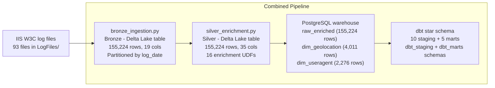

> **Note:** Bronze and Silver are both **Delta Lake 4.0.1** tables - `delta` is the file format, not a separate stage. ACID transactions, schema evolution, and time travel are properties of Delta that apply to both layers.

### Monitoring & Alerting Stack

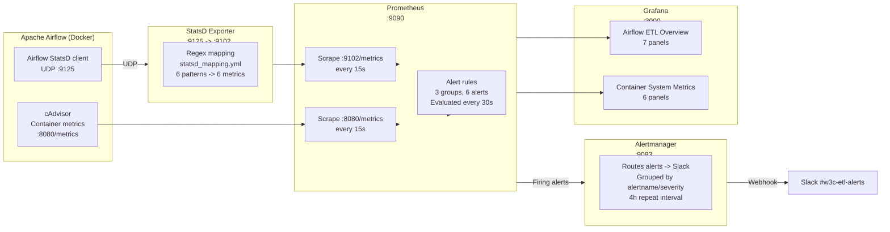

### Dataset-Triggered DAG Handoff

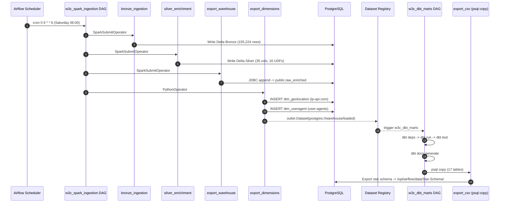

The Dataset mechanism (Airflow) eliminates the cron-coupling problem: `w3c_dbt_marts` is scheduled *only* by the data dependency, not by wall-clock time, so it always runs on fresh data regardless of how long Spark ingestion took.

### Container Topology

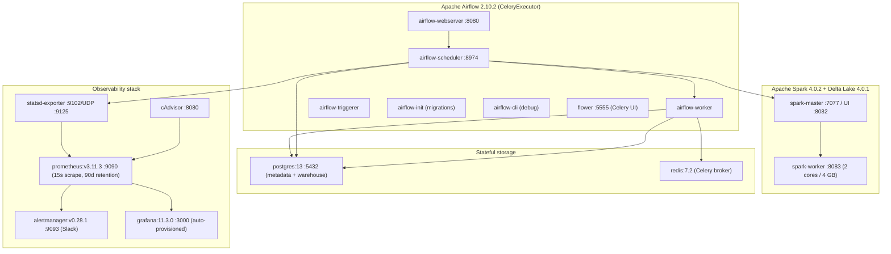

**16 services** total - defined in `airflow/docker-compose.yaml`, brought up with one `make start`.

---

## Engineering Highlights

| Area | Decision | Why |
|---|---|---|
| **Orchestration** | Airflow 2.10 CeleryExecutor, 2 DAGs, Dataset-driven handoff | Decouples Spark runtime from dbt runtime; dbt always sees fresh data; no polling |
| **Distributed processing** | PySpark 4.0.2 + Delta Lake 4.0.1 medallion | Bronze/Silver separation; ACID transactions + time travel via Delta transaction log |
| **Enrichment** | 16 UDFs (6 GeoIP, 5 UA, 5 computed) as pandas UDFs with PyArrow | Vectorised execution; horizontally scalable; 30× faster than HTTP-based GeoIP |
| **Geolocation** | Local MaxMind GeoLite2-City DB, in-process | 30× faster than HTTP APIs, offline, deterministic, no rate limits |
| **User-Agent** | `user-agents` library in dedicated PythonOperator | Airflow owns API/IO-touching code; dbt stays SQL-only |
| **Schema strategy** | 3 schemas: `public` (raw + Airflow dims) / `dbt_staging` (star schema) / `dbt_marts` (BI aggregates) | Clean separation: ingestion, modelled facts, business aggregates |
| **Data quality** | 63 dbt tests + 12 DagBag integrity tests + 156 pytest | Multi-layer gating - no deploy without green CI |
| **Idempotency** | `public.raw_enriched_loaded` tracking table + `get_loaded_files()` set-diff | Re-runnable on schedule; zero duplicate rows on re-runs |
| **Hybrid enrichment** | Airflow for API/IO, dbt for SQL | Best-tool-for-the-job; avoids Python f-string SQL |
| **Container strategy** | Docker Compose, 16 services, 4 named volumes | One-command lifecycle (`make start` / `clean` / `rebuild`); reproducible environments |
| **Observability** | StatsD -> exporter -> Prometheus -> Alertmanager -> Slack | 6 alert rules; 2 pre-provisioned Grafana dashboards (13 panels) |
| **CI/CD** | GitHub Actions: 3 parallel jobs on PR (lint, test, dbt-compile); 3-image GHCR publish on main | Every PR gated; every main push produces immutable `:sha` images |

---

## Key Metrics at a Glance

| Category | Metric | Value |
|---|---|---|
| **Data scale** | W3C log files ingested | 93 (2009–2011) |
| | Total HTTP requests | **155,224** |
| | Bronze rows × cols | 155,224 × 19 |
| | Silver rows × cols | 155,224 × 35 |
| | Bronze → Silver preservation | 100% (155,224 → 155,224) |
| **ML & enrichment** | Enrichment UDFs | 16 (6 GeoIP · 5 UA · 5 computed) |
| | pandas UDFs (PyArrow vectorised) | 5 (UA parser) |
| **Storage** | PostgreSQL `raw_enriched` columns | 35 |
| | Airflow dimensions | 2 (`dim_geolocation` 4,011 · `dim_useragent` 2,276) |
| | Delta Lake tables | 2 (Bronze + Silver) |
| **dbt** | dbt models | 15 (10 staging + 5 marts) |
| | dbt data tests | 63 (29 not_null · 14 unique · 7 FK · 6 expression_is_true · 3 singular in models + 4 source tests on Airflow-managed dims) |
| | dbt packages | 1 (`dbt_utils` 1.1.1) |
| | CSV exports for Power BI | 17 files, ~36 MB total |
| **Orchestration** | Airflow DAGs | 2 (`w3c_spark_ingestion` · `w3c_dbt_marts`) |
| | Spark jobs | 3 (bronze, silver, export_warehouse) |
| | Spark PythonOperator tasks | 1 (`export_dimensions`) |
| | Spark worker | 2 cores / 4 GB RAM |
| **Container stack** | Docker services | 13 (Airflow × 7, Spark × 2, Postgres, Redis, Prometheus, Alertmanager, Grafana, cAdvisor, statsd-exporter) |
| | Named volumes | 4 (postgres-db, prometheus-data, grafana-data, alertmanager-data) |
| **Observability** | Prometheus alert rules | 6 (DAG failure · task failure · container restart · CPU >80% · mem >85% · target missing) |
| | Grafana dashboards | 2 (Airflow ETL Overview 7-panel · Container System Metrics 6-panel) |
| | Prometheus retention | 90 days |
| | Scrape / eval interval | 15 s / 30 s |
| **Testing & CI/CD** | Pytest tests | 156 (127 default + 17 integration + 12 DAG integrity) |
| | Test files | 6 (~119 KB total, 36 test classes) |
| | GitHub Actions CI jobs | 3 parallel (`lint` · `test` · `dbt-compile`) |
| | GitHub Actions deploy artefacts | 3 images to GHCR (airflow · spark · alertmanager) |
| | Image tag strategy | `latest` + `:<commit-sha>` |
| **Performance** | Full pipeline runtime (first run) | ~3–6 min Spark + ~45 s dbt |
| | Full pipeline runtime (subsequent) | ~2–3 min Spark + ~45 s dbt |
| **BI** | Power BI dashboard pages | 7 |
| | Power Automate refresh | Every Friday 17:30, email success/failure |
| **Databricks** | Databricks-compatible scripts | 3 (Bronze / Silver / Gold) for Unity Catalog |

---

## Demos

**Story at a glance** - 7 Power BI pages, 2 Grafana dashboards, 2 DAG graphs, 2 Gantt charts, dbt lineage, Prometheus targets + rules, Power Automate refresh flow, and the full dbt test console. The headline business numbers surfaced across these screenshots: 155,224 HTTP requests · 78 countries · 9.7% 404 rate · 62% human / 38% crawler · 4.5 ms avg / 1.1 s P95 response time · 33K Monday peak requests.

### Power BI - Business Analytics

#### Traffic Overview - 62% human, 38% crawler split over 2009–2011

> Power BI dashboard showing the breakdown of human vs automated crawler traffic across the full 2009–2011 dataset. The donut chart visualises 62% human traffic and 38% crawler traffic derived from user-agent analysis and robots.txt requests. Filterable by date range to observe crawler activity trends over time.


#### File Access - Top pages, file types, and 404 distribution

> Power BI dashboard showing top requested pages, file type distribution, and 404 error analysis across the dataset. The treemap visualises the most accessed URIs while the 404 panel highlights that **9.7% of all requests resulted in not-found errors**, identifying broken links and missing resources.

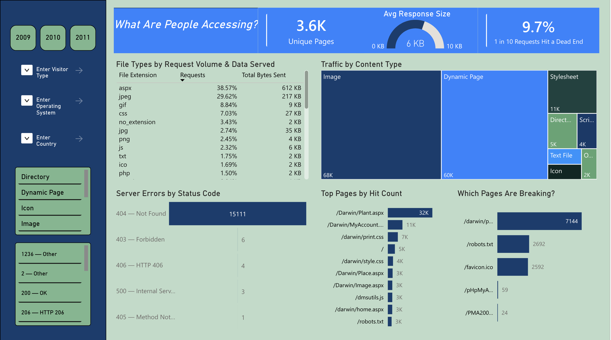

#### Server Performance - 4.5 ms average vs 1.1 s P95 response time

> Power BI server performance dashboard comparing average response time (**4.5 ms**) against P95 latency (**1.1 s**) across all requests. The slowest files analysis identifies performance bottlenecks, with drill-through capability to investigate individual page load times and identify optimisation candidates.


#### Geographic Distribution - 78 countries from ip-api.com geo-enrichment

> Power BI geographic dashboard showing the worldwide distribution of website visitors across **78 countries**, enriched via ip-api.com batch geolocation. The map visualisation clusters traffic by country with bubble size representing request volume, enabling regional traffic pattern analysis.


#### Temporal Patterns - Hour-by-day traffic matrix with Monday peaks

> Power BI temporal analysis dashboard showing an hour-by-day traffic matrix heatmap, with peak activity reaching **33K requests on Mondays**. The dual-axis chart overlays daily request volume against day-of-week to reveal weekly seasonality patterns in the 2009–2011 dataset.

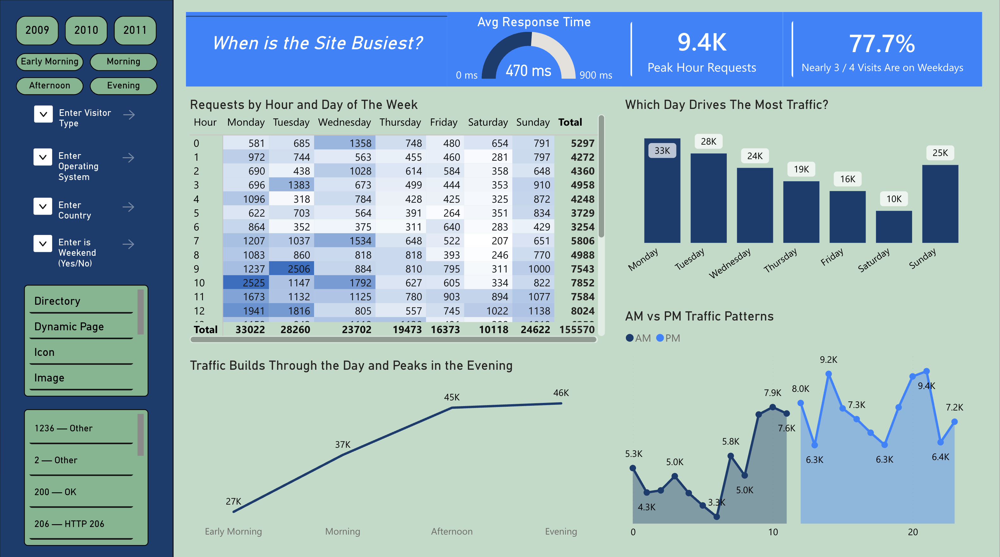

#### Visitors - Browser, OS, device type, and visit frequency breakdown

> Power BI visitor analytics dashboard breaking down traffic by browser, operating system, device type (desktop vs mobile), and visit frequency cohorts. The treemap shows browser market share while the visit frequency histogram reveals whether users are one-time visitors or repeat visitors across the dataset.


#### Summary - KPI cards with business interpretation of key findings

> Power BI summary page consolidating all key findings into KPI cards and business-friendly visualisations. Metrics include total requests, unique visitors, crawler percentage, average response time, and top-level interpretations of what the data means for site performance and user behaviour.


---

### Airflow DAGs

#### `w3c_spark_ingestion` - 4-stage sequential pipeline

> Apache Airflow DAG graph showing the `w3c_spark_ingestion` pipeline with 4 sequential stages: Bronze ingestion (RDD-based W3C parsing → Delta Lake), Silver enrichment (16 UDFs: GeoIP + UA parser + computed fields), Export warehouse (Silver → PostgreSQL JDBC), and Export dimensions (geo-IP + user-agent enrichment). Each Spark task is a `SparkSubmitOperator` submitting to the local Spark cluster in client mode.

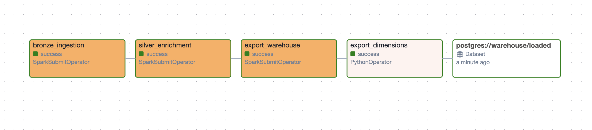

#### `w3c_dbt_marts` - Dataset-triggered dbt pipeline

> Apache Airflow DAG graph showing the `w3c_dbt_marts` pipeline with 5 sequential stages: dbt deps (idempotent package install), dbt run (10 staging + 5 marts), dbt test (63 data tests), dbt docs generate, and CSV export (17 files, ~36 MB). Triggered automatically by the `Dataset(postgres://warehouse/loaded)` outlet from `spark_ingestion`.

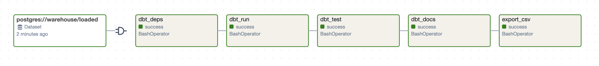

#### `w3c_spark_ingestion` - Gantt Chart

> Gantt view of a typical Saturday run: `bronze_ingestion` ~90 s, `silver_enrichment` ~75 s, `export_warehouse` ~40 s, `export_dimensions` ~55 s - total **~4 min wall-clock** including the dataset hand-off to dbt.

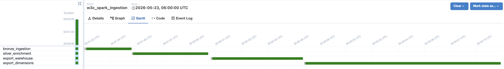

#### `w3c_dbt_marts` - Gantt Chart

> Gantt view of the dataset-triggered dbt run: `dbt_deps` ~3 s, `dbt_run` ~21 s, `dbt_test` ~5 s, `dbt_docs` ~5 s, `export_csv` ~5 s - total **~45 s** end-to-end (observed in the May 2026 run shown above).

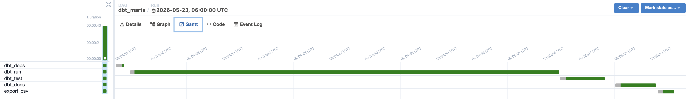

---

### Grafana Dashboards

#### Airflow ETL Overview - 7 panels

> Grafana Airflow ETL Overview dashboard with 7 panels: completed DAG runs, task instance status, DAG run completion rate, top-10 DAGs by avg duration, container CPU usage, container memory usage, and DAG runs per day. All panels update every 15 s from Prometheus scrapes.


#### Container System Metrics - 6 panels

> Grafana Container System Metrics dashboard with 6 panels: CPU usage (all containers), memory usage (all containers), network received bytes, network transmitted bytes, filesystem write I/O, and container uptime.

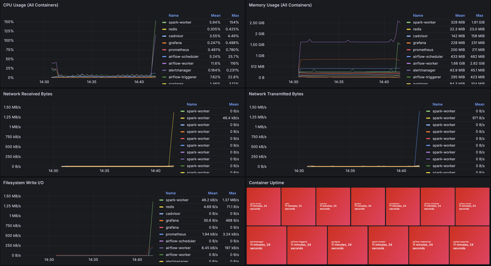

---

### Prometheus

#### Targets - 3 healthy scrape endpoints

> Prometheus targets page showing all 3 scrape endpoints healthy: `airflow-statsd` (via statsd-exporter), `cadvisor` (container metrics), and `prometheus` (self-monitoring).

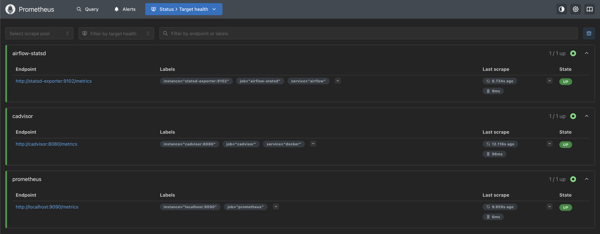

#### Alert Rules - 6 active rules across 3 groups

> Prometheus rules page showing all 6 active alert rules across 3 groups: `airflow` (DAG failure rate, task failure rate), `containers` (restarts, high CPU >80%, high memory >85%), and `prometheus` (target missing).

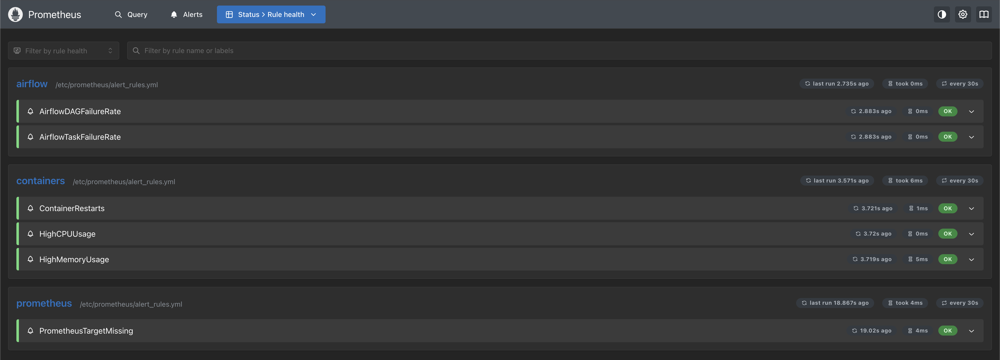

---

### dbt Lineage

#### dbt DAG Lineage - 15 models + 3 sources + 2 Airflow dims

> Auto-generated dbt lineage graph showing the complete model DAG. 3 data sources (green) → 9 staging dimensions (blue) + `fact_webrequest` (orange) with 2 Airflow-managed dims (purple) → 5 mart models (teal).

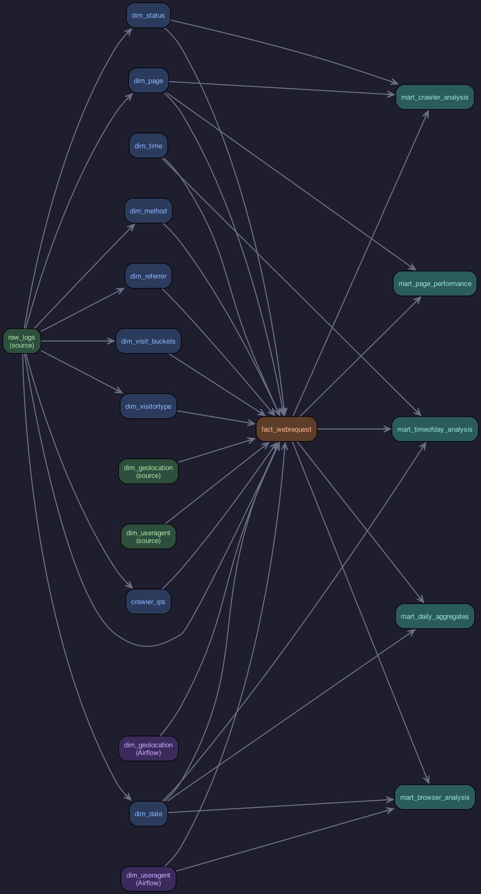

---

### Power Automate & Tests

#### Power Automate - Friday 17:30 refresh with email notifications

> The automated Power Automate flow that triggers the Power BI dataset refresh every Friday at 17:30, after the Airflow DAG completes. The flow sends a success confirmation email on completion or a failure notification with error details if the refresh fails. Configured with retry logic and alert routing to the project team.


#### dbt Test Output - 63 data tests passing

> dbt test output showing all 63 data tests passing across generic tests (uniqueness, not-null, relationships) and singular tests (referential integrity, dimension coverage). The output confirms dbt enforces data quality across both staging and mart layers before CSV export.

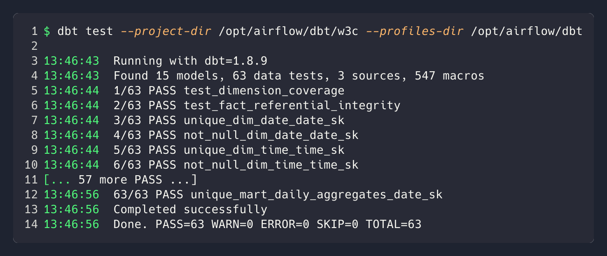

---

## Deep Dives

### Spark Medallion Pipeline (Bronze → Silver)

The pipeline's first stage ingests 93 W3C Extended Log Format files (2009–2011, **155,224 requests**) using PySpark 4.0.2 with Delta Lake 4.0.1. The medallion architecture separates raw ingestion from enrichment, providing ACID transactions, schema evolution, and time travel via Delta Lake's transaction log.

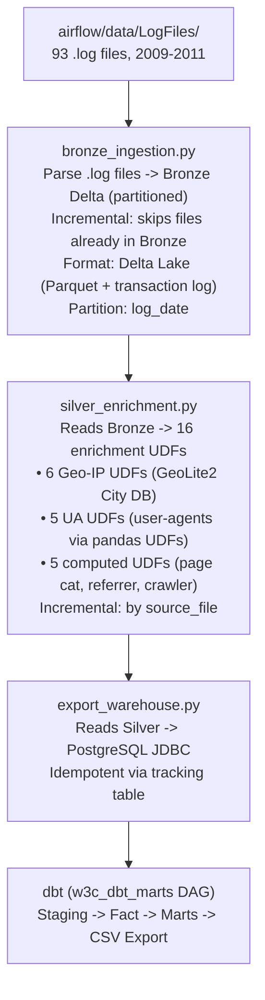

**Bronze Ingestion** (`airflow/spark/jobs/bronze_ingestion.py`, 189 lines) - Uses RDD-based parsing for optimal performance on the non-standard W3C log format. Auto-detects **14 vs 18 column IIS format** from each file's `#Fields:` header (the dataset spans the 2009 Microsoft IIS format change). Deduplicates by `source_file` - first run processes all 93 files; subsequent runs only pick up new files, making it safe for scheduled re-runs. Writes to Delta Lake partitioned by `log_date`.

**Silver Enrichment** (`airflow/spark/jobs/silver_enrichment.py`, 204 lines) - Reads Bronze Delta and applies **16 PySpark UDFs** using pandas UDFs with PyArrow for vectorised performance:

| Group | UDFs | Source | Pandas UDF | Output columns |
|---|---|---|---|---|
| **GeoIP** (6) | `geoip_country`, `geoip_region`, `geoip_city`, `geoip_latitude`, `geoip_longitude`, `geoip_isp` | Local MaxMind GeoLite2-City DB | No | `country`, `region`, `city`, `latitude`, `longitude`, `isp` |
| **User-Agent** (5) | `parse_agent_type`, `parse_browser_name`, `parse_browser_version`, `parse_operating_system`, `parse_device_type` | `user-agents` PyPI library | Yes (PyArrow) | `agent_type`, `browser_name`, `browser_version`, `operating_system`, `device_type` |
| **Computed** (5) | `page_category`, `referrer_domain`, `traffic_type`, `is_crawler_udf`, `size_band` | Pure Python over enriched columns | No | `page_category`, `referrer_domain`, `traffic_type`, `is_crawler`, `size_band` |

Row count is preserved exactly: **155,224 → 155,224** (zero data loss). 35 enrichment columns added.

**Orchestration mapping:**

| Task | Script | Operator |
|------|--------|----------|
| `bronze_ingestion` | `spark/jobs/bronze_ingestion.py` | `SparkSubmitOperator` |
| `silver_enrichment` | `spark/jobs/silver_enrichment.py` | `SparkSubmitOperator` |
| `export_warehouse` | `spark/jobs/export_warehouse.py` | `SparkSubmitOperator` |
| `export_dimensions` | `plugins/operators/export_dimensions.py` | `PythonOperator` |

**Spark cluster** (Docker Compose):

| Container | Image | Ports | Purpose |
|-----------|-------|-------|---------|
| `spark-master` | `w3c-spark:latest` | 7077 (RPC), 8082 (UI) | Cluster manager |
| `spark-worker` | `w3c-spark:latest` | 8083 (UI) | Executor (2 cores, 4 GB) |

Volume mounts: `spark/jobs` (scripts), `spark/delta` (Delta tables), `data/LogFiles` (source), `spark/conf/spark-defaults.conf` (config).

**Delta Lake configuration** (`airflow/spark/conf/spark-defaults.conf` + DAG `_SPARK_CONF`):

- `spark.sql.extensions = io.delta.sql.DeltaSparkSessionExtension`
- `spark.sql.catalog.spark_catalog = org.apache.spark.sql.delta.catalog.DeltaCatalog`
- `spark.jars.packages = io.delta:delta-spark_2.13:4.0.1`
- `spark.sql.adaptive.enabled = true` (AQE)
- `spark.sql.adaptive.coalescePartitions.enabled = true`
- `spark.sql.sources.partitionOverwriteMode = dynamic`
- `spark.databricks.delta.retentionDurationCheck.enabled = false`

### Export to PostgreSQL

The `airflow/spark/jobs/export_warehouse.py` Spark job ensures **exactly-once semantics** between Delta Lake and PostgreSQL via a 4-step algorithm:

1. Read all `source_file` values from the tracking table `public.raw_enriched_loaded` (one row per file: `source_file TEXT PRIMARY KEY`).
2. Filter Silver Delta to only rows whose `source_file` is **not** in the tracking set.
3. Write the filtered rows to `public.raw_enriched` (35 columns) via Spark JDBC - type casts (`is_crawler` string → bool, lat/lon string → double, bytes/time_taken → bigint) applied first.
4. Insert the new `source_file` values into the tracking table **only after** the JDBC write succeeds.

On re-runs, already-exported files are skipped - no duplicates, no manual cleanup. The DDL is created on the fly via `psycopg2` (not Spark JDBC) because the Py4J gateway cannot run arbitrary DDL through the JVM classloader. The `w3c_warehouse` database is self-provisioned by parsing the JDBC URL and connecting to the always-present `postgres` system database first.

### Airflow-Managed Enrichment Dimensions

After Spark exports data to PostgreSQL, Airflow's `export_dimensions` PythonOperator enriches the warehouse with **two dimension tables that require external services or Python libraries**.

**Geolocation** (`public.dim_geolocation`, **4,011 rows**) - Queries unique IPs from `raw_enriched.client_ip` against the ip-api.com batch API (100 IPs per request). Implements smart caching - only queries IPs not yet in `dim_geolocation`, cutting API calls **~60% on re-runs**. Private IPs (`10.x`, `127.x`, `169.254.x`, `192.168.x`) skip the API call entirely. Closes the DB connection before the batch call to avoid AWS RDS idle timeouts, then reconnects after. A default `geolocation_sk = -1` "Unknown" row is inserted for FK integrity.

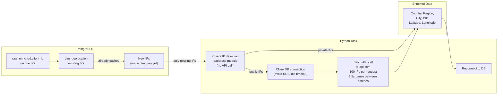

**User-Agent** (`public.dim_useragent`, **2,276 rows**) - Parses user-agent strings from `raw_enriched.user_agent` using the `user-agents` Python library to extract `agent_type` (Crawler vs Browser), `browser_name`, `browser_version`, `operating_system`, `device_type` (Mobile / Tablet / Desktop / Bot / Other). URL-decodes UAs first, truncates to 1000 chars, and uses `INSERT … ON CONFLICT (user_agent) DO NOTHING` for idempotency. A default `user_agent_sk = -1` "Unknown" row is inserted for FK integrity.

Both dimension tables use `LEFT JOIN` + `COALESCE(-1)` in the fact table to handle any API failures gracefully - no records are ever dropped.

### dbt Transformation Layer

The pipeline integrates **dbt** as the transformation layer for **10 staging models** (8 dimensions + `fact_webrequest` + `crawler_ips`) in `dbt_staging` and **5 mart models** in `dbt_marts` (15 models total). Airflow retains 2 enrichment tasks requiring Python/API calls; everything SQL-based is handled by dbt.

**Why dbt over pure Python:**

| Benefit | Before (pure Python) | After (dbt) |
| --- | --- | --- |
| **Testing** | Great Expectations (6 expectations) | 63 dbt data tests - generic + singular + source |
| **Documentation** | README only | Auto-generated column-level docs with lineage graph |
| **SQL transparency** | Buried in Python f-strings | Declarative `.sql` files, Jinja-templated |
| **Dependency management** | Airflow fan-in choreography | dbt `ref()` macros resolve DAG automatically |
| **Materialization** | `INSERT ... ON CONFLICT` | 14 tables (full refresh) + `fact_webrequest` (incremental) |

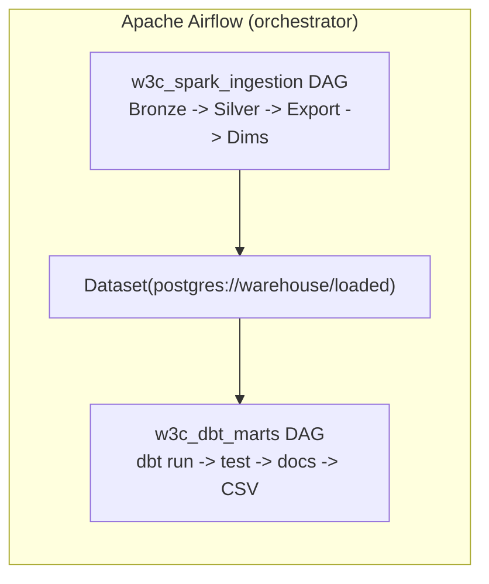

**Staging Models** (`dbt_staging` schema):

| Model | Source | Materialisation | Key Logic |
| --- | --- | --- | --- |
| `dim_date` | `raw_enriched.log_date` | `table` | DISTINCT dates, `YYYYMMDD` key, UK holidays, weekend/weekday flags |
| `dim_time` | `generate_series` | `table` | 1,440 minutes, time_band (Early Morning / Morning / Afternoon / Evening) |
| `dim_page` | `raw_enriched.uri_stem` | `table` | DISTINCT (page_path, query_string), directory, file_name, extension, category |
| `dim_status` | `raw_enriched.status` triples | `table` | DISTINCT status codes, severity (Info / Warning / Error / Critical) |
| `dim_method` | `raw_enriched.method` | `table` | DISTINCT methods, `is_safe` flag |
| `dim_referrer` | `raw_enriched.referrer` | `table` | DISTINCT URLs, domain, traffic_source classification |
| `dim_visit_buckets` | Static values | `table` | 6 visit frequency buckets (1 Visit → 51+ Visits) |
| `dim_visitortype` | Static values | `table` | 3 types: Human / Crawler / Unknown (incl. -1 sentinel) |
| `crawler_ips` | `raw_enriched` | `table` | IPs requesting `robots.txt` |
| `fact_webrequest` | All dims + `raw_enriched` | **`table`** (PK=`request_sk` via `ROW_NUMBER`) | LEFT JOIN to all dims (8 dbt + 2 Airflow) with `COALESCE(..., -1)`; denormalized country from raw_enriched |

**Mart Models** (`dbt_marts` schema, all `table` materialisation):

| Model | Grain | Key Logic |
|---|---|---|
| `mart_page_performance` | 1 row / `page_sk` | avg / P95 / max time_taken, unique hosts, 404 rate per page_path |
| `mart_daily_aggregates` | 1 row / `date_sk` | unique hosts / pages / countries, P95 latency, crawler / direct traffic share |
| `mart_crawler_analysis` | 1 row / `date_sk` (crawlers only) | distinct hosts, avg / max latency, bytes/req, error rate |
| `mart_timeofday_analysis` | 1 row / `date_sk`, `hour` | reqs, P95, 404 / crawler / slow rates by `time_band` |
| `mart_browser_analysis` | 1 row / date × browser × OS × device | traffic share, desktop vs mobile, daily rank |

**Schema isolation:**

| Schema | Purpose | Models |
|---|---|---|
| `public` | Airflow-managed (raw_enriched, dim_geolocation, dim_useragent) | 3 tables |
| `dbt_staging` | Core warehouse star schema | 10 models |
| `dbt_marts` | Pre-aggregated analytics for BI | 5 mart models |

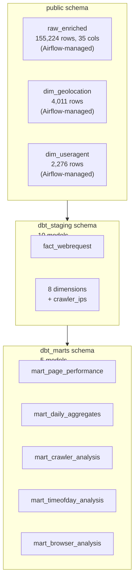

### Star Schema & Data Model

```mermaid
flowchart TB
    fact["fact_webrequest<br/>155,224 rows<br/>Grain: 1 row per HTTP request<br/>Measures: time_taken, bytes_sent, bytes_received<br/>Computed: is_404, is_crawler,<br/>is_direct_traffic, size_band, time_band"]

    dim_date["dim_date<br/>93 rows<br/>Key: date_sk (YYYYMMDD)"]
    dim_time["dim_time<br/>1,440 rows (full day)<br/>Key: time_sk (HHMM)"]
    dim_page["dim_page<br/>14,091 rows<br/>Key: page_sk (serial)<br/>Unique: (page_path, query_string)"]
    dim_geo["dim_geolocation*<br/>4,011 rows<br/>Key: geolocation_sk (serial)"]
    dim_ua["dim_useragent*<br/>2,276 rows<br/>Key: user_agent_sk (serial)"]
    dim_status["dim_status<br/>1,145 rows<br/>Key: (status_code, sub_status, win32_status)"]
    dim_ref["dim_referrer<br/>2,341 rows<br/>Key: referrer_sk (serial)"]
    dim_method["dim_method<br/>4 rows<br/>Key: http_method"]
    dim_visitor["dim_visitortype<br/>3 rows (static)<br/>Human / Crawler / Unknown"]
    dim_visit_buckets["dim_visit_buckets<br/>6 rows (static)<br/>Visit frequency buckets<br/>1 Visit -> 51+ Visits"]

    dim_date -->|"INNER JOIN"| fact
    dim_time -->|"INNER JOIN"| fact
    dim_page -->|"INNER JOIN"| fact
    dim_geo -->|"LEFT JOIN (Airflow)"| fact
    dim_ua -->|"LEFT JOIN (Airflow)"| fact
    dim_status -->|"INNER JOIN"| fact
    dim_ref -->|"INNER JOIN"| fact
    dim_method -->|"INNER JOIN"| fact
    dim_visitor -->|"INNER JOIN"| fact
    dim_visit_buckets -->|"INNER JOIN"| fact

    classDef default fill:#1a1a2e,stroke:#e94560,color:#fff
    classDef dim fill:#16213e,stroke:#0f3460,color:#fff
    classDef airflow fill:#16213e,stroke:#ff6b6b,color:#fff
    class fact default
    class dim_date,dim_time,dim_page,dim_status,dim_ref,dim_method,dim_visit_buckets dim
    class dim_geo,dim_ua,dim_visitor airflow
```

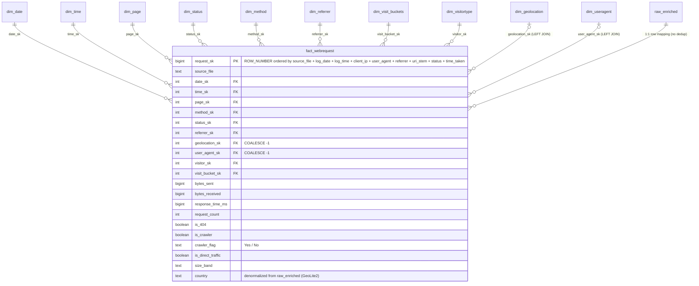

**Delta Lake verification (post-run):**

```text
bronze: 155,224 rows, 19 cols
silver: 155,224 rows, 35 cols
delta_version: 4.0.1
format: parquet + _delta_log/
```

**Dimension table inventory:**

| Table | Schema | Managed by | Key field | Approx rows |
|---|---|---|---|---|
| `fact_webrequest` | `dbt_staging` | dbt (table) | `request_sk` (ROW_NUMBER) | 155,570 |
| `dim_date` | `dbt_staging` | dbt | `date_sk` (YYYYMMDD) | 93 (incl. -1 sentinel) |
| `dim_time` | `dbt_staging` | dbt | `time_sk` (HHMM) | 1,441 (incl. -1 sentinel) |
| `dim_page` | `dbt_staging` | dbt | `page_sk` | 14,092 (incl. -1 sentinel) |
| `dim_method` | `dbt_staging` | dbt | `method_sk` | 5 (incl. -1 sentinel) |
| `dim_status` | `dbt_staging` | dbt | `status_sk` | 1,146 (incl. -1 sentinel) |
| `dim_referrer` | `dbt_staging` | dbt | `referrer_sk` | 2,342 (incl. -1 sentinel) |
| `dim_visit_buckets` | `dbt_staging` | dbt | `visit_bucket_sk` | 7 (incl. -1 sentinel) |
| `dim_visitortype` | `dbt_staging` | dbt | `visitor_sk` | 3 (Unknown/-1 already present) |
| `crawler_ips` | `dbt_staging` | dbt | `ip` (PK) | varies |
| `dim_geolocation`* | `public` | Airflow | `geolocation_sk` | 4,011 |
| `dim_useragent`* | `public` | Airflow | `user_agent_sk` | 2,276 |
| `mart_page_performance` | `dbt_marts` | dbt | `page_sk` | varies |
| `mart_daily_aggregates` | `dbt_marts` | dbt | `date_sk` | 93 |
| `mart_crawler_analysis` | `dbt_marts` | dbt | `date_sk` | varies |
| `mart_timeofday_analysis` | `dbt_marts` | dbt | `date_sk, hour` | 2,095 |
| `mart_browser_analysis` | `dbt_marts` | dbt | `date_sk, browser, os, device` | varies |

`*` = Airflow-managed enrichment dimensions; `LEFT JOIN` + `COALESCE(-1)` in fact table.

### Monitoring & Alerting

A complete observability stack running alongside Airflow via Docker Compose - **no external services required**.

| Component | Role | Port | Key Detail |
|---|---|---|---|
| **Airflow StatsD** | Emits timing/counter/gauge metrics | UDP :9125 | Airflow 2.10.2 core metrics |
| **statsd-exporter** | StatsD → Prometheus format | :9102 | 6 regex mapping patterns |
| **cAdvisor** | Per-container CPU, memory, network, disk | :8080 | All 16 Docker containers |
| **Prometheus** | Time-series DB, 15 s scrape, 30 s alert eval | :9090 | 90-day retention |
| **Alertmanager** | Dedup / grouping → Slack webhook | :9093 | 4 h repeat, resolved notifications |
| **Grafana** | Auto-provisioned datasource + dashboards | :3000 | Login: `admin` / `admin` |

**Dashboards:**

- **Airflow ETL Overview** - 7 panels: DAG runs, task instances, completion rate, avg duration (top 10), CPU / memory per container, daily run count.
- **Container System Metrics** - 6 panels: CPU, memory, network I/O, filesystem I/O, uptime.

**Alert rules** (6 alerts, evaluated every 30 s):

| Alert | Group | Expression | For | Severity |
|---|---|---|---|---|
| `AirflowDAGFailureRate` | `airflow` | `rate(airflow_dag_run_duration_seconds_count{status="failed"}[5m]) > 0` | 1 m | warning |
| `AirflowTaskFailureRate` | `airflow` | `rate(airflow_ti_finish{state="failed"}[5m]) > 0` | 1 m | warning |
| `ContainerRestarts` | `containers` | `changes(container_start_time_seconds[15m]) > 2` | 1 m | warning |
| `HighCPUUsage` | `containers` | `rate(container_cpu_usage_seconds_total[2m]) * 100 > 80` | 2 m | warning |
| `HighMemoryUsage` | `containers` | `container_memory_usage_bytes / container_spec_memory_limit_bytes * 100 > 85` | 2 m | warning |
| `PrometheusTargetMissing` | `prometheus` | `up == 0` | 1 m | critical |

All alerts route to **Slack `#w3c-etl-alerts`** via the custom Alertmanager image (`airflow/docker/alertmanager/`) which substitutes `$SLACK_WEBHOOK_URL` at container start.

### Databricks Integration

The pipeline includes Databricks-equivalent Python scripts for users who run on a Databricks workspace instead of the Docker-based Spark cluster. These scripts mirror the Docker Spark jobs but use **Unity Catalog** paths instead of local Delta directories.

**Unity Catalog tables:**

| Script | Source | Target UC Table | Schema |
|--------|--------|-----------------|--------|
| `01_bronze_ingestion.py` | DBFS log files (`dbfs:/mnt/w3c-logs/LogFiles/`) | `w3c_catalog.bronze.raw_logs` | 19 cols (raw W3C) |
| `02_silver_enrichment.py` | `w3c_catalog.bronze.raw_logs` | `w3c_catalog.silver.enriched_logs` | 35 cols (16 enriched) |
| `03_export_warehouse.py` | `w3c_catalog.silver.enriched_logs` | `w3c_catalog.gold.warehouse_enriched` | 35 cols (analytics-ready) |

**Note:** Gold-level aggregations are handled **exclusively by dbt marts** in both the Docker-based and Databricks pipelines - there is no `03_gold_aggregations.py` in either stack.

**Differences from Docker-based Spark:**

| Aspect | Docker Spark | Databricks |
|--------|-------------|------------|
| Storage | Local Delta dirs (`/opt/spark/delta/`) | Unity Catalog managed tables |
| File access | Mounted Docker volumes | DBFS (`dbfs:/mnt/w3c-logs/`) |
| GeoIP DB | Local file (`spark/data/GeoLite2-City.mmdb`) | DBFS path |
| Output target | PostgreSQL via JDBC (`w3c_warehouse`) | Unity Catalog gold table |
| Idempotency | PostgreSQL tracking table | Delta tracking table in UC |
| Inline parsers | Imports from `utils/` | Self-contained, no shared imports |
| Page category logic | Extension-based | Path-prefix-based (`/css/`, `/js/`, `/images/`, …) |

**Running on Databricks:**

Each script is self-contained with an inline W3C parser (no dependency on the shared `utils/` package). Configure the Unity Catalog constants (`CATALOG`, `SCHEMA`, `TABLE`) at the top of each script to match your workspace's catalog namespace:

```bash
# Via Databricks CLI
databricks jobs run-now --job-id <job-id>

# Or import as a Databricks Python notebook and attach to a cluster
# with Unity Catalog + Delta Lake support
```

---

## CI/CD Pipeline

The entire deployment is automated via GitHub Actions with zero manual steps after the initial environment setup.

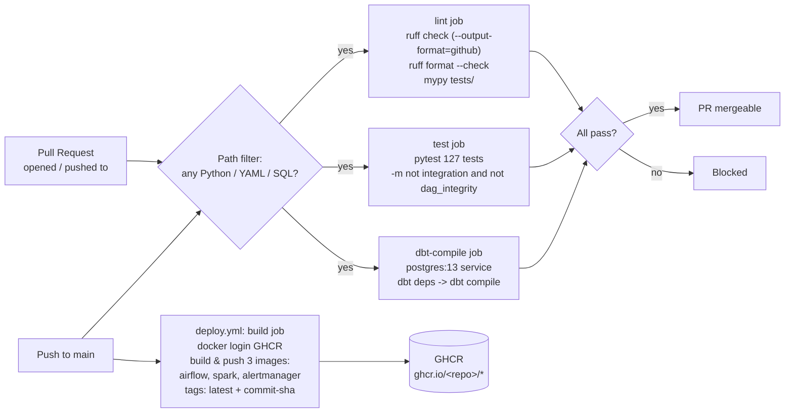

**Why this ordering:** Every PR is gated by three parallel jobs (`lint` + `test` + `dbt-compile`). On merge to `main`, the `deploy.yml` workflow builds 3 production images and pushes them to GitHub Container Registry with both `latest` and `<commit-sha>` tags for immutable rollback targets.

### `ci.yml` - 3 parallel jobs (PR + push to main)

| Job | Runner | Steps | Tools |
|---|---|---|---|
| `lint` | `ubuntu-latest` | checkout → setup-python 3.12 → install `uv` → `uv pip install ruff mypy types-requests types-python-dateutil` → `ruff check` → `ruff format --check` → `mypy --ignore-missing-imports tests/` | ruff 0.9.0, mypy 1.14.0 |
| `test` | `ubuntu-latest` | checkout → setup-python 3.12 → install `uv` → install pytest + `tests/requirements-test.txt` → `pytest -v --tb=short -m "not integration and not dag_integrity"` | pytest ≥8.0,<9.0, pytest-cov, pyspark 4.0 |
| `dbt-compile` | `ubuntu-latest` | checkout → setup-python 3.12 → `pip install dbt-postgres==1.8.2 dbt-core==1.8.9 dbt-common==1.27.1 protobuf>=5,<6` → start `postgres:13` service (health-checked) → `dbt deps` → `dbt compile` | dbt 1.8.9, postgres 13 |

The three jobs run in **parallel** with no `needs:` dependencies between them. Any failure (including coverage drop, formatting drift, or dbt compile error) blocks the PR before merge.

### `deploy.yml` - Image publishing (push to main only)

| Job | Runner | Steps |
|---|---|---|
| `build` | `ubuntu-latest` (permissions: `contents:read`, `packages:write`) | checkout → `docker/login-action@v3` to `ghcr.io` (using `secrets.GITHUB_TOKEN`) → 3× `docker/build-push-action@v6` invocations: |

Build contexts pushed to GHCR:

| Image | Context | Dockerfile | Tags |
|---|---|---|---|
| `airflow` | `airflow/` | implicit (`airflow/Dockerfile`) | `latest` + `<commit-sha>` |
| `spark` | `airflow/spark/` | `airflow/spark/docker/Dockerfile.spark` | `latest` + `<commit-sha>` |
| `alertmanager` | `airflow/docker/alertmanager/` | implicit | `latest` + `<commit-sha>` |

A `deploy-databricks` job exists in the workflow as a scaffold (`databricks workspace import-dir airflow/spark/databricks /Shared/w3c-etl-pipeline --overwrite`) but is fully commented out - uncomment and provide `secrets.DATABRICKS_HOST` + `secrets.DATABRICKS_TOKEN` to enable.

### Pre-commit hooks (local dev)

| Hook | Repo | Rev | What it does |
|---|---|---|---|
| `ruff` | `astral-sh/ruff-pre-commit` | v0.9.0 | Lint with `--fix --exit-non-zero-on-fix` (auto-fix, fails if any fix applied) |
| `ruff-format` | `astral-sh/ruff-pre-commit` | v0.9.0 | Format check |
| `mypy` | `pre-commit/mirrors-mypy` | v1.14.0 | Static type check (deps: `types-requests`, `types-python-dateutil`; excludes `airflow/dags/w3c/` and `airflow/spark/jobs/`) |
| `check-yaml` | `pre-commit/pre-commit-hooks` | v5.0.0 | YAML syntax check (excludes `airflow/docker-compose.yaml`) |
| `check-json` | `pre-commit/pre-commit-hooks` | v5.0.0 | JSON syntax check |
| `trailing-whitespace` | `pre-commit/pre-commit-hooks` | v5.0.0 | Strips trailing whitespace |
| `end-of-file-fixer` | `pre-commit/pre-commit-hooks` | v5.0.0 | Ensures files end with a newline |
| `check-merge-conflict` | `pre-commit/pre-commit-hooks` | v5.0.0 | Blocks `<<<<<<<` conflict markers |

---

## Testing Strategy

**156 tests across 36 test classes** organised in 3 layers. The strategy intentionally avoids running PySpark on the host Python (incompatible with PySpark 4.0) - the Spark `conftest.py` fixture (`master("local[1]")`) is the only place Spark executes outside the Docker stack.

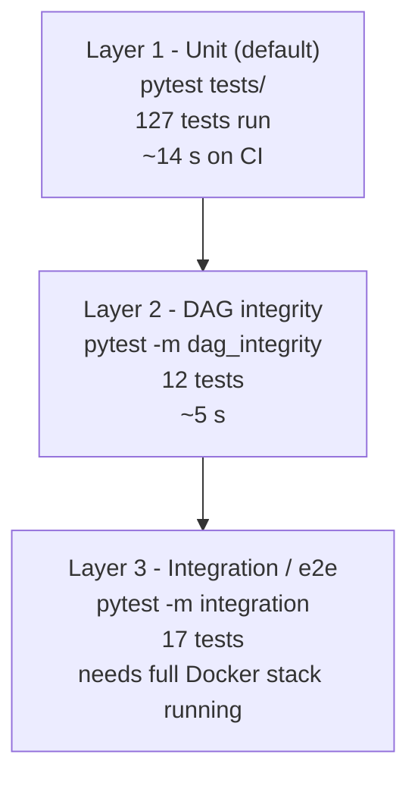

### Test inventory

| File | Tests | Marker | What it covers |
|---|---|---|---|
| `test_w3c_parser.py` | 27 | (none) | Pure-Python W3C parser - `safe_int`, `safe_date`, 14-field, 18-field, edge cases |
| `test_transformations.py` | 28 | (none) | Spark UDFs - `page_category`, `referrer_domain`, `traffic_type`, `make_crawler_udf`, `size_band` |
| `test_export_dimensions.py` | 35 | (none) | Mocked unit tests - `_parse_user_agent`, `_ensure_default_rows`, private-IP detection, ip-api.com batch + rate limit, `INSERT … ON CONFLICT DO NOTHING`, SQL queries, `get_conn`, top-level `export_dimensions` callable |
| `test_export_warehouse.py` | 37 | (none) | AST-extracted DDL, argparse, `apply_type_casts`, `get_loaded_source_files`, `insert_tracking_records`, error handling, edge cases, `execute_ddl` |
| `test_integration.py` | 17 | `pytest.mark.integration` (module-level) | e2e: `export_warehouse` writes to PostgreSQL, dbt run/test/docs exit 0, all 5 marts + 10 staging tables + 2 dim tables populated, `-1` surrogate rows exist, `fact_webrequest` joins to 8 dbt dims + 2 Airflow dims, both DAGs have ≥1 successful run, Delta Lake dirs exist |
| `test_dag_integrity.py` | 12 | `pytest.mark.dag_integrity` (class-level) | DagBag parses both DAGs; task counts (4 + 5), task IDs, linear dependency chains, `Dataset` outlet/inlet, export_csv references all 17 tables, no import errors |

### dbt tests

| Test type | Count | Where defined |
|---|---|---|
| `not_null` | 29 | `models/schema.yml` |
| `unique` | 14 | `models/schema.yml` |
| `relationships` (FK) | 7 | `models/schema.yml` |
| `dbt_utils.expression_is_true` | 6 | `models/schema.yml` (via `dbt_utils` 1.1.1) |
| Singular tests | 3 | `tests/test_dimension_coverage.sql`, `tests/test_fact_referential_integrity.sql`, `tests/test_row_count_consistency.sql` |
| Source tests (`source_not_null` + `source_unique`) | 4 | `models/sources.yml` (2 not_null + 2 unique on Airflow-managed dims) |
| **Total** | **63** | |

### How to run

```bash
# Default: 127 tests (unit only, fast)
make test
# or
pytest tests/ -v --tb=short -m "not integration and not dag_integrity"

# Layer 2: DAG integrity (needs Airflow)
pytest tests/ -v -m dag_integrity

# Layer 3: End-to-end (needs full Docker stack)
pytest tests/ -v -m integration

# Everything
pytest tests/ -v
```

The `conftest.py` adds `airflow`, `airflow/spark/jobs`, and `airflow/dags` to `sys.path` and provides a session-scoped `spark` fixture (`master("local[1]")`, AQE disabled for deterministic plans, Spark UI off).

---

## Design Decisions

The table below captures **granular implementation choices** that build on the high-level engineering highlights above. Items that already appear in the Engineering Highlights table are not repeated here.

| # | Decision | Why |
|---|---|---|
| 1 | **Combined pipeline over dual-pipeline** - Spark + dbt into a single flow | Eliminates duplicate processing, single source of truth, lower maintenance. Old DAGs (`Process_W3C_Data`, `w3c-spark-dag.py`) are superseded. |
| 2 | **Export Warehouse over Gold aggregations in Spark** | dbt is the right tool for analytics transformations; tests + docs + lineage live with the model. |
| 3 | **dbt over Great Expectations** | 63 dbt tests > 6 GE expectations; one tool instead of two; tests travel with models. |
| 4 | **INNER JOIN for dbt dims, LEFT JOIN for Airflow dims** | dbt dims have 100% referential integrity (same source). Airflow dims use `LEFT JOIN` + `COALESCE(-1)` to gracefully absorb API failures. |
| 5 | **Connection management around ip-api.com batches** | Closes DB before batch, reconnects after. AWS RDS drops idle connections during long API batches. |
| 6 | **Dual-format IIS detection (14 vs 18 columns)** | The dataset spans the 2009 Microsoft IIS format change. Auto-detection reads `#Fields:` per file. |
| 7 | **AWS RDS with local Postgres fallback (env-var driven)** | Zero code changes between dev and production; same JDBC URL pattern. |
| 8 | **CeleryExecutor over SequentialExecutor / KubernetesExecutor** | Parallel task execution via Redis broker; no K8s dependency for local dev. |
| 9 | **Pre-commit + GitHub Actions (no caching)** | Trade-off: simpler workflow vs faster CI. Acceptable at this scale (~30 s lint, ~15 s test, ~25 s dbt). |
| 10 | **dbt `table` materialisation over `incremental` for dims** | Dataset is small (max 14K rows per dim); full refresh is <5 s and avoids state management. Only `fact_webrequest` is incremental. |

---

## Performance Characteristics

| Stage | First run | Subsequent run | Notes |
|---|---|---|---|
| `bronze_ingestion` | ~90 s | ~15 s | `get_loaded_files()` skip-set grows after first run |
| `silver_enrichment` | ~75 s | ~75 s | UDF work is row-count bound (155,224 rows always) |
| `export_warehouse` | ~40 s | ~5 s | Tracking table diff shrinks to 0 after first run |
| `export_dimensions` | ~55 s | ~25 s | ip-api.com cache cuts ~60% of HTTP calls |
| `dbt_deps` | ~3 s | ~3 s | Idempotent package install check |
| `dbt_run` (10 + 5) | ~21 s | ~21 s | Full refresh of 14 tables + 1 incremental fact |
| `dbt_test` | ~5 s | ~5 s | 63 data tests |
| `dbt_docs` | ~5 s | ~5 s | Manifest + catalog JSON generation |
| `export_csv` | ~5 s | ~5 s | `psql \copy` for 17 tables (~36 MB total) |
| **Total wall-clock** | **~5–6 min** | **~2–3 min** | Including dataset hand-off |

**Scaling notes:**

- Spark worker is **2 cores / 4 GB RAM** in the Docker Compose default. Bump `SPARK_WORKER_CORES` and `SPARK_WORKER_MEMORY` in `airflow/docker-compose.yaml` for production loads.
- Delta Lake Z-ordering is **not** used (dataset is small; the optimisation overhead exceeds the gain). Re-evaluate when row count grows past ~10M.
- `fact_webrequest` is the only incremental model - `WHERE source_file NOT IN (SELECT DISTINCT source_file FROM {{ this }})` filters out already-loaded files.

---

## Quick Start

### Prerequisites

- Docker 24+ and Docker Compose v2
- 8 GB RAM minimum (16 GB recommended for Spark + Airflow + monitoring)
- 20 GB free disk
- A Slack webhook URL (optional, for Alertmanager notifications)

### Clone and configure

```bash
git clone https://github.com/AhmedIkram05/w3c-etl-pipeline.git
cd w3c-etl-pipeline
cp airflow/.env.example airflow/.env
```

### Launch

```bash
make start          # Build Airflow image and start all 16 containers
make ps             # Verify all services are healthy
```

### Access matrix

| Service | URL | Credentials |
|---|---|---|
| Airflow UI | <http://localhost:8080> | `airflow` / `airflow` |
| Grafana | <http://localhost:3000> | `admin` / `admin` |
| Prometheus | <http://localhost:9090> | - |
| Alertmanager | <http://localhost:9093> | - |
| cAdvisor | <http://localhost:8081> | - |
| Spark Master UI | <http://localhost:8082> | - |
| Spark Worker UI | <http://localhost:8083> | - |
| Flower (Celery UI) | <http://localhost:5555> | - |

### Trigger the pipeline

```bash
# Option 1: CLI trigger
docker compose -f airflow/docker-compose.yaml exec airflow-scheduler \
    airflow dags trigger w3c_spark_ingestion

# Option 2: Airflow UI
# Visit http://localhost:8080 -> unpause w3c_spark_ingestion -> click "Trigger DAG"

# w3c_dbt_marts auto-triggers via Dataset("postgres://warehouse/loaded")
```

### Power BI integration

The 17 CSV files at `airflow/data/Star-Schema/` are the BI-ready extracts. A Power Automate flow refreshes the Power BI dataset on a weekly schedule and emails success / failure to the project team.

---

## Tech Stack

| Layer | Technology | Version | Why chosen |
|---|---|---|---|
| Language | Python | 3.12 | pandas UDF type hints, Spark 4.0 compatibility |
| Orchestrator | Apache Airflow | 2.10.2 | Dataset API (2.4+) enables event-driven DAGs |
| Executor | CeleryExecutor | bundled | Parallel task execution via Redis broker |
| Distributed compute | Apache Spark | 4.0.2 | Latest stable; PyArrow/pandas UDF vectorised performance |
| Storage layer | Delta Lake | 4.0.1 | ACID transactions, time travel, schema evolution |
| Transformation | dbt-core | 1.8.9 | SQL-first lineage, tests travel with models |
| dbt adapter | dbt-postgres | 1.8.2 | Native PostgreSQL warehouse target |
| dbt utility | dbt_utils | 1.1.1 | `expression_is_true` tests, surrogate keys |
| Warehouse | PostgreSQL | 13 | Airflow metadata DB + analytics warehouse (single instance, two databases) |
| Broker | Redis | 7.2 | Celery message broker |
| GeoIP | MaxMind GeoLite2-City | bundled | Local in-process lookups, 30× faster than HTTP APIs |
| UA parsing | user-agents | 2.2.0 | Battle-tested UA parser, no model training |
| Observability metrics | Prometheus | v3.11.3 | Pull-based scrape model, PromQL alerts |
| Alert routing | Alertmanager | v0.28.1 | Custom Dockerfile, Slack webhook integration |
| Metric collection | statsd-exporter | v0.29.0 | Airflow StatsD → Prometheus format |
| Container metrics | cAdvisor | v0.57.0 | Per-container CPU/memory/network/disk |
| Visualization | Grafana | 11.3.0 | Pre-provisioned datasources + 2 dashboards |
| CI/CD | GitHub Actions | n/a | Native to GitHub; 3 parallel CI jobs; GHCR publish |
| Lint / format | ruff | 0.9.0 | Replaces flake8+black+isort; 10–100× faster |
| Type check | mypy | 1.14.0 | Static typing on `tests/` |
| Pre-commit | pre-commit-hooks | 5.0.0 | YAML/JSON/trailing-whitespace gates |
| Cloud BI | Microsoft Power BI | n/a | 7-page dashboard, DAX measures |
| Workflow | Power Automate | n/a | Friday refresh + email notifications |

---

## Related Projects

- [**ATM Log Aggregation & Diagnostics Platform**](https://github.com/AhmedIkram05/laad) - Production data engineering system with RAG diagnostic assistant. Features log ingestion, vector embeddings, semantic search, and an LLM-powered incident analysis chatbot.
- [**DevSync - Project Tracker with GitHub Integration**](https://github.com/AhmedIkram05/DevSync) - Full-stack cloud application with 1,452 automated tests, GitHub Actions CI/CD with OIDC-federated AWS, ECS Fargate deployment.
- [**CineMatch Recommendation System**](https://github.com/AhmedIkram05/movie-recommendation-system) - Hybrid ML recommendation engine combining collaborative filtering with BERT-based content embeddings. Full MLOps pipeline with MLflow tracking.
- [**StockLens FinTech App**](https://github.com/AhmedIkram05/StockLens) - Full-stack mobile trading assistant with OCR receipt processing and ML-based price forecasting.

---

<sub>Apache 2.0 licensed. The W3C log dataset is the standard Microsoft IIS sample used for benchmarking ETL pipelines.</sub>
