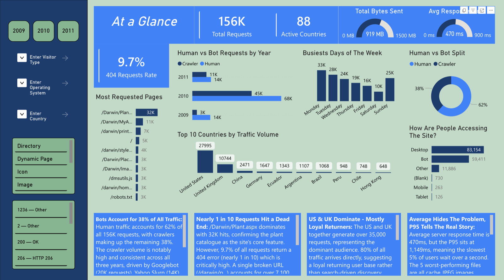
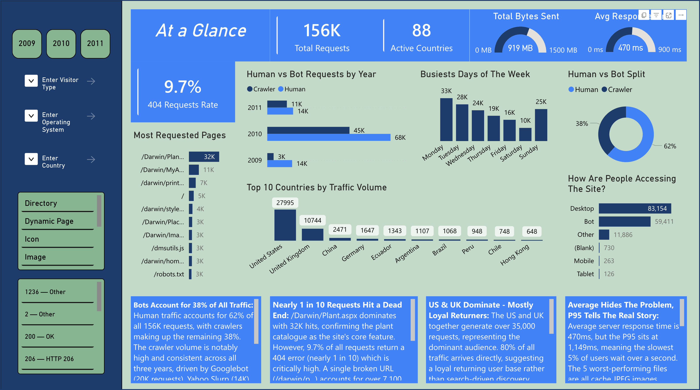
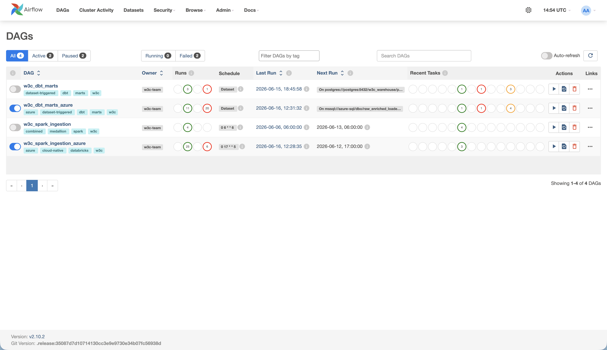
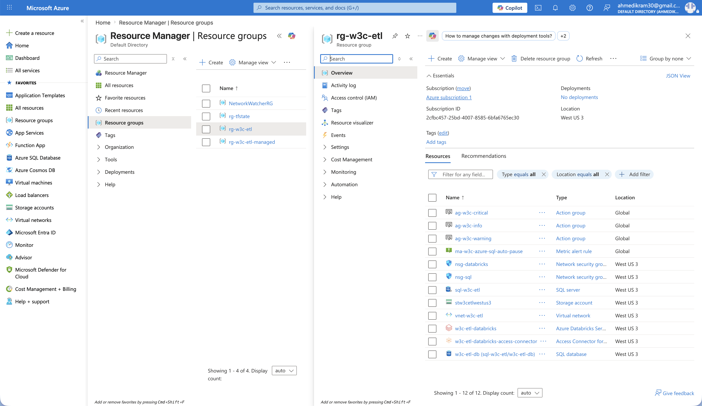
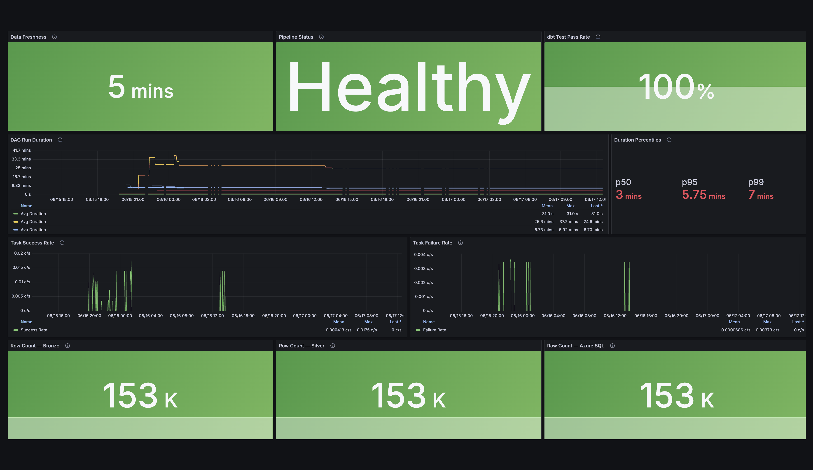
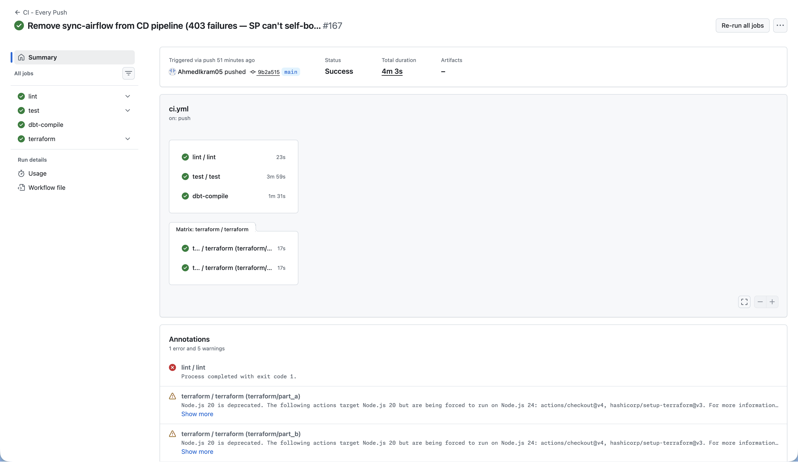

# W3C Web Logs ETL Pipeline

> W3C web logs, ingested raw → served as a business-ready Power BI datamart, on a fully serverless Azure stack with zero static credentials.

<p align="center">
<a href="https://azure.microsoft.com/"></a>
<a href="https://www.databricks.com/"></a>
<a href="https://www.getdbt.com/"></a>
<a href="https://airflow.apache.org/"></a>
<a href="https://www.terraform.io/"></a>
<a href="https://www.python.org/"></a>
<a href="https://powerbi.microsoft.com/"></a>
<a href="https://spark.apache.org/"></a>
<a href="https://spark.apache.org/docs/latest/api/python/"></a>
<a href="https://delta.io/"></a>
<a href="https://www.microsoft.com/sql-server"></a>
<a href="https://www.postgresql.org/"></a>
<a href="https://redis.io/"></a>
<a href="https://grafana.com/"></a>
<a href="https://prometheus.io/"></a>
<a href="https://openlineage.io/"></a>
<a href="https://marquezproject.ai/"></a>
<a href="https://www.docker.com/"></a>
<a href="https://github.com/features/actions"></a>
<a href="https://docs.pytest.org/"></a>
</p>

<p align="center">
  <a href="https://github.com/AhmedIkram05/w3c-etl-pipeline/actions/workflows/ci.yml"></a>
  <a href="https://codecov.io/gh/AhmedIkram05/w3c-etl-pipeline"></a>
</p>

<p align="center">
  <a href="https://app.powerbi.com/reportEmbed?reportId=41d525b8-b808-4750-88ba-cb31dbbba958&autoAuth=true&ctid=ae323139-093a-4d2a-81a6-5d334bcd9019">
    
  </a>
  <br/>
  <em>Click the preview above to open the live 7-page Power BI dashboard</em>
</p>

---

## How It Fits Together

Bronze → Silver → Azure SQL → dbt → Power BI, on Databricks serverless, with OpenLineage → Marquez observing every stage across both engines.


```mermaid
flowchart LR
    classDef source fill:#3b82f6,color:#fff,stroke:#1e40af
    classDef ingest fill:#10b981,color:#fff,stroke:#047857
    classDef dlt fill:#8b5cf6,color:#fff,stroke:#6d28d9
    classDef sql fill:#f59e0b,color:#fff,stroke:#d97706
    classDef dbtclass fill:#ef4444,color:#fff,stroke:#dc2626
    classDef bi fill:#ec4899,color:#fff,stroke:#db2777
    classDef lineage fill:#7c3aed,color:#fff,stroke:#5b21b6

    source["93 W3C IIS log files<br/>2009–2011"]:::source

    adls["ADLS Gen2<br/>raw-logs container"]:::ingest

    bronze["DLT Bronze (serverless)<br/>parse • validate • partition"]:::dlt

    silver["DLT Silver (serverless)<br/>GeoIP enrichment + dedup"]:::dlt

    jdbc["JDBC Export (notebook_task)<br/>pymssql batch write"]:::sql

    azsql["Azure SQL Serverless<br/>dbo.raw_enriched"]:::sql

    dims["Airflow: export_dimensions<br/>SCD Type 2 + MERGE dims"]:::dbtclass

    dbt["dbt - 16 models • 121 tests<br/>dual-dialect T-SQL / PostgreSQL"]:::dbtclass

    csv["18 CSV exports<br/>Star-Schema"]:::bi

    powerbi["Power BI<br/>7-page dashboard<br/>weekly auto-refresh"]:::bi

    marquez["OpenLineage → Marquez<br/>cross-engine lineage"]:::lineage

    source -->|"ABFSS path"| adls
    adls -->|"Auto Loader"| bronze
    bronze -->|"spark.table()"| silver
    silver -->|"collect() + pymssql"| jdbc
    jdbc --> azsql
    azsql --> dims
    dims -->|"Dataset trigger"| dbt
    dbt --> csv
    csv --> powerbi

    dims -.->|"task events"| marquez
    dbt -.->|"quality facet"| marquez
```

**Every piece, in one line:**

| Component | What it does |
|---|---|
| **[Azure Databricks DLT](docs/README-full.md#1-azure-databricks-dlt-bronze--silver)** | Serverless Bronze → Silver: custom W3C parser, GeoIP enrichment, dedup - zero cluster management |
| **[Azure SQL](docs/README-full.md#2-azure-sql--jdbc-export)** | Serverless warehouse; Silver → Azure SQL via pymssql export |
| **[Apache Airflow](docs/README-full.md#3-apache-airflow-orchestration)** | 4 DAGs wired by dataset triggers - ingestion → dimensions → dbt, no polling |
| **[dbt](docs/README-full.md#4-dbt--the-t-sql-migration)** | 16 models compiling against both T-SQL and PostgreSQL from one source |
| **[Power BI](docs/README-full.md#5-power-bi--semantic-contract)** | 7-page live dashboard on a semantic contract: logic in dbt, presentation in BI |
| **[Terraform](docs/README-full.md#6-terraform-infrastructure-as-code)** | Entire Azure estate as code, GitHub→Azure auth via OIDC - zero static secrets |
| **[Unity Catalog](docs/README-full.md#7-unity-catalog--governance)** | Governed catalogs, schemas, volumes, cross-pipeline `spark.table()` reads |
| **[CI/CD](docs/README-full.md#8-cicd-pipeline)** | 7 workflows: lint, test, dbt-compile, terraform plan→apply, smoke test |
| **[Observability](docs/README-full.md#9-monitoring--observability)** | 3 Grafana dashboards, 8 Prometheus alert rules - DAG duration to data freshness |
| **[OpenLineage → Marquez](docs/README-full.md#10-data-lineage--openlineage-marquez)** | Cross-engine lineage for every run, plus a custom `w3cDataQuality` facet |
| **[Docker dev stack](docs/README-full.md#quick-start)** | Same 16-service pipeline locally - Airflow on Celery+Redis, Spark, Postgres, Grafana - for fast iteration and CI |

---

## Why It's Interesting

| Highlight | Why It Matters |
|---|---|
| **JDBC export** - Silver → Azure SQL via pymssql with tracking-table idempotency. | Databricks serverless only supports JDBC reads, not writes, so the export uses pure-Python `pymssql`. [Deep dive](docs/README-full.md#2-azure-sql--jdbc-export) |
| **Dual-dialect dbt** - all 16 models compile against PostgreSQL (dev/CI) and T-SQL (Azure SQL/prod) via inline dialect branches, no duplicate model files. | One model, two databases, one source of truth. [Deep dive](docs/README-full.md#4-dbt--the-t-sql-migration) |
| **Terraform with OIDC** - two Terraform parts provision the whole estate, including the GitHub→Azure auth chain itself. | Zero static credentials: the runner assumes an Azure AD identity via token exchange, not client secrets. One `terraform apply` from scratch. [Deep dive](docs/README-full.md#6-terraform-infrastructure-as-code) |
| **4-layer observability** - Grafana dashboards, Prometheus alerting on a StatsD stream, Azure Monitor alerts, and OpenLineage lineage. | DAG durations, container health, data freshness, and pipeline lineage are all tracked from day one. [Deep dive](docs/README-full.md#9-monitoring--observability) |

---

## Key Metrics

| Metric | Value |
|---|---|
| Requests served | **155.6K** across **88 active countries** (BI) / 30+ GeoIP-resolved (Silver) |
| Traffic | **62% human / 38% bot**, 9.7% 404 rate |
| Bronze rows ingested | **153,380** - 0 dropped through 7 quality gates |
| Silver rows exported | **153,377** to Azure SQL via pymssql |
| dbt models | **16** (10 staging + 6 marts), dual-dialect T-SQL/PostgreSQL |
| dbt data tests | **121** (not_null, unique, accepted_values, relationships, expression_is_true, singular) |
| pytest | **627 total** (597 in CI: 480 unit + 92 terraform + 25 DAG integrity) |
| Orchestration | **4 Airflow DAGs**, dataset-triggered; **7 GitHub Actions workflows** |
| Observability | **3 Grafana dashboards** (23 panels), **8 Prometheus + 2 Azure Monitor alerts** |
| Cost | **~$0–100/mo** - serverless auto-scales to zero, $50 warning / $100 hard cap |

---

## Demos

**The 7-page Power BI dashboard** (live report [here](https://app.powerbi.com/reportEmbed?reportId=41d525b8-b808-4750-88ba-cb31dbbba958&autoAuth=true&ctid=ae323139-093a-4d2a-81a6-5d334bcd9019)):



**Orchestration in action** - Airflow DAG graphs and gantts, Databricks workflow + DLT pipeline runs, and the Power Automate refresh schedule:



**The Azure estate** - resource group, ADLS, the Azure SQL schema and table row counts, Unity Catalog:



**Observability** - Grafana dashboards and the Prometheus targets/alert rules behind them:



**CI/CD** - the 4 parallel CI jobs, terraform plan→apply→smoke-test CD run, and the rollback story:



---

## Trade-offs That Mattered

| Decision | Alternative | Why This Won |
|---|---|---|
| **Dual-dialect dbt:** inline `` branches | Per-dialect model files (`_azure.sql`) | dbt would parse both as independent models - duplicate DAG entries. Inline branches keep one source of truth. |
| **Serverless DLT** over classic clusters | Fixed job clusters with VMs | Zero infrastructure management: scales to zero when idle, no cluster tuning ever. |
| **SCD Type 2** for `dim_geolocation` over append-only/Type 1 | In-place overwrite | Full attribute history plus current-state performance, via a T-SQL `MERGE ... OUTPUT` pattern. |
| **Thin Power BI reports** - transforms stay in dbt/SQL | Logic embedded in Power BI DAX | The report is a presentation layer over a semantic contract; the warehouse stays the single source of truth. |
| **OIDC over static secrets** | API keys / client secrets in Azure DevOps | Zero static Azure credentials: federated identity via token exchange, Terraform-managed from repo to role assignment. |
| **`tuple(row)` over `row.asDict()`** | DataFrames in the JDBC export loop | Avoids dict construction overhead — the 153K-row feed to `pymssql` `executemany` uses `SparkRow.__iter__` directly. |
| **Weekly Power BI refresh** over real-time | Streaming / DirectQuery to the lakehouse | The source is 2009-2011 historical logs - a weekly fact-refresh validates all 5 upstream layers once, without idle compute spend. |

All 15 decisions, with alternatives and reasoning: [Design Decisions](docs/README-full.md#design-decisions).

---

## Quick Start

```bash
docker compose -f airflow/docker-compose.yaml up -d   # 16-service Airflow+Spark+PG+Grafana stack
dbt deps --project-dir airflow/dbt/w3c --profiles-dir airflow/dbt
dbt run  --project-dir airflow/dbt/w3c --profiles-dir airflow/dbt
dbt test --project-dir airflow/dbt/w3c --profiles-dir airflow/dbt
uv run pytest tests/ -m "not integration and not dbt_compile"
cd terraform/part_a && terraform init -backend=false && terraform test
```

Full local, lineage, and Azure instructions: [docs/README-full.md](docs/README-full.md#quick-start).

---

## Documentation

The **complete design document** - all 11 component deep dives, every proof image, the full design-decisions table - lives at **[docs/README-full.md](docs/README-full.md)**.

---

## Related Projects

- [**LAAD**](https://github.com/AhmedIkram05/laad) - ATM log aggregation & diagnostics platform with Kafka streaming, 3-layer ML/heuristic anomaly detection, and an Agentic RAG diagnostic assistant with multi-signal confidence fusion.
- [**DevSync**](https://github.com/AhmedIkram05/devsync) - full-stack project tracker with real-time collaboration and GitHub OAuth integration
- [**StockLens**](https://github.com/AhmedIkram05/StockLens) - FinTech mobile app: OCR receipt scanning, portfolio analytics, LSTM forecasting, self-built MCP server

---

<p align="center">
  <sub>Built with Azure, Databricks, dbt, Airflow, OpenLineage, Terraform, Python, and SQL.</sub>
</p>
