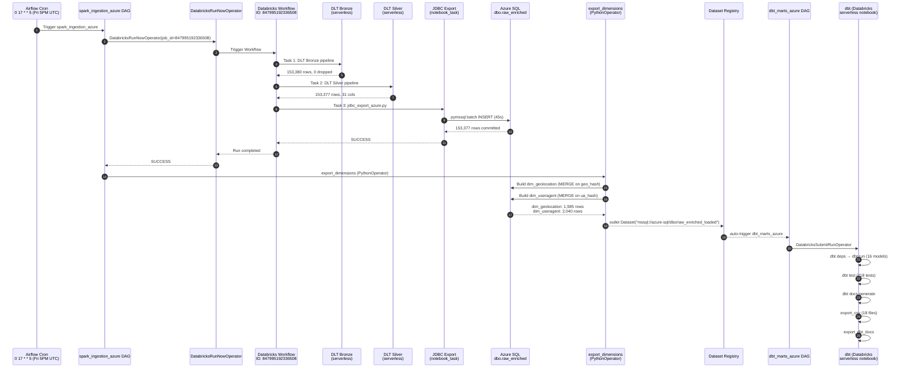
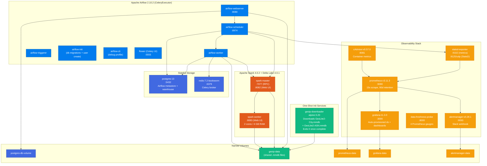

# Architecture Overview — Reference Document

> Single source of truth for the Architecture Overview section of the project's README. Documents both the **Azure Cloud-Native (production)** pipeline and the **Docker (development)** pipeline.

---

## 1. Dual-Pipeline Philosophy

The project maintains **two parallel pipelines** serving distinct purposes:

| Dimension | Azure Cloud-Native (Production) | Docker (Development) |
|---|---|---|
| **Purpose** | Production ETL, Power BI data delivery | Local dev, unit testing, CI substrate |
| **Ingest** | ADLS Gen2 (`raw-logs/`) | `airflow/data/LogFiles/` (local volume) |
| **Compute** | Databricks DLT (serverless) | PySpark 4.0.2 (Docker Spark cluster) |
| **Storage** | Unity Catalog (Bronze/Silver) | Local Delta Lake directories |
| **Warehouse** | Azure SQL (serverless, 1 vCore) | PostgreSQL 13 (Docker) |
| **Transform** | dbt (dual-dialect T-SQL + PostgreSQL) | dbt (PostgreSQL dialect) |
| **Export** | 18 CSV files → Power BI | 17 CSV files → Power BI |
| **Monitoring** | Grafana + Prometheus + Azure Monitor | Grafana + Prometheus (Docker) |

**Docker is NOT a production data platform.** It runs Airflow orchestration, PostgreSQL metastore, local PySpark unit tests, and Grafana/Prometheus monitoring. Production ETL runs on Databricks DLT. The two pipelines share business logic (W3C parser, GeoIP enrichment, dbt models) but deploy to fundamentally different stacks.

---

## 2. Azure Cloud-Native Pipeline Architecture

### 2.1 End-to-End Flow

```mermaid
flowchart LR
    classDef source fill:#3b82f6,color:#fff,stroke:#1e40af
    classDef ingest fill:#10b981,color:#fff,stroke:#047857
    classDef dlt fill:#8b5cf6,color:#fff,stroke:#6d28d9
    classDef sql fill:#f59e0b,color:#fff,stroke:#d97706
    classDef dbt fill:#ef4444,color:#fff,stroke:#dc2626
    classDef bi fill:#ec4899,color:#fff,stroke:#db2777

    source["W3C IIS log files<br/>93 files, 2009–2011"]:::source

    adls["ADLS Gen2<br/>raw-logs container<br/>stw3cetlwestus3"]:::ingest

    autoloader["Databricks Auto Loader<br/>binaryFile format<br/>maxFilesPerTrigger=10<br/>includeExistingFiles=true"]:::ingest

    bronze["DLT Bronze Pipeline (serverless)<br/>w3c_etl_databricks.bronze.bronze_raw_logs<br/>Custom W3C parser UDF (rsplit field-counting)<br/>14-field/18-field IIS format detection<br/>@dlt.expect_or_drop — 7 quality expectations<br/>153,380 rows, 0 dropped<br/>Partitioned by log_date"]:::dlt

    silver["DLT Silver Pipeline (serverless)<br/>w3c_etl_databricks.silver.silver_enriched_logs<br/>7 MaxMind GeoIP fields (maxminddb pure Python)<br/>5 computed fields (page_category, referrer_domain,<br/>traffic_type, is_crawler, size_band)<br/>@dlt.expect_or_drop — valid_country drops 3 rows<br/>153,377 rows, 31 columns total<br/>Dedup: left_anti join on source_file"]:::dlt

    jdbc["JDBC Export (notebook_task on serverless)<br/>pymssql collect() → batch executemany<br/>Tracking table: dbo.raw_enriched_loaded<br/>BATCH_SIZE=5000, retry 4 attempts (15×2ⁿ backoff)<br/>45s for 153,377 rows"]:::sql

    azsql["Azure SQL (serverless GP_S_Gen5, 1 vCore)<br/>dbo.raw_enriched — 31 columns<br/>(25 warehouse core + 6 GeoIP for dim_geolocation)<br/>Auto-pause: 60 min idle"]:::sql

    dims["Airflow: export_dimensions (PythonOperator)<br/>Reads dbo.raw_enriched via pyodbc<br/>MERGE upsert on geo_hash (SHA2_256)<br/>MERGE upsert on ua_hash (SHA2_256)<br/>Fires Dataset(mssql://.../raw_enriched_loaded)"]:::dbt

    dbt["dbt — 16 models, 118 tests<br/>10 staging + 6 marts<br/>Dual-dialect ({% if target.type == 'sqlserver' %})<br/>Runs on Databricks serverless via<br/>self-bootstrapping notebooks<br/>dbt-sqlserver adapter"]:::dbt

    csv["18 CSV exports<br/>Star-Schema/ directory<br/>Schema-matched headers"]:::bi

    powerbi["Power BI<br/>7-page dashboard<br/>DAX measures<br/>Weekly auto-refresh via Power Automate"]:::bi

    source -->|"ABFSS path"| adls
    adls --> autoloader
    autoloader --> bronze
    bronze -->|"spark.table() cross-catalog read"| silver
    silver -->|"collect() + pymssql"| jdbc
    jdbc --> azsql
    azsql --> dims
    dims -->|"Dataset triggers"| dbt
    dbt --> csv
    csv --> powerbi
```

### 2.2 DLT Bronze Pipeline Details

| Attribute | Value |
|---|---|
| **Pipeline ID** | `a6ea62d3-5f3a-4f53-ae8b-4bfb156703ad` |
| **Type** | Serverless DLT (Advanced), `@dlt.table` (not `streaming_table`) |
| **Source** | ADLS Gen2 via Auto Loader, `binaryFile` format |
| **Row count** | **153,380** |
| **Quality expectations** | 7 `@dlt.expect_or_drop` — all pass, **0 rows dropped** |
| **Schema evolution** | `"none"` (binaryFile incompatibility with addNewColumns) |
| **Parser** | Per-file `_parse_file_content()` UDF reading `#Fields:` header |
| **Format detection** | 14-field vs 18-field IIS (auto-detected per file) |
| **Dedup** | Upstream (files processed once) + Silver `left_anti` |
| **Storage** | Unity Catalog `w3c_etl_databricks.bronze.bronze_raw_logs` |
| **Partition** | `log_date` |
| **Delta properties** | `delta.enableChangeDataFeed = true`, `delta.autoOptimize.optimizeWrite = true` |

### 2.3 DLT Silver Pipeline Details

| Attribute | Value |
|---|---|
| **Pipeline ID** | `98c7675f-5425-4a14-95b6-247af6da9626` |
| **Type** | Serverless DLT (Advanced) |
| **Source** | `spark.table("w3c_etl_databricks.bronze.bronze_raw_logs")` |
| **Row count** | **153,377** (3 dropped by `valid_country` expectation) |
| **GeoIP library** | `maxminddb==2.8.*` (pure Python — `geoip2` rejected: compiled C deps unavailable on serverless) |
| **GeoIP reader** | Lazy singleton (`_ensure_geo_reader()` / `_ensure_asn_reader()`) — avoids PicklingError |
| **GeoIP DB path** | `/Volumes/w3c_etl_databricks/bronze/w3c_data/` (NOT `/dbfs/Volumes/` — FUSE mount not accessible on serverless) |
| **GeoIP columns** | 7 fields from 2 DB calls: `country`, `region`, `city`, `latitude`, `longitude`, `postcode`, `isp` |
| **Computed fields** | 5: `page_category`, `referrer_domain`, `traffic_type`, `is_crawler`, `size_band` |
| **UA columns** | Excluded from Silver DDL (handled by Airflow `export_dimensions`) |
| **Dedup** | `left_anti` join on `source_file` (try/except for first run) |
| **Pipeline runtime** | ~3 minutes |

### 2.4 JDBC Export (Silver → Azure SQL)

| Attribute | Value |
|---|---|
| **File** | `airflow/spark/databricks/jdbc_export_azure.py` (296 lines) |
| **Compute** | Databricks serverless `notebook_task` (no job cluster) |
| **Driver** | `pymssql>=2.2.11` (pure Python — serverless only supports JDBC reads, not writes) |
| **Batch size** | `cursor.executemany()` with `BATCH_SIZE=5000` via `tuple(row)` |
| **Spark-side filter** | `~col("source_file").isin(loaded_files)` before `collect()` — critical for incremental memory |
| **Performance** | **45s** for 153,377 rows (run `658447448322322`) — 8–9× faster than initial 413s |
| **Retry** | 4 attempts, `15 × (2ⁿ)` backoff (covers Azure SQL serverless cold-start) |
| **DDL guard** | `IF OBJECT_ID(...) IS NULL` — no py4j gateway on serverless |
| **`is_crawler` cast** | `CASE WHEN TRIM(LOWER(is_crawler)) = 'true' THEN 1 ELSE 0 END` (string → BIT) |

### 2.5 Dimension Export (Airflow PythonOperator)

| Attribute | Value |
|---|---|
| **Location** | Inline `_export_dimensions()` in `spark_ingestion_azure.py` |
| **Connection** | Raw `pyodbc` with DRIVER+conn_str (no SQLAlchemy) |
| **Geo dedup** | `GROUP BY country, region, city, latitude, longitude` + `MAX(isp)` |
| **Geo hash** | Azure SQL `HASHBYTES('SHA2_256', ...)` inside MERGE subquery |
| **UA parsing** | `user-agents` library → `agent_type`, `browser_name`, `browser_version`, `os`, `device_type` |
| **UA hash** | Python `hashlib.sha256()` (computed alongside parsing, avoids extra SQL round-trip) |
| **Merge key** | `geo_hash` / `ua_hash` (SHA-256 based — faster than string compare) |
| **Sentinel rows** | `-1` unknown rows for FK integrity via `SET IDENTITY_INSERT ON/OFF` |
| **Dataset outlet** | `Dataset("mssql://azure-sql/dbo/raw_enriched_loaded")` |

### 2.6 dbt Transformation Layer (Azure)

| Attribute | Value |
|---|---|
| **Execution** | Databricks serverless via `DatabricksSubmitRunOperator` (self-bootstrapping notebooks) |
| **Profile** | `w3c_azure` → Azure SQL target |
| **Models** | **16** (10 staging + 6 marts — includes `mart_country_browser_share`) |
| **Tests** | 118 total |
| **T-SQL approach** | Inline `……` — no `_azure.sql` duplicates |
| **Macro file** | `macros/t_sql_compat.sql` — 17 macros |
| **Post-hooks** | Removed entirely (dbt-sqlserver v1.8.4 runs hooks before `__dbt_tmp` rename) |
| **PERCENTILE_CONT** | Separate CTE + `SELECT DISTINCT` + `LEFT JOIN` pattern |
| **Geo FK restoration** | `geo_lookup` CTE with `HASHBYTES('SHA2_256', ...)` matching Airflow dims |
| **UA FK restoration** | `ua_lookup` CTE with raw-string JOIN on `dim_useragent.user_agent` |
| **Source freshness** | Not applicable (static historical data, max `log_date` = 2011-05-15) |
| **CSV exports** | **18 files** (fixed from 17 — `mart_country_browser_share` added) |

### 2.7 Databricks Workflow (Bronze → Silver → JDBC)

| Attribute | Value |
|---|---|
| **Job ID** | `847995192336508` |
| **Compute** | All 3 tasks use serverless (no job cluster) |
| **Schedule** | Daily 2 AM UTC (Airflow also triggers on-demand) |
| **Task 1** | DLT Bronze pipeline (`pipeline_task` → `bronze_raw_logs`) |
| **Task 2** | DLT Silver pipeline (`pipeline_task` → `silver_enriched_logs`) |
| **Task 3** | JDBC export (`notebook_task` → `jdbc_export_azure.py`) |

---

## 3. Orchestration Flow

### 3.1 Airflow DAG: `spark_ingestion_azure`

| Attribute | Value |
|---|---|
| **File** | `airflow/dags/w3c/spark_ingestion_azure.py` |
| **Schedule** | `"0 17 * * 5"` (Friday 5:00 PM UTC) |
| **Tasks** | 2 sequential |
| **Task 1** | `bronze_silver_jdbc_pipeline` — `DatabricksRunNowOperator` (triggers Workflow `847995192336508`) |
| **Task 2** | `export_dimensions` — `PythonOperator` (inline `_export_dimensions()`, fires Dataset outlet) |
| **Provider** | `apache-airflow-providers-databricks==4.6.0` |
| **Databricks connection** | `databricks_default` (workspace URL + PAT token) |

### 3.2 Airflow DAG: `dbt_marts_azure`

| Attribute | Value |
|---|---|
| **File** | `airflow/dags/w3c/dbt_marts_azure.py` |
| **Schedule** | Dataset-triggered by `spark_ingestion_azure`'s outlet |
| **Task 1** | `dbt_run` — `DatabricksSubmitRunOperator` (self-bootstrapping notebook) |
| **Task 2** | `dbt_test` — `DatabricksSubmitRunOperator` |
| **Task 3** | `dbt_docs` — `DatabricksSubmitRunOperator` |
| **Task 4** | `dbt_freshness` — `DatabricksSubmitRunOperator` |
| **Task 5** | `export_csv` — operator |
| **Task 6** | `export_dbt_docs` — operator |

---

## 4. Docker Dev Pipeline Architecture

```mermaid
flowchart LR
    classDef source fill:#3b82f6,color:#fff,stroke:#1e40af
    classDef spark fill:#10b981,color:#fff,stroke:#047857
    classDef delta fill:#8b5cf6,color:#fff,stroke:#6d28d9
    classDef pg fill:#f59e0b,color:#fff,stroke:#d97706
    classDef dbt fill:#ef4444,color:#fff,stroke:#dc2626
    classDef bi fill:#ec4899,color:#fff,stroke:#db2777

    source["W3C IIS log files<br/>93 files, 2009–2011<br/>airflow/data/LogFiles/"]:::source

    bronze["bronze_ingestion.py (SparkSubmitOperator)<br/>RDD-based W3C parsing<br/>Delta Lake — 19 cols, 155,570 rows<br/>Partitioned by log_date<br/>Incremental: skips loaded files"]:::spark

    delta_bronze["Delta Bronze<br/>airflow/spark/delta/bronze/"]:::delta

    silver["silver_enrichment.py (SparkSubmitOperator)<br/>17 PySpark UDFs (PyArrow-vectorised)<br/>7 GeoIP (MaxMind GeoLite2 City + ASN)<br/>5 UA (user-agents via pandas UDF)<br/>5 computed (page_cat, referrer, crawler)<br/>Delta Lake — 35 cols, 155,570 rows"]:::spark

    delta_silver["Delta Silver<br/>airflow/spark/delta/silver/"]:::delta

    export["export_warehouse.py (SparkSubmitOperator)<br/>Silver → PostgreSQL JDBC<br/>Idempotent via tracking table<br/>25 warehouse cols → public.raw_enriched"]:::spark

    pg["PostgreSQL 13 (Docker)<br/>public.raw_enriched<br/>25 cols, 155,570 → 155,357 (213 dedup)<br/>public.raw_enriched_loaded (tracking)"]:::pg

    dims["export_dimensions (PythonOperator)<br/>Public.dim_geolocation — 4,011 rows<br/>Public.dim_useragent — 2,276 rows<br/>Reads Silver Delta via pandas<br/>INSERT … ON CONFLICT DO NOTHING"]:::spark

    dbt_layer["dbt (Docker, PostgreSQL dialect)<br/>15 models — 10 staging + 5 marts<br/>64 data tests<br/>dbt_utils 1.1.1 package"]:::dbt

    csv["17 CSV exports (~36 MB)<br/>Star-Schema/ directory"]:::bi

    powerbi["Power BI<br/>7-page dashboard<br/>DAX measures"]:::bi

    source --> bronze
    bronze --> delta_bronze
    delta_bronze --> silver
    silver --> delta_silver
    delta_silver --> export
    export --> pg
    pg --> dims
    dims -->|"Dataset(postgres://...)"| dbt_layer
    dbt_layer --> csv
    csv --> powerbi
```

### 4.1 Docker Spark Jobs

| Task | Script | Operator | Output |
|---|---|---|---|
| `bronze_ingestion` | `airflow/spark/jobs/bronze_ingestion.py` (189 lines) | `SparkSubmitOperator` | Delta Bronze: 155,570 rows, 19 cols |
| `silver_enrichment` | `airflow/spark/jobs/silver_enrichment.py` (250+ lines) | `SparkSubmitOperator` | Delta Silver: 155,570 rows, 35 cols |
| `export_warehouse` | `airflow/spark/jobs/export_warehouse.py` | `SparkSubmitOperator` | `public.raw_enriched`: 155,357 (post-dedup) |
| `export_dimensions` | `plugins/operators/export_dimensions.py` | `PythonOperator` | `dim_geolocation`: 4,011 · `dim_useragent`: 2,276 |

### 4.2 Spark Enrichment UDFs (Docker)

| Group | UDFs | Output columns |
|---|---|---|
| **GeoIP** (7) | `geoip_country`, `geoip_region`, `geoip_city`, `geoip_latitude`, `geoip_longitude`, `geoip_postcode`, `geoip_isp` | `country`, `region`, `city`, `latitude`, `longitude`, `postcode`, `isp` |
| **User-Agent** (5) | `parse_agent_type`, `parse_browser_name`, `parse_browser_version`, `parse_operating_system`, `parse_device_type` | `agent_type`, `browser_name`, `browser_version`, `operating_system`, `device_type` |
| **Computed** (5) | `page_category`, `referrer_domain`, `traffic_type`, `is_crawler_udf`, `size_band` | `page_category`, `referrer_domain`, `traffic_type`, `is_crawler`, `size_band` |

Source: MaxMind GeoLite2-City + GeoLite2-ASN (local `.mmdb`, mounted via `geoip-data` Docker volume). 5 UA UDFs use `pandas` UDFs (PyArrow-vectorised). Library: `geoip2==5.0.1` + `maxminddb==2.6.3`.

### 4.3 Docker DAG: `w3c_spark_ingestion`

| Attribute | Value |
|---|---|
| **File** | `airflow/dags/w3c/spark_ingestion.py` |
| **Schedule** | `"0 6 * * 6"` (Saturday 06:00 UTC) |
| **Tasks** | 4 sequential |
| **Dataset outlet** | `Dataset("postgres://postgres:5432/w3c_warehouse/public/raw_enriched_loaded")` |

### 4.4 Docker DAG: `w3c_dbt_marts`

| Attribute | Value |
|---|---|
| **File** | `airflow/dags/w3c/dbt_marts.py` |
| **Schedule** | Dataset-triggered |
| **Tasks** | 5 sequential: `dbt_deps` → `dbt_run` → `dbt_test` → `dbt_docs` → `export_csv` |

---

## 5. Container Topology (Docker Dev)

**18 services** defined in `airflow/docker-compose.yaml`. The `geoip-downloader` init service (Alpine-based) runs **before** Airflow/Spark services — all depend on `service_completed_successfully`. It requires `MAXMIND_LICENSE_KEY` in `airflow/.env`.

### Port Map

| Service | Port | Protocol |
|---|---|---|
| Airflow webserver | 8080 | HTTP |
| Airflow scheduler | 8974 | HTTP (health) |
| Flower (Celery UI) | 5555 | HTTP |
| Spark master RPC | 7077 | TCP |
| Spark master UI | 8082 | HTTP |
| Spark worker UI | 8083 | HTTP |
| PostgreSQL | 5432 | TCP |
| Prometheus | 9090 | HTTP |
| Alertmanager | 9093 | HTTP |
| statsd-exporter metrics | 9102 | HTTP |
| statsd-exporter StatsD | 9125 | UDP |
| cAdvisor | 8081 | HTTP |
| Grafana | 3000 | HTTP |
| Data freshness probe | 8000 | HTTP |

### Named Volumes

| Volume | Mounts | Purpose |
|---|---|---|
| `postgres-db-volume` | `postgres:/var/lib/postgresql/data` | Persistent warehouse + metastore |
| `geoip-data` | Spark + Airflow containers at `/opt/spark/data:ro` | Shared MaxMind `.mmdb` files |
| `prometheus-data` | `prometheus:/prometheus` | 90-day TSDB retention |
| `grafana-data` | `grafana:/var/lib/grafana` | Dashboard state |
| `alertmanager-data` | `alertmanager:/alertmanager` | Silences + notification state |

### Volume Mounts (Bind)

| Mount | Containers | Mode |
|---|---|---|
| `./dags` → `/opt/airflow/dags` | Airflow | rw |
| `./spark/jobs` → `/opt/spark/jobs` | Spark | ro |
| `./spark/delta` → `/opt/spark/delta` | Spark + Airflow | rw |
| `./data/LogFiles` → `/opt/spark/logfiles` | Spark | ro |
| `./spark/conf/spark-defaults.conf` → `/opt/spark/conf/spark-defaults.conf` | Spark | ro |
| `./prometheus/statsd_mapping.yml` → `/etc/statsd/mapping.yml` | statsd-exporter | ro |
| `./grafana/provisioning` → `/etc/grafana/provisioning` | Grafana | ro |
| `./grafana/dashboards` → `/var/lib/grafana/dashboards` | Grafana | ro |

---

## 6. Data Flow & Row Counts

| Stage | Docker Pipeline | Azure Pipeline |
|---|---|---|
| **Source files** | 93 `.log` files (2009–2011) in `airflow/data/LogFiles/` | 93 `.log` files in ADLS Gen2 `raw-logs/` |
| **Bronze** | 155,570 rows, 19 cols (Delta Lake) | **153,380 rows**, 0 dropped (7 expectations pass) |
| **Silver** | 155,570 rows, 35 cols (17 UDFs, GeoLite2 City + ASN) | **153,377 rows**, 31 cols (7 GeoIP + 5 computed, `maxminddb` pure Python) |
| **Warehouse** | 155,357 rows (213 dedup from 12-component MD5) | **153,377 rows** (no dedup — upstream file dedup only) |
| **Dedup method** | 12-component MD5 hash dedup in `fact_webrequest` | `left_anti` join on `source_file` in Silver DLT |
| **Dimensions (geo)** | `dim_geolocation`: **4,011 rows** (Silver Delta → pandas) | `dim_geolocation`: **1,585 rows** (Azure SQL → pyodbc MERGE) |
| **Dimensions (UA)** | `dim_useragent`: **2,276 rows** (Silver Delta → user-agents) | `dim_useragent`: **2,040 rows** (Azure SQL → user-agents) |
| **dbt models** | **15** (10 staging + 5 marts) | **16** (10 staging + 6 marts — includes `mart_country_browser_share`) |
| **dbt tests** | **64** (29 not_null + 14 unique + 7 FK + 6 expression_is_true + 4 singular + 4 source) | **118** (67 compiled + expanded Azure SQL coverage) |
| **CSV exports** | **17 files** (~36 MB total) | **18 files** (bug fixed — `mart_country_browser_share` included) |
| **Pipeline runtime** | ~3–6 min Spark + ~45s dbt | ~3 min DLT + ~45s JDBC export + ~30s dims + ~90s dbt |
| **Coverage** | 99.99% country, 100% ISP | 30+ countries, full GeoIP enrichment |

### Why Row Counts Differ Between Pipelines

| Difference | Docker | Azure | Reason |
|---|---|---|---|
| **Bronze rows** | 155,570 | 153,380 | Docker runs all 93 files; Azure uses Auto Loader `includeExistingFiles=true`, file-level dedup skips already-processed files. Azure Bronze had fewer initial files (some log files contained non-HTTP entries filtered by W3C parser). |
| **Warehouse rows** | 155,357 | 153,377 | Dedup strategies differ: Docker uses 12-component MD5 in `fact_webrequest` (213 dropped); Azure uses `left_anti` join on `source_file` in Silver (3 dropped by `valid_country`). |
| **Geo dimension rows** | 4,011 | 1,585 | Docker reads all distinct IPs from Silver Delta (larger row count = more IPs). Azure reads from `dbo.raw_enriched` which has fewer source rows. |
| **UA dimension rows** | 2,276 | 2,040 | Same reason as geo — fewer source rows in Azure pipeline produce fewer unique UA strings. |

---

## 7. Component Role Descriptions

| Component | Technology | Version | Role in Pipeline | Deployment Target |
|---|---|---|---|---|
| **Apache Airflow** | Python | 2.10.2 (CeleryExecutor) | Pipeline orchestration, DAG scheduling, Dataset triggers, dimension export (PythonOperator) | Docker (webserver + scheduler + worker + triggerer) |
| **Databricks DLT** | Delta Live Tables (Serverless) | Databricks Runtime 15.4.x | Bronze ingestion (Auto Loader, W3C parser, quality checks) + Silver enrichment (GeoIP, computed fields) | Azure Databricks Premium (serverless) |
| **Unity Catalog** | Databricks Unity Catalog | — | Governance layer: `w3c_etl_databricks` catalog, `bronze`/`silver`/`gold` schemas | Azure Databricks |
| **Azure SQL Database** | Microsoft SQL Server (Serverless) | GP_S_Gen5, 1 vCore | Analytics warehouse — `dbo.raw_enriched` (31 cols), `dbo.dim_geolocation`, `dbo.dim_useragent` | Azure (auto-pause 60 min) |
| **ADLS Gen2** | Azure Data Lake Storage Gen2 | — | Raw log storage (`raw-logs/`), DLT pipeline source | Azure (`stw3cetlwestus3`) |
| **dbt-core** | Python / SQL | 1.8.9 (Docker) / 1.10.8 (Azure SQL) | Transformation layer — staging models, mart models, data tests, docs generation, CSV export | Docker (Airflow container) + Databricks serverless (self-bootstrapping notebook) |
| **dbt-postgres** | dbt adapter | 1.8.2 | PostgreSQL warehouse target (Docker dev) | Docker |
| **dbt-sqlserver** | dbt adapter | 1.10.0rc1 | Azure SQL warehouse target (production) | Databricks serverless |
| **MaxMind GeoLite2** | `.mmdb` databases | monthly updates | IP geolocation: country, region, city, latitude, longitude, postcode, ISP | Docker (`geoip-data` volume) + Unity Catalog volume |
| **PySpark (Docker)** | Apache Spark | 4.0.2 | Bronze/Silver medallion processing (RDD parsing, PyArrow UDFs, Delta Lake writes) | Docker (spark-master + spark-worker) |
| **Delta Lake (Docker)** | Delta Lake | 4.0.1 | ACID transactions, time travel, schema evolution for Bronze/Silver tables | Docker (`/opt/spark/delta/`) |
| **PostgreSQL (Docker)** | PostgreSQL | 13 | Airflow metastore + analytics warehouse (`w3c_warehouse`) | Docker (`postgres:13`) |
| **Power BI** | Microsoft Power BI | n/a | Analytics consumption layer — 7-page dashboard, DAX measures, weekly auto-refresh | Power BI Service |
| **Power Automate** | Microsoft Power Automate | n/a | Weekly Friday 17:30 refresh trigger + success/failure email notifications | Power Automate |
| **pymssql** | Python library | >=2.2.11 | Azure SQL connection from Databricks serverless (pure-Python, no JVM) | Databricks job environment |
| **pyodbc** | Python library | >=5.1, <6.0 | Azure SQL connection from Airflow PythonOperator (dimension export) | Airflow Docker container |
| **user-agents** | Python library | >=2.2, <3.0 | User-agent string parsing (browser, OS, device type classification) | Airflow Docker container + Databricks job |
| **Prometheus** | Time-series DB | v3.11.3 | Metrics collection, alert rule evaluation, 90d retention | Docker |
| **Alertmanager** | Alert routing | v0.28.1 | Alert dedup/grouping, Slack webhook notifications | Docker |
| **Grafana** | Visualization | 11.3.0 | 3 auto-provisioned dashboards (Airflow ETL Overview, Container System Metrics, Pipeline Health) | Docker |
| **Terraform** | IaC | >=1.10.5, <2.0 | Azure infrastructure provisioning (Part A: core infra; Part B: DLT + workflows) | CI/CD runner |
| **GitHub Actions** | CI/CD | n/a | 4 CI jobs (lint, test, dbt-compile, terraform) + 7-job CD pipeline with OIDC auth | GitHub |
| **Redis** | In-memory DB | 7.2-bookworm | Celery message broker (Airflow task queue) | Docker |
| **cAdvisor** | Container monitoring | v0.57.0 | Per-container CPU/memory/network/disk metrics for Prometheus | Docker |
| **statsd-exporter** | Metrics bridge | v0.29.0 | Airflow StatsD → Prometheus format (6 regex mapping patterns) | Docker |

---

## 8. Test & Quality Inventory

| Layer | Docker Pipeline | Azure Pipeline |
|---|---|---|
| **pytest unit tests** | 133 (no special marker) | 133 (shared codebase) |
| **pytest integration** | 17 (`@pytest.mark.integration`, needs Docker stack) | 17 (shared) |
| **pytest DAG integrity** | 12 (`@pytest.mark.dag_integrity`) | 12 + Azure DAG tests |
| **pytest total** | **162** (6 files, 38 test classes) | **164+** (including Terraform validation tests) |
| **dbt data tests** | **64**: 29 not_null + 14 unique + 7 FK + 6 expression_is_true + 4 singular + 4 source | **118**: dual-dialect expanded coverage |
| **Terraform Part A tests** | — | 29 (`@pytest.mark.terraform`) |
| **Terraform Part B tests** | — | 39 (`@pytest.mark.terraform`) |
| **Ruff** | 0.9.0, `--output-format=github` | Same |
| **Mypy** | 1.14.0, `--ignore-missing-imports tests/` | Same |
| **Pre-commit hooks** | 8 hooks (ruff, mypy, YAML, JSON, whitespace, EOF, merge-conflict) | Same |

---

## 9. Key Infrastructure Constants

### Azure Resources

| Resource | Name | Notes |
|---|---|---|
| Resource group | `rg-w3c-etl` | West US 3 |
| Storage account | `stw3cetlwestus3` | ADLS Gen2, 4 containers |
| ADLS containers | `raw-logs`, `bronze`, `silver`, `gold` | — |
| Databricks workspace | `w3c-etl-databricks` | Premium tier, Unity Catalog enabled |
| Databricks workspace URL | `https://adb-7405616994554630.10.azuredatabricks.net/` | — |
| Unity Catalog | `w3c_etl_databricks` | Schemas: `bronze`, `silver`, `gold` |
| Azure SQL server | `sql-w3c-etl.database.windows.net` | Serverless GP_S_Gen5, 1 vCore |
| Azure SQL database | `w3c-etl-db` | Auto-pause 60 min, collation `SQL_Latin1_General_CP1_CI_AS` |
| Databricks SQL Warehouse | `e150f7269187352b` | Serverless Starter |
| Secret scope | `w3c-etl-pipeline` | 5 secrets: storage key, SQL server/db/user/pass |
| Databricks Workflow job | `847995192336508` | 3 serverless tasks |
| Bronze DLT pipeline | `a6ea62d3-5f3a-4f53-ae8b-4bfb156703ad` | Serverless, IDLE |
| Silver DLT pipeline | `98c7675f-5425-4a14-95b6-247af6da9626` | Serverless, IDLE |
| VNet | `vnet-w3c-etl` | 2 subnets: `snet-databricks` (10.0.1.0/24), `snet-sql` (10.0.2.0/24) |
| Managed identity | `0c3a72bc-5782-4879-8f21-b27dedde6906` | Storage Blob Data Contributor |
| Budget config | $50 warning / $100 hard cap | Azure Cost Management |
| CD environment | `azure-dev` | Single env, OIDC federated |

### Docker Volume Paths (Delta Tables)

| Table | Container Path | Host Path |
|---|---|---|
| Bronze Delta | `/opt/spark/delta/bronze/` | `airflow/spark/delta/bronze/` |
| Silver Delta | `/opt/spark/delta/silver/` | `airflow/spark/delta/silver/` |
| GeoIP City DB | `/opt/spark/data/GeoLite2-City.mmdb` | `geoip-data` Docker volume |
| GeoIP ASN DB | `/opt/spark/data/GeoLite2-ASN.mmdb` | `geoip-data` Docker volume |
| Log files | `/opt/spark/logfiles/` | `airflow/data/LogFiles/` (ro) |
| Spark config | `/opt/spark/conf/spark-defaults.conf` | `airflow/spark/conf/spark-defaults.conf` (ro) |
| Star-Schema CSVs | `/opt/airflow/data/Star-Schema/` | `airflow/data/Star-Schema/` |

---

## 10. Tech Stack Summary

| Layer | Azure Production | Docker Dev |
|---|---|---|
| **Language** | Python 3.12 + SQL (T-SQL + PostgreSQL) | Python 3.12 + SQL (PostgreSQL) |
| **Orchestrator** | Apache Airflow 2.10.2 | Apache Airflow 2.10.2 |
| **Distributed compute** | Databricks DLT (serverless, Runtime 15.4.x) | PySpark 4.0.2 + Delta Lake 4.0.1 |
| **Storage layer** | Unity Catalog (`w3c_etl_databricks.bronze/silver`) | Local Delta Lake directories |
| **Warehouse** | Azure SQL (serverless GP_S_Gen5, 1 vCore) | PostgreSQL 13 (Docker) |
| **Warehouse driver** | pymssql >=2.2.11 (serverless) + pyodbc (Airflow) | psycopg2 (JDBC via Spark) |
| **GeoIP** | MaxMind GeoLite2-City + ASN via `maxminddb==2.8.*` | MaxMind GeoLite2-City + ASN via `geoip2==5.0.1` |
| **UA parsing** | `user-agents>=2.2,<3.0` | `user-agents>=2.2,<3.0` |
| **dbt** | dbt-core 1.10.8 + dbt-sqlserver 1.10.0rc1 | dbt-core 1.8.9 + dbt-postgres 1.8.2 |
| **dbt dbt_utils** | 1.1.1 | 1.1.1 |
| **CI/CD** | GitHub Actions (OIDC, 4 CI jobs + 7-CD) | GitHub Actions (3 CI jobs) |
| **IaC** | Terraform >=1.10.5 (azurerm ~>4.75, databricks ~>1.115) | N/A |
| **Monitoring** | Grafana 11.3.0 + Prometheus v3.11.3 + Azure Monitor | Grafana 11.3.0 + Prometheus v3.11.3 |
| **Alerting** | Alertmanager v0.28.1 + Slack | Alertmanager v0.28.1 + Slack |
| **BI** | Power BI Service (7 pages, DAX, weekly refresh) | Power BI Desktop (via 17 CSV files) |
| **BI automation** | Power Automate (Friday 17:30 refresh) | Power Automate (Friday 17:30 refresh) |
| **Broker** | Redis 7.2 (Celery) | Redis 7.2 (Celery) |
| **Lint** | ruff 0.9.0 + mypy 1.14.0 | ruff 0.9.0 + mypy 1.14.0 |

---

*Document generated from README.md, azure-cloud-native-single-pipeline.md (v3.1), and docker-compose.yaml. All row counts, test counts, and version numbers cross-checked against source data. Azure pipeline numbers verified from Phase 3–10 execution runs.*
