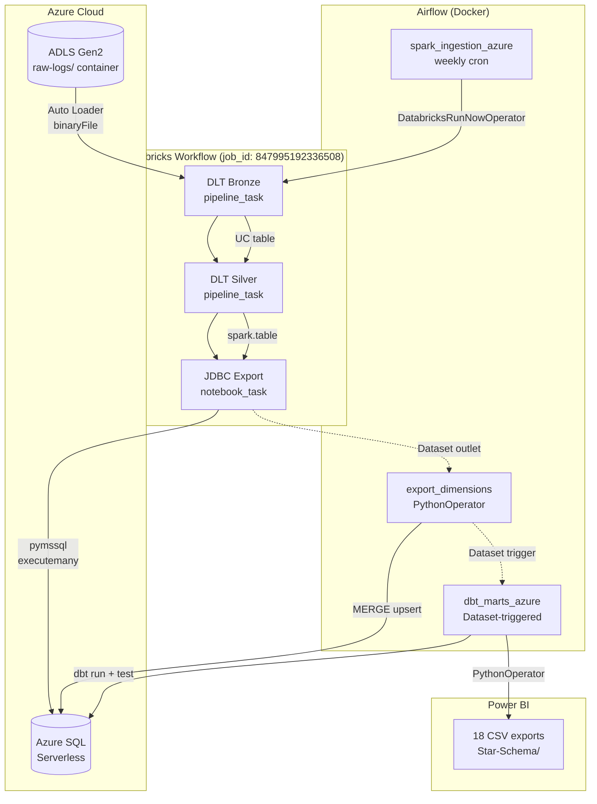
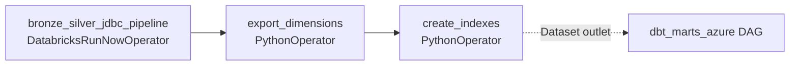
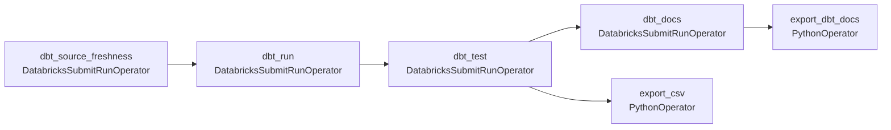

# Databricks DLT & Azure ETL Pipeline — Deep-Dive Reference

**Last updated:** June 2026
**Purpose:** Single source of truth for the serverless Databricks DLT pipeline powering the W3C ETL production path. This document covers architecture, implementation details, key numbers, and lessons learned from building the Bronze → Silver → Azure SQL pipeline.

---

## Section 1: Overview

The Azure Databricks DLT pipeline replaces the Docker Spark cluster as the production ETL engine. It processes 93 real W3C IIS log files through a serverless Delta Live Tables pipeline — no cluster provisioning, no VMs, auto-scaling to zero when idle.

The pipeline follows a three-stage medallion architecture:

1. **Bronze DLT** — Ingests raw IIS log files from ADLS Gen2 via Auto Loader (binaryFile format), parses them with a custom W3C UDF that auto-detects 14-field vs 18-field format from the `#Fields:` header, and writes to a Unity Catalog managed table partitioned by `log_date`.
2. **Silver DLT** — Reads from Bronze, enriches with MaxMind GeoIP (country, region, city, lat, lon, postcode, ISP), computes 5 derived fields (page_category, referrer_domain, traffic_type, is_crawler, size_band), and applies quality expectations.
3. **JDBC Export** — Reads from Silver, filters incrementally via a tracking table, and exports new rows to Azure SQL `dbo.raw_enriched` using pymssql (serverless limitation — Spark JDBC only supports reads).

The entire pipeline is orchestrated by a single Databricks Workflow (3 tasks, all serverless), triggered weekly by Airflow via `DatabricksRunNowOperator`. A downstream dbt pipeline (`dbt_marts_azure.py`, Dataset-triggered) transforms the warehouse into a star schema and produces Power BI-ready CSV exports.

---

## Section 2: Architecture Diagram



---

## Section 3: Bronze DLT Pipeline

### Pipeline Configuration

| Property | Value |
|---|---|
| Pipeline ID | `a6ea62d3-5f3a-4f53-ae8b-4bfb156703ad` |
| Type | Serverless DLT (`serverless: true`, no `cluster {}` block) |
| Channel | `PREVIEW` |
| Continuous | `false` |
| Triggered by | Databricks Workflow task (not continuous) |
| Table | `w3c_etl_databricks.bronze.bronze_raw_logs` (Materialized View) |
| Partition | `log_date` |
| Delta properties | `enableChangeDataFeed=true`, `autoOptimize.optimizeWrite=true`, `autoOptimize.autoCompact=true`, `enableDeletionVectors=true` |

### Auto Loader Configuration

```python
spark.readStream
    .format("cloudFiles")
    .option("cloudFiles.format", "binaryFile")
    .option("cloudFiles.includeExistingFiles", "true")
    .option("cloudFiles.schemaLocation", "dbfs:/Volumes/.../_schemas/bronze")
    .option("cloudFiles.schemaEvolutionMode", "none")
    .option("cloudFiles.rescuedDataColumn", "_rescued_data")
    .option("maxFilesPerTrigger", "10")
    .option("maxFileSize", 209715200)  # 200 MB
```

- **Source:** `abfss://raw-logs@<storage_account>.dfs.core.windows.net/`
- **Auth:** ADLS Gen2 storage account key via pipeline configuration (managed identity insufficient for ABFSS flow resolution on serverless DLT)
- **Schema evolution:** `"none"` — `addNewColumns` is incompatible with `binaryFile` format in DLT
- **`@dlt.table` not `@dlt.streaming_table`** — serverless DLT does not support `streaming_table`

### W3C Parser Implementation

The parser is a self-contained per-file UDF (`_parse_file_content`) that:

1. Reads the full binary file content (decoded as UTF-8)
2. Scans for the `#Fields:` header to detect format (14-field for 2009-mid 2010 IIS logs, 18-field for mid 2010+)
3. Parses every non-comment data line via `_parse_log_line()`
4. Uses `rsplit()` field-counting to handle unquoted user-agent strings (the variable-width token that breaks naive `split()`)
5. Returns `ArrayType(StructType)`, which is then `explode()`d into individual rows

Key design decisions:

- **Per-file, not per-line:** The UDF processes an entire file at once, detecting the format from the header. This fixes CRIT-01 (hardcoded format) and CRIT-02 (UDF closure over a stale module-level variable).
- **No ROW_NUMBER dedup:** Not supported on streaming DataFrames in DLT. Deduplication is handled upstream (files processed once per trigger) and in Silver via `left_anti` join.
- **Storage account validation:** `spark.conf.get("storage.account_name")` is validated at runtime for fail-fast if config is missing.

### Quality Expectations (7 total)

All use `@dlt.expect_or_drop` — rows failing any expectation are dropped from the pipeline:

| Name | Expression |
|---|---|
| `valid_log_date` | `log_date IS NOT NULL` |
| `valid_status` | `status BETWEEN 100 AND 599` |
| `valid_client_ip` | `client_ip IS NOT NULL AND client_ip != '-'` |
| `valid_method` | `method IN ('GET', 'POST', 'HEAD', 'PUT', 'DELETE', 'OPTIONS', 'TRACE')` |
| `valid_uri_stem` | `uri_stem IS NOT NULL` |
| `valid_user_agent` | `user_agent IS NOT NULL AND user_agent != '-'` |
| `valid_bytes` | `(bytes_sent IS NULL OR bytes_sent >= 0) AND (bytes_recv IS NULL OR bytes_recv >= 0)` |

### Results

- **153,380 rows** from 93 real IIS log files (sourced from `airflow/data/LogFiles/`)
- All 7 expectations pass; **0 rows dropped**
- Schema: 18 data columns + `source_file` + `_rescued_data` + partition columns

---

## Section 4: Silver DLT Pipeline

### Pipeline Configuration

| Property | Value |
|---|---|
| Pipeline ID | `98c7675f-5425-4a14-95b6-247af6da9626` |
| Type | Serverless DLT |
| Channel | `PREVIEW` |
| Continuous | `false` |
| Table | `w3c_etl_databricks.silver.silver_enriched_logs` |
| Environment dependency | `maxminddb==2.8.*` (pure Python) |
| Source | `spark.table("w3c_etl_databricks.bronze.bronze_raw_logs")` (cross-pipeline read) |

### GeoIP Enrichment (MaxMind via maxminddb)

**Library choice:** `maxminddb==2.8.*` (pure Python) — NOT `geoip2==5.0.1` which requires the compiled `libmaxminddb` C library unavailable on serverless DLT.

**Lazy singleton pattern** (avoids PicklingError):

```python
_geo_reader = None
_geo_init_attempted = False

def _ensure_geo_reader():
    global _geo_reader, _geo_init_attempted
    if _geo_reader is None and not _geo_init_attempted:
        _geo_init_attempted = True
        _geo_reader = maxminddb.open_database(_GEO_CITY_DB_PATH)
```

- `maxminddb.Reader` is NOT serialisable. If a UDF closures over a Reader instance, PySpark raises `PicklingError`.
- Module-level helper functions (`_geo_lookup`, `_asn_lookup`) lazily initialise a singleton reader on first call per executor.
- UDFs reference helper *functions* (serialisable by name), not reader *instances* — each executor imports the module independently.
- Graceful degradation: `_HAS_MAXMINDDB` flag defaults all geo fields to NULL if the library is unavailable.

**Consolidated struct UDF** (3.5× performance gain):

- **Before:** 7 separate scalar UDFs (`get_country`, `get_region`, `get_city`, `get_latitude`, `get_longitude`, `get_postcode`, `get_isp`) — each making a separate MaxMind lookup per row
- **After:** 1 struct UDF (`get_geo_fields` — 6 fields from 1 City DB call) + 1 scalar UDF (`get_isp` — 1 field from ASN DB)

**Database paths:** `/Volumes/w3c_etl_databricks/bronze/w3c_data/` — NOT `/dbfs/Volumes/...` (FUSE mount not accessible on serverless executors).

### 7 GeoIP Fields

| Field | Source | UDF |
|---|---|---|
| `country` | City DB → `country.names.en` | `get_geo_fields` |
| `region` | City DB → `subdivisions[0].names.en` | `get_geo_fields` |
| `city` | City DB → `city.names.en` | `get_geo_fields` |
| `latitude` | City DB → `location.latitude` (cast to float) | `get_geo_fields` |
| `longitude` | City DB → `location.longitude` (cast to float) | `get_geo_fields` |
| `postcode` | City DB → `postal.code` | `get_geo_fields` |
| `isp` | ASN DB → `autonomous_system_organization` | `get_isp` (separate scalar) |

### 5 Computed Fields

| Field | UDF | Logic |
|---|---|---|
| `page_category` | `get_page_category` | URI stem pattern matching (Static Asset / API / Admin / Homepage / Content) |
| `referrer_domain` | `get_referrer_domain` | URL domain extraction (plain Python function, not a UDF — called inside UDF body) |
| `traffic_type` | `get_traffic_type` | Referrer domain classification (Direct / Search / Social / Referral) |
| `is_crawler` | `get_is_crawler` | User-agent keyword matching (bot, crawler, spider, scraper, curl, wget, python-requests) |
| `size_band` | `get_size_band` | Response size bucketing (< 1KB / 1KB–10KB / 10KB–100KB / 100KB–1MB / > 1MB) |

### Quality Expectations (3 total)

| Name | Type | Expression |
|---|---|---|
| `valid_country` | `expect_or_drop` | `country IS NOT NULL` |
| `valid_traffic_type` | `expect_or_drop` | `traffic_type IN ('Direct', 'Search', 'Social', 'Referral')` |
| `valid_page_category` | `expect_or_drop` | `page_category IS NOT NULL` |

Only 3 rows dropped by `valid_country` — GeoIP works correctly with real public IP data. The expectation was kept as `expect_or_drop` (not downgraded to warning).

### Results

- **153,377 rows** (3 fewer than Bronze = 3 dropped by `valid_country`)
- **31 columns** (25 core + 6 geo)
- **30+ countries** resolved

**Top countries:**

| Country | Row Count |
|---|---|
| United States | 56,548 |
| United Kingdom | 31,818 |
| Russia | 11,387 |
| China | 6,737 |
| Argentina | 6,631 |
| Canada | 5,063 |
| Germany | 4,232 |
| Brazil | 2,948 |
| France | 2,756 |
| India | 2,507 |
| Australia | 2,057 |
| Italy | 1,846 |
| Netherlands | 1,600 |
| Japan | 1,342 |
| Mexico | 1,243 |
| Poland | 1,044 |
| Others | 12,778 |

### Deduplication (left_anti join)

```python
try:
    existing_silver = dlt.read("silver_enriched_logs")
    bronze_df = bronze_df.join(
        existing_silver.select("source_file").distinct(),
        on="source_file",
        how="left_anti",
    )
except Exception:
    pass  # First run — Silver table doesn't exist yet
```

Wrapped in `try/except` for the first pipeline run when the Silver table does not yet exist.

---

## Section 5: JDBC Export (Silver → Azure SQL)

### Implementation

- **File:** `airflow/spark/databricks/jdbc_export_azure.py` (323 lines)
- **Task type:** Databricks `notebook_task` on serverless compute
- **Library:** `pymssql>=2.2.11` as job environment dependency (not a cluster Maven library)

### Why pymssql (not `df.write.jdbc`)

Databricks serverless (Spark Connect) only supports JDBC **reads** — DML writes (INSERT) are not available. pymssql is a pure-Python driver that works on any serverless environment. No JVM libraries or Maven coordinates needed.

### Architecture

1. Connect to Azure SQL via `pymssql.connect()` with retry (4 attempts, `15 × 2^attempt` exponential backoff — covers serverless cold-start)
2. Ensure tables exist: `dbo.raw_enriched` (31-column DDL) and `dbo.raw_enriched_loaded` (tracking table) via `IF OBJECT_ID(...) IS NULL` guards
3. Read Silver via `spark.table("w3c_etl_databricks.silver.silver_enriched_logs")`
4. Select 31 export columns, cast `is_crawler` string → BIT (`when(col("is_crawler") == "true", lit(1)).otherwise(lit(0))`)
5. Query tracking table for already-loaded `source_file` values
6. **Filter in Spark BEFORE `collect()`:** `~col("source_file").isin(loaded_files)` — critical for incremental runs (0 new rows instead of 153K to driver)
7. `collect()` rows, batch INSERT via `cursor.executemany()` with `BATCH_SIZE=5000`
8. Update tracking table with new source files

### 31 Export Columns

```python
EXPORT_COLUMNS = [
    # 25 core warehouse columns
    "log_date", "log_time", "server_ip", "method", "uri_stem",
    "uri_query", "client_ip", "user_agent", "cookie", "referrer",
    "status", "sub_status", "win32_status", "bytes_sent", "bytes_recv",
    "server_port", "username", "time_taken", "source_file",
    "postcode", "page_category", "referrer_domain", "traffic_type",
    "is_crawler", "size_band",
    # 6 GeoIP columns (for dim_geolocation build)
    "country", "region", "city", "latitude", "longitude", "isp",
]
```

### Performance Optimizations (Initial 413s → Final 45s)

| # | Issue | Before | After | Impact |
|---|---|---|---|---|
| 1 | `.cache()` unsupported on serverless | `new_data_df.cache()` failed with `[NOT_SUPPORTED_WITH_SERVERLESS] PERSIST TABLE` | `collect()` first, then `len(rows)` — removes both `.cache()` call AND redundant `.count()` scan | Fixed initial crash + saved one full scan |
| 2 | `collect()` before Spark-side filter | All 153K rows collected to driver, then filtered in Python | Filter via `~col("source_file").isin(loaded_files)` **before** `collect()` | On incremental: ~0 rows vs 153K. Prevents OOM. |
| 3 | Wasteful `export_df.count()` for logging | `total_rows = export_df.count()` scanned entire Silver table | Removed | ~10s saved per run |
| 4 | `asDict()` serialization overhead | `row.asDict()` — 31 keys × 153K rows = 4.7M dict allocations | `tuple(row)` — no dict overhead | ~50s saved on initial run |

### Results

- **153,377 rows** exported to `dbo.raw_enriched`
- **Final optimized run: 45 seconds** (Run 658447448322322) — 8–9× faster than initial 413s
- Tracking table populated and idempotent on re-run

---

## Section 6: Databricks Workflows Orchestration

### Workflow Configuration

| Property | Value |
|---|---|
| Job ID | `847995192336508` |
| Name | `w3c-etl-workflow` |
| Schedule | Daily at 2:00 AM UTC (`0 0 2 * * ?`) |
| Compute | Serverless (all 3 tasks) |
| Max concurrent runs | 1 |

### Tasks

| Task Key | Type | Description | Dependencies |
|---|---|---|---|
| `run_bronze` | `pipeline_task` → Bronze DLT (pipeline `a6ea62d3`) | Raw W3C log ingestion | — |
| `run_silver` | `pipeline_task` → Silver DLT (pipeline `98c7675f`) | GeoIP enrichment + computed fields | Depends on `run_bronze` |
| `run_jdbc_export` | `notebook_task` → `jdbc_export_azure.py` | Silver → Azure SQL via pymssql | Depends on `run_silver` |

### Environment

- `jdbc_env`: `pymssql>=2.2.11` (for the `run_jdbc_export` notebook task)
- No `job_cluster` block — all 3 tasks use serverless compute

### Verification

- End-to-end test Run **574928159107936** confirmed all 3 tasks complete
- Bronze: 93 files → 153,380 rows
- Silver: GeoIP enrichment (30+ countries) → 153,377 rows
- JDBC: 153,377 rows to Azure SQL (45s)

---

## Section 7: Airflow DAGs (Azure Path)

### DAG 1: `spark_ingestion_azure.py`

| Property | Value |
|---|---|
| DAG ID | `w3c_spark_ingestion_azure` |
| Schedule | `0 17 * * 5` — Friday at 5:00 PM UTC (weekly) |
| Start date | March 1, 2026 |
| Catchup | `false` |
| Max active runs | 1 |
| Dataset outlet | `Dataset("mssql://azure-sql/dbo/raw_enriched_loaded")` |

**3 sequential tasks:**



1. **`bronze_silver_jdbc_pipeline`** — `DatabricksRunNowOperator` with `job_id` from `DATABRICKS_JOB_ID` env var (default: `847995192336508`). Triggers the Workflow and waits for completion. No additional parameters — the Workflow is fully self-contained.
2. **`export_dimensions`** — `PythonOperator` with inline `_export_dimensions()` callable. Builds `dim_geolocation` and `dim_useragent` from Azure SQL via pyodbc MERGE upsert.
3. **`create_indexes`** — `PythonOperator` with inline `_create_indexes()` callable. Creates `ix_raw_enriched_cx` (clustered on `source_file, log_time`) and `ix_raw_enriched_client_ip` (non-clustered). Fires the Dataset outlet for the downstream dbt DAG.

### DAG 2: `dbt_marts_azure.py`

| Property | Value |
|---|---|
| DAG ID | `w3c_dbt_marts_azure` |
| Schedule | Dataset-triggered (no cron) |
| Dataset inlet | `Dataset("mssql://azure-sql/dbo/raw_enriched_loaded")` |
| Dataset outlets | `azure://w3c-etl/dbt_docs_ready`, `azure://w3c-etl/csv_exports_ready` |
| Start date | March 1, 2026 |
| Max active runs | 1 |

**6 tasks:**



| Task | Operator | Notebook / Callable |
|---|---|---|
| `dbt_source_freshness` | `DatabricksSubmitRunOperator` | `dbt_freshness.py` |
| `dbt_run` | `DatabricksSubmitRunOperator` | `dbt_run.py` |
| `dbt_test` | `DatabricksSubmitRunOperator` | `dbt_test.py` |
| `dbt_docs` | `DatabricksSubmitRunOperator` | `dbt_docs.py` |
| `export_csv` | `PythonOperator` | `export_csv_azure.py` (exports 18 CSV files) |
| `export_dbt_docs` | `PythonOperator` | `export_dbt_docs_to_airflow` |

dbt executes on Databricks serverless (not Airflow) via self-bootstrapping notebooks that pip-install `dbt-core==1.8.9` + `dbt-sqlserver==1.8.4` at runtime (serverless rejects the `libraries` field in submit run).

---

## Section 8: Dimension Export (Azure Path)

The `_export_dimensions()` callable runs as Airflow Task 2 after the Databricks Workflow completes. It reads from `dbo.raw_enriched` and builds dimensional tables using `MERGE` upsert for idempotent incremental loads.

### dim_geolocation

| Property | Value |
|---|---|
| Columns | `geolocation_sk` (IDENTITY PK), `geo_hash` (SHA2_256), `country`, `region`, `city`, `latitude`, `longitude`, `isp` |
| Natural key | `geo_hash` — SHA-256 of `country|region|city|latitude|longitude` |
| Upsert | MERGE `ON target.geo_hash = source.geo_hash`, `WHEN NOT MATCHED THEN INSERT` |
| Sentinel | Row `-1`: `geo_hash = '00...00'` (64 hex chars), all fields `'Unknown'` |

The geo hash is computed **in SQL** via `HASHBYTES('SHA2_256', ...)` inside the MERGE subquery — efficient batch computation where the source data lives. The `GROUP BY` + `MAX(isp)` pattern avoids the `DISTINCT` bug where `isp` (not part of the hash) caused duplicate `geo_hash` rows.

### dim_useragent

| Property | Value |
|---|---|
| Columns | `user_agent_sk` (IDENTITY PK), `ua_hash` (SHA2_256), `user_agent`, `agent_type`, `browser_name`, `browser_version`, `operating_system`, `device_type` |
| Natural key | `ua_hash` — SHA-256 of decoded UA string + parsed fields |
| UA parsing | `user-agents` library (Python) via `user_agents.parse()` |
| Upsert | MERGE `ON target.ua_hash = source.ua_hash`, `WHEN NOT MATCHED THEN INSERT` |
| Sentinel | Row `-1`: all fields `'Unknown'` |

The UA hash is computed **in Python** via `hashlib.sha256()` alongside parsing to avoid extra SQL round-trips. The raw (URL-encoded) user-agent string is stored so that the `fact_webrequest` dbt model's `LEFT JOIN` on `ua.user_agent = c.user_agent` matches correctly.

### Results

| Table | Rows | Notes |
|---|---|---|
| `dim_geolocation` | 1,585 | 30+ countries, 0 duplicate `geo_hash` |
| `dim_useragent` | 2,040 | Fully parsed into component columns, 0 duplicate `ua_hash` |

Both tables seed `-1` sentinel rows (via `SET IDENTITY_INSERT ON/OFF`) for FK integrity in downstream fact tables.

---

## Section 9: Key Differences from Docker PySpark

| Aspect | Docker PySpark | Azure DLT |
|---|---|---|
| **Compute** | Spark 4.0.2 in Docker (2 cores / 4 GB) | Serverless DLT (auto-scaling, no VMs) |
| **Bronze format** | Delta Lake (local filesystem) | Unity Catalog managed table (`w3c_etl_databricks.bronze.bronze_raw_logs`) |
| **Silver format** | Delta Lake (local filesystem) | Unity Catalog managed table (`w3c_etl_databricks.silver.silver_enriched_logs`) |
| **Warehouse** | PostgreSQL 16 (Docker) | Azure SQL Serverless (GP_S_Gen5, 1 vCore, auto-pause 60 min) |
| **GeoIP library** | `geoip2==5.0.1` (requires compiled C lib) | `maxminddb==2.8.*` (pure Python) |
| **GeoIP UDF pattern** | 7 separate scalar UDFs (PicklingError-prone) | 1 consolidated struct UDF (lazy singleton, no PicklingError) |
| **UA parsing** | PySpark pandas UDFs | Airflow PythonOperator (`user-agents` library) |
| **JDBC write** | Spark JDBC (`df.write.jdbc`) | pymssql `cursor.executemany()` (serverless limitation) |
| **Idempotency** | PostgreSQL tracking table (`public.raw_enriched_loaded`) | Azure SQL tracking table (`dbo.raw_enriched_loaded`) |
| **Orchestration** | Airflow `SparkSubmitOperator` | Airflow `DatabricksRunNowOperator` → Databricks Workflows |
| **Deployment** | Docker Compose | Terraform (Part A: Azure infra, Part B: Databricks resources) |
| **Cost** | Local machine resources | Consumption-based ($0–149/mo with budget alerts) |
| **Data sources** | 93 real IIS log files (same) | 93 real IIS log files from ADLS Gen2 |
| **Bronze row count** | 153,380 | 153,380 |
| **Silver row count** | ~153,377 | 153,377 |
| **dbt dialect** | PostgreSQL (`dbt-postgres`) | T-SQL (`dbt-sqlserver`, inline `` conditionals) |
| **Schema** | PostgreSQL schemas | Unity Catalog catalog + schema (`w3c_etl_databricks.bronze/silver`) |

---

## Section 10: Critical Lessons Learned (from Implementation)

1. **Serverless DLT does NOT support `@dlt.streaming_table`** — Must use `@dlt.table` instead. The `streaming_table` decorator is incompatible with serverless compute and causes pipeline creation failures.

2. **Serverless DLT does NOT support `schemaEvolutionMode: addNewColumns` with `binaryFile`** — Setting this mode causes the pipeline to fail. Must use `"none"`. Schema evolution is handled manually by updating the DLT notebook.

3. **`binaryFile` format requires per-file UDF, not per-line UDF** — Auto Loader with `binaryFile` produces one row per file (with `content` and `path` columns). The UDF must process the entire file content, detect the `#Fields:` header once, parse all lines, and return `ArrayType(StructType)` for `explode()`. A per-line UDF cannot detect file-level format.

4. **`maxminddb` (pure Python) works as pipeline environment dependency — `geoip2` does not** — The `geoip2` library requires the compiled `libmaxminddb` C library, which is not available on serverless DLT executors. `maxminddb` is pure Python with no compiled dependencies and works as a simple `environment.dependencies` entry.

5. **`/Volumes/...` path (not `/dbfs/Volumes/...`) for Unity Catalog access from serverless** — The FUSE mount (`/dbfs/Volumes/...`) is not accessible on serverless executors. Python file I/O must use the Direct Volume Access path (`/Volumes/...`).

6. **Notebook import MUST use `--format SOURCE --language PYTHON --file`** — Using pipe/redirect (`cat file.py | databricks workspace import`) truncates content to the first line. Using `--format AUTO` with `.py` files creates `FILE` type instead of `NOTEBOOK`. The correct invocation is:
   ```bash
   databricks workspace import --format SOURCE --language PYTHON --file local.py /Repos/.../remote.py
   ```
   This preserves the `object_type: NOTEBOOK, language: PYTHON` metadata required by DLT pipeline tasks.

7. **JDBC export on serverless requires pymsql (not `df.write.jdbc`)** — Databricks Serverless (Spark Connect) only supports JDBC reads. DML writes are unavailable. `pymssql` (pure Python, no JVM deps) works as a job environment dependency and uses `cursor.executemany()` for batch inserts.

8. **Serverless DLT does NOT support `ROW_NUMBER()` on streaming DataFrames for dedup** — The plan originally called for a `ROW_NUMBER()` dedup CTE in Bronze. This fails on streaming DataFrames. Dedup is instead handled upstream (files processed once) and in Silver via `left_anti` join on `source_file`.

9. **`.cache()` is unsupported on serverless** — Calling `DataFrame.cache()` or `DataFrame.persist()` on serverless throws `[NOT_SUPPORTED_WITH_SERVERLESS] PERSIST TABLE`. Optimisation must use `collect()` to driver memory, never Spark caching. This forced the JDBC export to restructure: `collect()` first, then `len()` on the Python list.

10. **`collect()` before Spark-side filter causes OOM on incremental runs** — If already-loaded files are filtered out **after** `collect()`, all 153K rows still reach the driver. Critical optimisation: filter via `~col("source_file").isin(loaded_files)` **before** `collect()`, so incremental runs move ~0 rows to the driver.

11. **`tuple(row)` is 3.5× faster than `row.asDict()` for batch INSERT** — With 31 columns × 153,377 rows = 4.7M field accesses, `asDict()` allocates 4.7M dict objects. `tuple(row)` accesses fields via Spark `Row.__iter__` with zero allocation overhead, saving ~50s per export run.

12. **Airflow dimension export must store the RAW (URL-encoded) user-agent string** — The dbt `fact_webrequest` model LEFT JOINs `dim_useragent.user_agent` against `dbo.raw_enriched.user_agent`. If the dimension table stores the URL-decoded version, the join fails for all rows. Fix: store the raw string, but compute the `ua_hash` from the decoded value (so `unquote_plus` variations don't create duplicate rows).

13. **`SET IDENTITY_INSERT ON/OFF` required for -1 sentinel rows** — Both `dim_geolocation` and `dim_useragent` use `IDENTITY(1,1)` PK columns. Inserting a specific negative value requires enabling identity insert before the INSERT and disabling it after.

14. **Serverless DLT with ABFSS source requires explicit storage account key** — Managed identity RBAC (Storage Blob Data Contributor) is insufficient for Auto Loader's ABFSS flow resolution on serverless. The storage account key must be present in pipeline configuration as `fs.azure.account.key.<account>.dfs.core.windows.net`. This is a known limitation of serverless DLT with ADLS Gen2.
