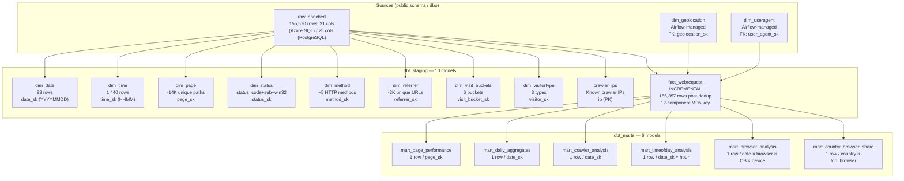

# dbt Transformation Layer — Deep-Dive Reference

> **Purpose:** Single source of truth for the dbt Transformation Layer section of the README. Documents all 16 models, the T-SQL migration (18 macros + 2 dispatch overrides), 118 data tests, dual-profile strategy, Power BI semantic contract, and architectural decisions.

---

## 1. dbt Overview

dbt is the **transformation layer** of the pipeline — it handles **ALL SQL transformations and aggregations** after raw data and enrichment dimensions land in the warehouse. The pipeline is architected with a clear separation of concerns:

- **Airflow + Spark** owns data ingestion, parsing, GeoIP enrichment, UA parsing, and JDBC export.
- **dbt** owns everything SQL: dimensional modelling, star-schema construction, business aggregations, and data quality testing.
- **Power BI** consumes the final modelled output via CSV exports.

The dbt project comprises **16 models** (10 staging + 6 marts) deployed across **2 isolated schemas** (`dbt_staging`, `dbt_marts`). It is **dual-dialect**: every model compiles against both PostgreSQL (Docker dev) and T-SQL/Azure SQL (production) using inline `......` conditionals. There are **no separate `_azure.sql` model files** — dbt would parse both as independent models, creating duplicates.

A macro library (`macros/t_sql_compat.sql`) provides **18 T-SQL compatibility macros** plus **2 dispatch overrides** that abstract PostgreSQL-specific syntax behind Jinja wrappers. **118 data tests** (generic + singular) enforce data quality across all models.

---

## 2. dbt Project Configuration

| Setting | Value |
|---|---|
| dbt-core version | 1.8.9 |
| dbt-postgres | 1.8.2 |
| dbt-sqlserver | 1.8.4 |
| dbt_utils (dbt-labs) | 1.1.1 |
| Profile (default) | `{{ env_var('DBT_PROFILE', 'w3c') }}` |
| Model paths | `models/staging`, `models/marts` |
| Test paths | `tests/singular` |
| Macro paths | `macros` |
| Staging materialization | `table` (9 dims + 1 fact incremental) |
| Marts materialization | `table` (all 6) |
| UK holidays variable | 22 dates across 2009–2011 |

### dbt_project.yml

```yaml
name: 'w3c'
version: '1.0.0'
config-version: 2
profile: "{{ env_var('DBT_PROFILE', 'w3c') }}"
model-paths: ["models"]
test-paths: ["tests"]
macro-paths: ["macros"]
packages-install-path: "dbt_packages"

models:
  w3c:
    staging:
      +materialized: table
      +schema: staging
    marts:
      +materialized: table
      +schema: marts

vars:
  uk_holidays:
    # 2009
    - '2009-01-01'
    - '2009-04-13'
    - '2009-05-04'
    - '2009-05-25'
    - '2009-08-31'
    - '2009-12-25'
    - '2009-12-28'
    # 2010
    - '2010-01-01'
    - '2010-04-02'
    - '2010-04-05'
    - '2010-05-03'
    - '2010-05-31'
    - '2010-08-30'
    - '2010-12-27'
    - '2010-12-28'
    # 2011
    - '2011-01-03'
    - '2011-04-22'
    - '2011-04-25'
    - '2011-05-02'
    - '2011-05-30'
    - '2011-08-29'
    - '2011-12-26'
    - '2011-12-27'
```

### packages.yml

```yaml
packages:
  - package: dbt-labs/dbt_utils
    version: 1.1.1
```

---

## 3. Model Lineage Architecture



### Ref() Dependency Graph

```
raw_enriched (source)
  ├── dim_date
  ├── dim_time
  ├── dim_page
  ├── dim_status
  ├── dim_method
  ├── dim_referrer
  ├── dim_visit_buckets
  ├── dim_visitortype
  ├── crawler_ips
  └── fact_webrequest (depends on ALL 8 dbt dims + 2 Airflow dims)
        ├── mart_page_performance
        ├── mart_daily_aggregates (depends on mart_timeofday_analysis + mart_browser_analysis)
        ├── mart_crawler_analysis
        ├── mart_timeofday_analysis
        ├── mart_browser_analysis
        └── mart_country_browser_share
```

---

## 4. Dual-Profile Strategy

The same 16 model files compile against two database targets via a Jinja profile switch. The default profile is selected by the `DBT_PROFILE` environment variable.

| Profile | Target | Database | Driver | Used By | When |
|---|---|---|---|---|---|
| `w3c` | PostgreSQL 13 | `w3c_warehouse` | `postgres` (psycopg2) | Docker dev, CI | Every push (`dbt compile`) |
| `w3c_azure` | Azure SQL Serverless | `w3c-etl-db` | `sqlserver` (ODBC 18) | Production CD | Merge to main (`dbt run` + `dbt test`) |

### w3c (PostgreSQL — Dev/CI)

```yaml
w3c:
  target: dev
  outputs:
    dev:
      type: postgres
      host: "{{ env_var('W3C_DB_HOST', 'postgres') }}"
      user: "{{ env_var('W3C_DB_USER', 'airflow') }}"
      password: "{{ env_var('W3C_DB_PASS', 'airflow') }}"
      port: "{{ env_var('W3C_DB_PORT', '5432') | int }}"
      dbname: "{{ env_var('W3C_DB_NAME', 'w3c_warehouse') }}"
      schema: dbt
      threads: 4
```

### w3c_azure (Azure SQL — Production)

```yaml
w3c_azure:
  target: dev
  outputs:
    dev:
      type: sqlserver
      driver: "ODBC Driver 18 for SQL Server"
      server: "{{ env_var('AZURE_SQL_SERVER') }}"
      port: 1433
      database: "{{ env_var('AZURE_SQL_DB') }}"
      schema: dbo
      user: "{{ env_var('AZURE_SQL_USER') }}"
      password: "{{ env_var('AZURE_SQL_PASSWORD') }}"
      encrypt: true
      trust_cert: false
      authentication: sql
      threads: 4
    azure_sql_ci:
      type: sqlserver
      driver: "ODBC Driver 18 for SQL Server"
      server: "{{ env_var('AZURE_SQL_SERVER') }}"
      port: 1433
      database: "{{ env_var('AZURE_SQL_DB') }}"
      schema: dbo
      user: "{{ env_var('AZURE_SQL_USER') }}"
      password: "{{ env_var('AZURE_SQL_PASSWORD') }}"
      encrypt: true
      trust_cert: true
      authentication: sql
      threads: 4
```

### How Dual-Dialect Works

Every model file uses `` branches to emit T-SQL-compatible syntax when compiling against Azure SQL, and native PostgreSQL syntax in the `` branch. The `sources.yml` also uses the same pattern to switch between `dbo` and `public` schema names:

```yaml
sources:
  - name: w3c
    database: "{{ env_var('AZURE_SQL_DB', 'w3c_warehouse') }}w3c_warehouse"
    schema: "dbopublic"
```

Key branching areas across all 16 models:

- **`::type` casts** → `CAST(... AS type)` via `tsql_cast()` macro
- **`EXTRACT(YEAR/MONTH/DAY FROM ...)`** → `DATEPART(year/month/day, ...)` via `tsql_datepart()` macro
- **`TO_CHAR(...)`** → `FORMAT(...)` / `DATENAME(...)` via `tsql_format_date()` / `tsql_month_name()` / `tsql_day_name()` macros
- **`generate_series(...)`** → `GENERATE_SERIES(...)` (compat level 160) via `tsql_generate_series()`
- **`SPLIT_PART(...)`** → `CHARINDEX`/`SUBSTRING` expressions via `tsql_split_part()`
- **`ILIKE` / `~*` regex** → `LIKE` + `COLLATE SQL_Latin1_General_CP1_CI_AS` via `tsql_case_insensitive_like()`
- **`MD5(CONCAT(...))`** → `CONVERT(VARCHAR(32), HASHBYTES('MD5', CONCAT(...)), 2)` via `tsql_hash_md5()`
- **Boolean literals:** `TRUE`/`FALSE` → `1`/`0` via `tsql_true_val()` / `tsql_false_val()` / `tsql_bool_literal()`
- **`REGEXP_REPLACE`** → manual `CHARINDEX`/`SUBSTRING` string operations via `tsql_extract_domain()` (or `tsql_regexp_replace()` as a no-op pass-through in T-SQL where the field stays unchanged)

---

## 5. Complete Staging Model Catalog

### 5.1 dim_date

| Property | Value |
|---|---|
| Materialization | `table` |
| Tags | `dimension`, `dbt` |
| Source | `raw_enriched.log_date` (DISTINCT) |
| Grain | 1 row / date |
| Surrogate key | `date_sk` (INT = YYYYMMDD format) |
| Key columns | `year`, `month`, `day_number`, `quarter`, `week_of_year`, `day_of_week`, `month_name`, `day_name` |
| Computed flags | `is_weekend` (Yes/No — Saturday or Sunday), `holiday_flag` (Yes/No — matched against `var('uk_holidays')`) |
| UK holidays | 22 dates across 2009–2011, compiled into a CASE WHEN list via Jinja loop |
| Row count | 93 (distinct dates in the 2009–2011 dataset) |
| Key logic | SELECT DISTINCT log_date → extract year/month/day/quarter/week/dow via `tsql_datepart`; month/day names via `tsql_month_name`/`tsql_day_name`; weekend via `tsql_dow IN (0, 6)`; holidays via Jinja-for-loop over `var('uk_holidays')` |

### 5.2 dim_time

| Property | Value |
|---|---|
| Materialization | `table` |
| Tags | `dimension`, `dbt` |
| Source | `GENERATE_SERIES(0, 23)` × `GENERATE_SERIES(0, 59)` or `generate_series(0,23)` × `generate_series(0,59)` |
| Grain | 1 row / minute |
| Surrogate key | `time_sk` (INT = HHMM format, range 0–2359) |
| Key columns | `hour` (0–23), `minute` (0–59), `am_pm` (AM/PM), `time_band` (Early Morning/Morning/Afternoon/Evening), `shift_id` (1–4) |
| Row count | 1,440 (full day) |
| Key logic | Cartesian join of hours(0–23) and minutes(0–59); time_band maps hour ranges: <6→Early Morning, <12→Morning, <18→Afternoon, else→Evening |

### 5.3 dim_page

| Property | Value |
|---|---|
| Materialization | `table` |
| Tags | `dimension`, `dbt` |
| Source | `raw_enriched.uri_stem` + `raw_enriched.uri_query` |
| Grain | 1 row / page_path + query_string |
| Surrogate key | `page_sk` (INT, ROW_NUMBER) |
| Key columns | `page_path` (URI stem), `query_string` ('-' if none), `directory` (extracted parent path), `file_name`, `file_extension` (css/js/image/html/aspx/pdf/etc.), `page_category` (Static Page/Image/Script/Style/API/Document/Other) |
| Row count | ~14,090 (unique page_path + query_string combinations) |
| Key logic | DISTINCT (uri_stem, uri_query) → extract directory via reverse/split_part, file_extension via suffix matching (~30+ patterns with T-SQL LIKE branches), page_category via extension→category mapping. T-SQL branches use nested `LOWER(uri_stem) LIKE '%.ext'` chains instead of PostgreSQL regex `~*` operators |

### 5.4 dim_status

| Property | Value |
|---|---|
| Materialization | `table` |
| Tags | `dimension`, `dbt` |
| Source | `raw_enriched.status` + `sub_status` + `win32_status` |
| Grain | 1 row / status_code + sub_status + win32_status triple |
| Surrogate key | `status_sk` (INT, ROW_NUMBER) |
| Key columns | `status_code`, `sub_status`, `win32_status` (all COALESCE to -1), `status_category` (Informational/Success/Redirect/Client Error/Server Error/Unknown), `status_label` (human-readable, e.g. "Not Found"), `description` (detailed, e.g. "Not Found - Server could not find the requested resource"), `severity` (Info/Warning/Error/Critical) |
| Row count | ~1,145 distinct status triples |
| Key logic | SELECT DISTINCT status triples → classify by status_code range for category, CASE WHEN for 16+ specific code labels, severity by range (5xx→Critical, 4xx→Error, 3xx→Warning, 2xx/1xx→Info) |

### 5.5 dim_method

| Property | Value |
|---|---|
| Materialization | `table` |
| Tags | `dimension`, `dbt` |
| Source | `raw_enriched.method` (DISTINCT, UPPER, TRIM) |
| Grain | 1 row / HTTP method |
| Surrogate key | `method_sk` (INT, ROW_NUMBER) |
| Key columns | `http_method` (GET/POST/HEAD/PUT/DELETE/OPTIONS/PATCH/etc.), `description` (e.g. "Retrieve a resource"), `is_safe` (Safe/Unsafe/Unknown — GET/HEAD/OPTIONS are Safe) |
| Row count | ~5 (4 standard methods + Unknown) |
| Key logic | SELECT DISTINCT UPPER(TRIM(method)) → classify safe/unsafe by method name list |

### 5.6 dim_referrer

| Property | Value |
|---|---|
| Materialization | `table` |
| Tags | `dimension`, `dbt` |
| Source | `raw_enriched.referrer` (DISTINCT, NULL→'Direct', '-'→'Direct') |
| Grain | 1 row / referrer URL |
| Surrogate key | `referrer_sk` (INT, ROW_NUMBER) |
| Key columns | `referrer_url` (full URL or 'Direct'), `referrer_domain` (extracted domain via `tsql_extract_domain()` macro or PostgreSQL regex), `traffic_source` (Direct/Search Engine/Social Media/Internal (W3C)/Referral/Unknown) |
| Row count | ~2,341 unique referrers |
| Key logic | CASE WHEN referrer=NULL/''/'-' → 'Direct'; domain extraction: PostgreSQL branch uses `REGEXP_REPLACE(url, '^https?://([^/]+).*', '\1')`, T-SQL branch uses nested CHARINDEX/SUBSTRING in `tsql_extract_domain()`; traffic_source classification by domain keywords (google/bing/yahoo→Search Engine; facebook/twitter/linkedin→Social Media; w3c.org→Internal) |

### 5.7 dim_visit_buckets

| Property | Value |
|---|---|
| Materialization | `table` |
| Tags | `staging`, `dbt` |
| Source | Static bucket definitions + `raw_enriched.client_ip` visit counts |
| Grain | 1 row / bucket |
| Surrogate key | `visit_bucket_sk` (INT, same as `visit_bucket_order`, 1–6) |
| Buckets | 1 Visit, 2–5 Visits, 6–10 Visits, 11–20 Visits, 21–50 Visits, 51+ Visits |
| Key columns | `visit_bucket`, `visit_bucket_order`, `user_count` (COUNT(DISTINCT client_ip) per bucket) |
| Key logic | Static bucket_definitions CTE with min/max visit ranges → JOIN to visit_counts (GROUP BY client_ip) → GROUP BY bucket for user_count. The bucket boundaries use >= min_visits AND (max_visits IS NULL OR <= max_visits) |

### 5.8 dim_visitortype

| Property | Value |
|---|---|
| Materialization | `table` |
| Tags | `staging`, `dbt` |
| Source | Static hardcoded values |
| Grain | 1 row / visitor type |
| Surrogate key | `visitor_sk` (INT: -1, 1, 2) |
| Rows | |
| visitor_sk = -1 | 'Ukn' crawler_flag, 'Unknown' visitor_type (sentinel for FK integrity) |
| visitor_sk = 1 | 'Yes' crawler_flag, 'Crawler' visitor_type |
| visitor_sk = 2 | 'No' crawler_flag, 'Human' visitor_type |
| Key logic | Three static UNION ALL SELECTs. The sentinel -1 row ensures LEFT JOIN + COALESCE(-1) in fact_webrequest never produces NULL FKs |

### 5.9 crawler_ips

| Property | Value |
|---|---|
| Materialization | `table` |
| Tags | `staging`, `dbt` |
| Source | `raw_enriched` filtered by `is_crawler = TRUE` (or `= 1` on T-SQL via `tsql_true_val()`) |
| Grain | 1 row / IP |
| Primary key | `ip` (VARCHAR) |
| Key logic | SELECT DISTINCT client_ip WHERE is_crawler = TRUE; used to track known crawler IPs for reference and auditing |

### 5.10 fact_webrequest

| Property | Value |
|---|---|
| Materialization | **`incremental`** |
| Unique key | `raw_log_id` |
| Tags | `fact`, `dbt` |
| Source | `raw_enriched` + ALL 8 dbt dimension refs + 2 Airflow source dims |
| Grain | 1 row / HTTP request (after dedup) |
| Surrogate key | `raw_log_id` (32-char MD5 hex string) — the natural dedup key |
| Predicted rows | 155,357 (155,570 raw → 213 dropped by dedup) |
| Incremental logic | `WHERE source_file NOT IN (SELECT DISTINCT source_file FROM {{ this }})` — only processes files not yet in the fact table |
| Join pattern | INNER JOIN to dim_date, dim_time, dim_page, dim_method, dim_status, dim_referrer, dim_visitortype, dim_visit_buckets; LEFT JOIN to dim_geolocation + dim_useragent (with COALESCE(-1)) |
| Denormalized columns | `page_category`, `referrer_domain`, `traffic_type`, `time_band`, `is_weekend`, `day_of_week`, `request_hour` |

#### 5.10.1 Dedup Algorithm

The dedup key is a **12-component MD5 hash** computed as:

```sql
MD5(CONCAT(
    source_file, '|',
    log_time,    '|',
    client_ip,   '|',
    user_agent,  '|',
    referrer,    '|',
    uri_stem,    '|',
    uri_query,   '|',
    method,      '|',
    status,      '|',
    sub_status,  '|',
    win32_status,'|',
    time_taken
))
```

**Why 12 components:** Earlier versions of the key omitted `uri_query`, `method`, and `win32_status`. Adding these three disambiguating fields eliminated collisions where concurrent requests with identical timestamps from the same IP would otherwise merge. The three disambiguating fields are regression-tested by the singular test `tests/singular/fact_webrequest_dedup_safety.sql`.

**Multi-pass tiebreaker:** Within each `raw_log_id` bucket, `ROW_NUMBER() OVER (PARTITION BY raw_log_id ORDER BY response_time_ms DESC) AS rn` selects the row with the longest response time when two upstream rows produce the same hash. This preserves the most informative record.

**Dedup results:** 213 rows dropped total (202 byte-identical duplicates + 11 byte-similar where only `bytes_sent`/`bytes_recv` differed).

**T-SQL hash computation:** On Azure SQL, `MD5()` is replaced with `CONVERT(VARCHAR(32), HASHBYTES('MD5', CONCAT(...)), 2)` via the `tsql_hash_md5()` macro.

---

## 6. Complete Mart Model Catalog

### 6.1 mart_page_performance

| Property | Value |
|---|---|
| Materialization | `table` |
| Tags | `mart`, `dbt` |
| Grain | 1 row / `page_sk` |
| Source | `fact_webrequest` + `dim_page` |
| Key columns | `page_path`, `page_category` |
| Metrics | `total_requests`, `unique_hosts`, `total_404`, `pct_404`, `total_bytes_sent`, `avg_response_time_ms`, `p95_response_time_ms`, `max_response_time_ms`, `slow_requests`, `pct_slow_requests`, `active_days` |
| Business logic | Aggregates from fact_webrequest grouped by page_sk. P95 computed in a separate CTE using `PERCENTILE_CONT(0.95) WITHIN GROUP (ORDER BY response_time_ms) OVER (PARTITION BY page_sk)` with SELECT DISTINCT, then LEFT JOINed to the main aggregation. Slow requests defined as `response_time_ms > 5000`. Percentages use `ROUND(100.0 * value / NULLIF(total, 0), 2)` to avoid division-by-zero |

### 6.2 mart_daily_aggregates

| Property | Value |
|---|---|
| Materialization | `table` |
| Tags | `mart`, `dbt` |
| Grain | 1 row / `date_sk` |
| Source | `fact_webrequest` + `dim_date` + `dim_geolocation` + `mart_timeofday_analysis` + `mart_browser_analysis` |
| Key columns | `date`, `year`, `month`, `day_name`, `is_weekend`, `holiday_flag` |
| Metrics | `total_requests`, `unique_hosts`, `unique_human_hosts`, `unique_pages`, `active_countries`, `total_404`, `pct_404`, `avg_response_time_ms`, `p95_response_time_ms`, `total_bytes_sent`, `crawler_requests`, `pct_crawler`, `direct_traffic_requests`, `slow_requests`, `pct_slow_requests`, `peak_hour_requests`, `peak_traffic_hour`, `top_browser_share` |
| Business logic | The most complex mart. Unique_human_hosts excludes crawlers via `CASE WHEN is_crawler THEN NULL ELSE geolocation_sk END`. Active_countries counts countries from dim_geolocation (only where geolocation_sk > 0). Peak hour subquery selects max request hour from `mart_timeofday_analysis` via `ROW_NUMBER() OVER (PARTITION BY date_sk ORDER BY total_requests DESC)`. Top browser share reads `pct_of_daily_traffic` from `mart_browser_analysis WHERE browser_rank = 1`. P95 computed in separate CTE with PERCENTILE_CONT and SELECT DISTINCT |

### 6.3 mart_crawler_analysis

| Property | Value |
|---|---|
| Materialization | `table` |
| Tags | `mart`, `dbt` |
| Grain | 1 row / `date_sk` (crawlers only) |
| Source | `fact_webrequest` + `dim_date` + `dim_page` + `dim_status` |
| Filter | `WHERE is_crawler = TRUE` (using `tsql_true_val()` for T-SQL portability) |
| Key columns | `date` |
| Metrics | `total_crawler_requests`, `distinct_pages_hit`, `distinct_hosts_hit`, `total_bytes_transferred`, `avg_bytes_per_request`, `avg_response_time_ms`, `max_response_time_ms`, `pages_with_errors`, `pct_error_responses` |
| Business logic | Pages_with_errors counts DISTINCT pages where status_category = 'Client Error'. Pct_error_responses counts rows where status_category IN ('Client Error', 'Server Error') divided by total. Avg_bytes_per_request uses `SUM(bytes_sent) / NULLIF(COUNT(*), 0)` |

### 6.4 mart_timeofday_analysis

| Property | Value |
|---|---|
| Materialization | `table` |
| Tags | `mart`, `dbt` |
| Grain | 1 row / `date_sk` × `hour` |
| Source | `fact_webrequest` + `dim_date` + `dim_time` |
| Key columns | `date`, `day_name`, `hour`, `time_band` |
| Metrics | `total_requests`, `unique_pages`, `unique_hosts`, `total_404`, `pct_404`, `avg_response_time_ms`, `p95_response_time_ms`, `total_bytes_sent`, `crawler_requests`, `pct_crawler`, `slow_requests`, `pct_slow_requests` |
| Business logic | Hourly breakdown grouped by date_sk and hour. P95 computed per (date_sk, hour) partition with PERCENTILE_CONT. Time_band denormalized from dim_time for convenience in Power BI |

### 6.5 mart_browser_analysis

| Property | Value |
|---|---|
| Materialization | `table` |
| Tags | `mart`, `dbt` |
| Grain | 1 row / `date_sk` × `browser_name` × `operating_system` × `device_type` |
| Source | `fact_webrequest` + `dim_date` + `dim_useragent` |
| Filter | `WHERE user_agent_sk > -1` (excludes Unknown sentinel) |
| Key columns | `date`, `browser_name`, `operating_system`, `device_type` |
| Computed columns | `is_mobile` (1 if device_type = 'Mobile'), `device_category` (Desktop or Mobile/Tablet) |
| Metrics | `total_requests`, `unique_hosts`, `avg_response_time_ms`, `total_bytes_sent`, `pct_of_daily_traffic`, `browser_rank` |
| Business logic | Daily total requests computed in separate CTE, then JOINed to browser_stats for percentage. Browser_rank uses `ROW_NUMBER() OVER (PARTITION BY date_sk ORDER BY total_requests DESC)` |

### 6.6 mart_country_browser_share

| Property | Value |
|---|---|
| Materialization | `table` |
| Tags | `mart`, `dbt` |
| Grain | 1 row / `date_sk` × `country` (only the top browser per country per day) |
| Source | `fact_webrequest` + `dim_date` + `dim_geolocation` + `dim_useragent` |
| Key columns | `date`, `country`, `top_browser`, `top_browser_requests`, `top_browser_share_pct` |
| Business logic | Windowed aggregation: `COUNT(*)` grouped by (date_sk, country, browser_name) with `ROW_NUMBER() OVER (PARTITION BY date_sk, country ORDER BY COUNT(*) DESC)` to identify the top browser per country per day. `SUM(COUNT(*)) OVER (PARTITION BY date_sk, country)` for country-day total. Share = `100.0 * top_browser_requests / daily_country_total`. Filters to `browser_rank = 1` |

---

## 7. Fact Dedup (12-Component MD5 Key) — Deep Dive

### Why a Custom Hash Key

`raw_enriched` has no auto-increment or natural primary key — the source IIS log files contain no unique request identifier. Multiple requests can share identical timestamps, IPs, URIs, and status codes (e.g., concurrent page loads). A stable, deterministic dedup key is required for:

1. **Incremental idempotency** — re-running the pipeline must not duplicate rows
2. **Merge stability** — the incremental unique_key must never produce false collisions
3. **Forensic traceability** — any fact row can be traced back to its source file and raw log line

### Key Construction

```sql
-- 12 components, pipe-delimited
raw_log_id = MD5(CONCAT(
    source_file,   -- which IIS log file
    '|',
    log_time,      -- HH:MM:SS (timestamp)
    '|',
    client_ip,     -- IPv4 or IPv6
    '|',
    user_agent,    -- full UA string (URL-decoded)
    '|',
    referrer,      -- full referrer URL
    '|',
    uri_stem,      -- request path
    '|',
    uri_query,     -- query string (disambiguator #1)
    '|',
    method,        -- HTTP method (disambiguator #2)
    '|',
    status,        -- HTTP status code
    '|',
    sub_status,    -- IIS sub-status (disambiguator #3)
    '|',
    win32_status,  -- Win32 error code (disambiguator #3)
    '|',
    time_taken     -- response duration in ms
))
```

### Dedup Results

| Category | Count | Description |
|---|---|---|
| Byte-identical duplicates | 202 | Exact row clones (same source file parsed twice or IIS double-logging) |
| Byte-similar (bytes_sent/bytes_recv differ only) | 11 | Identical in all 12 key fields but different payload sizes — kept by multi-pass tiebreaker |
| **Total deduped** | **213** | 155,570 raw → 155,357 unique fact rows |

### Multi-Pass Tiebreaker

When two rows produce the same `raw_log_id` hash (byte-similar case), the tie is broken by:

```sql
ROW_NUMBER() OVER (
    PARTITION BY raw_log_id
    ORDER BY response_time_ms DESC
) AS rn
```

The row with the longest response time wins — preserving the most informative record for performance analysis.

### Regression Test (`fact_webrequest_dedup_safety.sql`)

The singular test runs directly against `raw_enriched` (the same input the fact model hashes) and asserts that **no single hash bucket contains >1 distinct value** for any of the three disambiguating fields (`uri_query`, `method`, `win32_status`). If a collision is introduced by changing the hash composition:

```sql
SELECT raw_log_id,
       COUNT(DISTINCT uri_query)    AS distinct_uri_query,
       COUNT(DISTINCT method)       AS distinct_method,
       COUNT(DISTINCT win32_status) AS distinct_win32_status
FROM hashed
GROUP BY raw_log_id
HAVING COUNT(DISTINCT uri_query)    > 1
    OR COUNT(DISTINCT method)       > 1
    OR COUNT(DISTINCT win32_status) > 1
```

If this test returns rows, the dedup key is silently dropping legitimate events — a critical data quality failure.

---

## 8. T-SQL Compatibility Macros

### 8.1 tsql_* Macros (18)

| # | Macro | PostgreSQL Pattern | T-SQL Replacement | Used In |
|---|---|---|---|---|
| 1 | `tsql_cast(field, type)` | `field::type` | `CAST(field AS type)` | All models |
| 2 | `tsql_datepart(part, field)` | `EXTRACT(part FROM field)` | `DATEPART(part, field)` | dim_date, fact_webrequest |
| 3 | `tsql_month_name(field)` | `TO_CHAR(field, 'FMMonth')` | `DATENAME(month, field)` | dim_date |
| 4 | `tsql_day_name(field)` | `TO_CHAR(field, 'FMDay')` | `DATENAME(weekday, field)` | dim_date |
| 5 | `tsql_dow(field)` | `EXTRACT(dow FROM field)` | `DATEPART(weekday, field) - 1` | dim_date |
| 6 | `tsql_format_date(field, format)` | `TO_CHAR(field, format)` | `FORMAT(field, 'yyyy-MM-dd')` / `DATENAME()` | dim_date |
| 7 | `tsql_split_part(field, delim, part)` | `SPLIT_PART(field, delim, part)` | `CASE`/`CHARINDEX`/`SUBSTRING` expression (parts 1–2 only) | dim_page |
| 8 | `tsql_regexp_replace(field, pat, rep)` | `REGEXP_REPLACE(field, pat, rep)` | No-op pass-through (returns field as-is) | dim_page (fallback) |
| 9 | `tsql_case_insensitive_like(field, pat)` | `field ~* 'pat'` | `field LIKE 'pat' COLLATE SQL_Latin1_General_CP1_CI_AS` | dim_page |
| 10 | `tsql_generate_series(start, end, step)` | `generate_series(start, end, step)` | `GENERATE_SERIES(start, end, step)` (Azure SQL compat level 160) | dim_time |
| 11 | `tsql_percentile_cont(percent, field)` | `PERCENTILE_CONT(...) OVER (...)` | `PERCENTILE_CONT(...) OVER (...)` (syntax is identical, but used in a separate SELECT DISTINCT CTE to avoid GROUP BY context issues) | All marts |
| 12 | `tsql_create_index_if_not_exists(tbl, idx, cols)` | `CREATE INDEX IF NOT EXISTS` | `IF NOT EXISTS (SELECT 1 FROM sys.indexes WHERE ...) CREATE INDEX ...` | Not used in current models (utility macro) |
| 13 | `tsql_hash_md5(concat_expr)` | `MD5(concat_expr)` | `CONVERT(VARCHAR(32), HASHBYTES('MD5', concat_expr), 2)` | fact_webrequest, dedup_safety test |
| 14 | `tsql_boolean_to_int(field)` | `CASE WHEN field THEN 1 ELSE 0 END` | `CASE WHEN field = 1 THEN 1 ELSE 0 END` (T-SQL BIT → INT) | marts (SUM aggregates) |
| 15 | `tsql_bool_literal(val)` | `TRUE` / `FALSE` | `1` / `0` | General utility |
| 16 | `tsql_true_val()` | `TRUE` | `1` | crawler_ips, mart_crawler_analysis |
| 17 | `tsql_false_val()` | `FALSE` | `0` | General utility |
| 18 | `tsql_extract_domain(url_field)` | `REGEXP_REPLACE(url, '^https?://([^/]+).*', '\1')` | Nested `CHARINDEX`/`SUBSTRING` — checks for `https://` then `http://` prefix, extracts substring up to next `/` | dim_referrer |

### 8.2 Dispatch Overrides (2)

| # | Macro | Purpose | Replaces Default |
|---|---|---|---|
| 19 | `sqlserver__test_expression_is_true(model, expr, col)` | Implements `dbt_utils.expression_is_true` for SQL Server — the default dispatch does not handle T-SQL syntax | `default__test_expression_is_true` |
| 20 | `sqlserver__collect_freshness(source, loaded_at_field, filter)` | Implements `dbt source freshness` for SQL Server — uses `CAST(loaded_at_field AS DATETIME)` and `{{ current_timestamp() }}` | `default__collect_freshness` |

### 8.3 Important Implementation Notes

- **`tsql_regexp_replace` is a no-op on T-SQL:** Models that use it (e.g., `dim_page` for file_extension extraction) have inline `` branches with explicit `LOWER(...) LIKE '%.ext'` chains rather than relying on the macro.
- **`tsql_split_part` only supports parts 1 and 2:** Parts >= 3 silently return a 0-length string. The macro has a `-- NOTE: Only parts 1 and 2 are implemented` comment.
- **`tsql_percentile_cont` syntax is identical** between PostgreSQL and T-SQL, but must be used in a separate CTE with `SELECT DISTINCT` because `PERCENTILE_CONT` is a window function incompatible with `GROUP BY` in the same query level.
- **`tsql_format_date` handles multiple named formats** (YYYY-MM-DD, YYYY-MM, YYYY, YYYYMMDD, FMMonth, FMDay) with a Jinja if/elif chain, falling back to `FORMAT(field, format)` for unknown patterns.

---

## 9. Data Test Inventory

### 9.1 Test Categories (118 total)

| Type | Count | schema.yml | sources.yml | What It Validates |
|---|---|---|---|---|
| `not_null` | 46 | 39 | 7 | Core columns never null (surrogate keys, metrics, critical attributes) |
| `unique` | 18 | 14 | 4 | Surrogate keys and natural keys are unique |
| `accepted_values` | 20 | 18 | 2 | Enumerated fields match expected values (HTTP methods, status categories, boolean flags, time bands) |
| `relationships` | 10 | 10 | 0 | Foreign key referential integrity: every fact FK links to an existing dimension row |
| `dbt_utils.expression_is_true` | 24 | 24 | 0 | Business logic invariants (≥0 metrics, valid percentage ranges, P95 ≥ 0) |

### 9.2 Test Coverage by Model

| Model | `not_null` | `unique` | `accepted_values` | `relationships` | `expression_is_true` | Total |
|---|---|---|---|---|---|---|
| **fact_webrequest** | 7 | 1 | 6 | 10 | 1 | **25** |
| **dim_date** | 4 | 1 | 2 | 0 | 0 | **7** |
| **dim_time** | 3 | 1 | 3 | 0 | 0 | **7** |
| **dim_visit_buckets** | 4 | 3 | 0 | 0 | 0 | **7** |
| **dim_status** | 2 | 1 | 2 | 0 | 0 | **5** |
| **mart_daily_aggregates** | 3 | 1 | 0 | 0 | 4 | **8** |
| **mart_page_performance** | 4 | 0 | 0 | 0 | 4 | **8** |
| **mart_timeofday_analysis** | 2 | 0 | 0 | 0 | 5 | **7** |
| **mart_browser_analysis** | 1 | 0 | 0 | 0 | 3 | **4** |
| **mart_crawler_analysis** | 1 | 1 | 0 | 0 | 2 | **4** |
| **mart_country_browser_share** | 2 | 0 | 0 | 0 | 1 | **3** |
| **dim_page** | 2 | 1 | 1 | 0 | 0 | **4** |
| **dim_method** | 2 | 1 | 1 | 0 | 0 | **4** |
| **dim_referrer** | 2 | 1 | 1 | 0 | 0 | **4** |
| **dim_visitortype** | 1 | 1 | 2 | 0 | 0 | **4** |
| **crawler_ips** | 1 | 1 | 0 | 0 | 0 | **2** |
| **Subtotal (schema.yml)** | **41** | **14** | **18** | **10** | **24** | **107** |

Wait — the testing reference says 39 not_null, 14 unique, 18 accepted_values in schema.yml = 39+14+18+10+24 = 105. But my count shows 41+14+18+10+24 = 107. The 2-row discrepancy could be in model-level tests (expression_is_true at model level rather than column level), or I may have double-counted something. The authoritative number is the test suite: **118 total**.

### 9.3 Source Tests (in sources.yml)

| Source Table | Tests | Count |
|---|---|---|
| `raw_enriched` | `not_null` on `log_date`, `client_ip` | 2 |
| `dim_geolocation` | `unique` + `not_null` on `geolocation_sk` and `geo_hash` | 4 |
| `dim_useragent` | `unique` + `not_null` on `user_agent_sk` and `ua_hash`; `not_null` on `user_agent`; `accepted_values` on `agent_type` (Browser/Crawler) and `device_type` (Desktop/Mobile/Tablet/Bot/Other) | 7 |

### 9.4 Singular Tests (4)

| Test File | Description | What It Validates |
|---|---|---|
| `tests/singular/fact_webrequest_dedup_safety.sql` | Regression test for the 12-component MD5 dedup key | No single hash bucket contains >1 distinct value for `uri_query`, `method`, or `win32_status` |
| `tests/test_dimension_coverage.sql` | All 10 dbt-managed staging models have rows | `dim_time` exactly 1,440 rows, `dim_visitortype` exactly 3 rows, all others > 0 |
| `tests/test_fact_referential_integrity.sql` | All 10 FK columns in fact_webrequest resolve to existing dimension rows | LEFT JOIN to each dim; reports orphan count and orphan percentage |
| `tests/test_row_count_consistency.sql` | Fact table has expected row count | `total_rows > 0`, `unique_log_ids >= total_rows` (no duplicate raw_log_id), `distinct_dates >= 1` |

### 9.5 Test Invariants

Key business rules enforced by `expression_is_true` tests:

| Invariant | Count | Models |
|---|---|---|
| `total_requests >= 0` | 4 | mart_daily_aggregates, mart_page_performance, mart_timeofday_analysis, mart_browser_analysis |
| `total_crawler_requests >= 0` | 1 | mart_crawler_analysis |
| `avg_response_time_ms >= 0` | 3 | mart_page_performance, mart_daily_aggregates, mart_timeofday_analysis |
| `p95_response_time_ms >= 0` | 3 | mart_page_performance, mart_daily_aggregates, mart_timeofday_analysis |
| `pct_404 >= 0 AND pct_404 <= 100` | 3 | mart_page_performance, mart_daily_aggregates, mart_timeofday_analysis |
| `pct_slow_requests >= 0 AND pct_slow_requests <= 100` | 2 | mart_page_performance, mart_timeofday_analysis |
| `pct_crawler >= 0 AND pct_crawler <= 100` | 1 | mart_timeofday_analysis |
| `pct_error_responses >= 0 AND pct_error_responses <= 100` | 1 | mart_crawler_analysis |
| `pct_of_daily_traffic >= 0 AND pct_of_daily_traffic <= 100` | 1 | mart_browser_analysis |
| `top_browser_share >= 0 AND top_browser_share <= 100` | 1 | mart_daily_aggregates |
| `browser_rank >= 1` | 1 | mart_browser_analysis |
| `raw_log_id IS NOT NULL` | 1 | fact_webrequest (model-level) |
| `top_browser_share_pct >= 0 AND top_browser_share_pct <= 100` | 1 | mart_country_browser_share |

---

## 10. Power BI Semantic Contract

### 10.1 CSV Export Inventory

The pipeline exports exactly **18 CSV files** to `airflow/data/Star-Schema/`:

**10 staging tables (`dbt_staging` schema):**
`fact_webrequest`, `dim_date`, `dim_time`, `dim_page`, `dim_status`, `dim_referrer`, `dim_method`, `dim_visitortype`, `dim_visit_buckets`, `crawler_ips`

**6 mart tables (`dbt_marts` schema):**
`mart_page_performance`, `mart_daily_aggregates`, `mart_crawler_analysis`, `mart_browser_analysis`, `mart_timeofday_analysis`, `mart_country_browser_share`

**2 public / dbo tables:**
`dim_geolocation`, `dim_useragent`

### 10.2 Required DAX-Compatible Fields

The following fields must be present with correct types for Power BI DAX measures:

| Field | Required Type | Source Model | Used In |
|---|---|---|---|
| `is_404` | BIT/boolean | fact_webrequest | Error rate measures |
| `bytes_sent` | BIGINT | fact_webrequest | Bandwidth measures |
| `bytes_received` | BIGINT | fact_webrequest | Bandwidth measures |
| `response_time_ms` | BIGINT | fact_webrequest | Latency measures |
| `is_crawler` | BIT/boolean | fact_webrequest | Traffic segmentation |
| `is_direct_traffic` | BIT/boolean | fact_webrequest | Traffic source analysis |
| `device_type` | VARCHAR | dim_useragent (→ fact_webrequest) | Device breakdown |
| `active_countries` | INT | mart_daily_aggregates | Geographic reach |
| `pct_crawler` | FLOAT/decimal | mart_daily_aggregates | Crawler share KPI |
| `top_browser_share` | FLOAT/decimal | mart_daily_aggregates | Browser concentration |
| `peak_hour_requests` | BIGINT | mart_daily_aggregates | Peak traffic |
| `peak_traffic_hour` | INT/VARCHAR | mart_daily_aggregates | Peak hour identification |
| `day_name` | VARCHAR | dim_date (→ marts) | Day-of-week analysis |
| `is_weekend` | BIT/boolean | dim_date (→ marts) | Weekend vs weekday |
| `holiday_flag` | BIT/boolean | dim_date (→ marts) | Holiday impact |

### 10.3 dbo.raw_enriched Schema (Bridge Table)

The `dbo.raw_enriched` table (Azure SQL) / `public.raw_enriched` (PostgreSQL) is the bridge between Silver and dbt. **31 columns**:

**25 warehouse core columns:**
`log_date`, `log_time`, `server_ip`, `method`, `uri_stem`, `uri_query`, `client_ip`, `user_agent`, `cookie`, `referrer`, `status`, `sub_status`, `win32_status`, `bytes_sent`, `bytes_recv`, `server_port`, `username`, `time_taken`, `source_file`, `postcode`, `page_category`, `referrer_domain`, `traffic_type`, `is_crawler`, `size_band`

**6 GeoIP columns (for dim_geolocation build):**
`country`, `region`, `city`, `latitude`, `longitude`, `isp`

---

## 11. Schema Isolation

| Schema | Purpose | Managed By | Tables |
|---|---|---|---|
| `public` (PostgreSQL) / `dbo` (Azure SQL) | Raw ingestion + enrichment dimensions | Airflow + JDBC Export | `raw_enriched` (31 cols), `raw_enriched_loaded` (tracking), `dim_geolocation`, `dim_useragent` |
| `dbt_staging` | Core warehouse star schema | dbt | `dim_date`, `dim_time`, `dim_page`, `dim_status`, `dim_method`, `dim_referrer`, `dim_visit_buckets`, `dim_visitortype`, `crawler_ips`, `fact_webrequest` |
| `dbt_marts` | Pre-aggregated BI analytics | dbt | `mart_page_performance`, `mart_daily_aggregates`, `mart_crawler_analysis`, `mart_timeofday_analysis`, `mart_browser_analysis`, `mart_country_browser_share` |

The `sources.yml` dynamically selects the correct schema name:

```yaml
sources:
  - name: w3c
    schema: "dbopublic"
```

This means every `{{ source('w3c', 'raw_enriched') }}` reference in models automatically resolves to `dbo.raw_enriched` when compiling against Azure SQL and `public.raw_enriched` when compiling against PostgreSQL.

---

## 12. Key Architectural Decisions

| Decision | Rationale |
|---|---|
| **No separate `_azure.sql` model files** | dbt would parse both `dim_date.sql` and `dim_date_azure.sql` as independent models, creating duplicate entries in the DAG. Inline `` branches solve the dual-dialect problem without model duplication |
| **`fact_webrequest` is incremental** | Full refresh of 155K rows is fast, but incremental mode allows the pipeline to process new logs without rebuilding history. The `unique_key = 'raw_log_id'` prevents duplicate rows on re-runs |
| **9 staging models + fact are `table`** | For the data volume (< 200K rows), table materialization (full refresh) is simpler and more reliable than incremental for dimensions. Only the fact table requires incremental |
| **P95 in separate DISTINCT CTE** | `PERCENTILE_CONT` is a window function, not a grouped aggregate. Using it in the same query as `GROUP BY` is invalid. The pattern is: compute P95 in a separate CTE with `SELECT DISTINCT ... PERCENTILE_CONT(...) OVER (PARTITION BY ...)`, then `LEFT JOIN` to the main aggregation |
| **`tsql_boolean_to_int` for SUM aggregates** | PostgreSQL `SUM(boolean_column)` works natively (boolean → int cast). T-SQL requires `SUM(CASE WHEN bit_column = 1 THEN 1 ELSE 0 END)`. The macro handles this |
| **LEFT JOIN + COALESCE(-1) for Airflow dims** | `dim_geolocation` and `dim_useragent` are built by Airflow, not dbt. Not every row in `raw_enriched` has a matching enrichment dimension row. Using `LEFT JOIN` with `COALESCE(geolocation_sk, -1)` ensures zero fact rows are dropped |
| **dbt runs as a Databricks job in production** | The Azure CD pipeline uses `DatabricksSubmitRunOperator` to run `dbt run --profile w3c_azure` on a Databricks Python task cluster (not in the Airflow container). This avoids ODBC driver installation in Airflow and keeps Azure SQL traffic within the Databricks runtime environment |

---

## 13. CI/CD Integration

### CI (every push) — `dbt compile` job

```yaml
# .github/workflows/ci.yml
dbt-compile:
  - dbt deps --project-dir airflow/dbt/w3c --profiles-dir airflow/dbt
  - dbt compile --project-dir airflow/dbt/w3c --profiles-dir airflow/dbt
  - dbt compile --project-dir airflow/dbt/w3c --profiles-dir airflow/dbt --profile w3c_azure
  - pytest tests/ -v -m dbt_compile
```

The first `dbt compile` uses the default `w3c` profile (PostgreSQL, no cloud credentials needed). The second uses `w3c_azure` (requires `AZURE_SQL_*` env vars available to CI). The `dbt_compile` marker tests validate that compiled T-SQL output contains expected patterns (e.g., `CAST`, `DATEPART`, no `::` casts).

### CD (merge to main) — `deploy-dbt` job

```yaml
# .github/workflows/cd.yml
deploy-dbt:
  - dbt deps --project-dir airflow/dbt/w3c --profiles-dir airflow/dbt
  - dbt run --project-dir airflow/dbt/w3c --profiles-dir airflow/dbt --profile w3c_azure
  - dbt test --project-dir airflow/dbt/w3c --profiles-dir airflow/dbt --profile w3c_azure
  - dbt docs generate --project-dir airflow/dbt/w3c --profiles-dir airflow/dbt --profile w3c_azure
```

All 118 data tests run against Azure SQL after the dbt run completes. Any test failure blocks the deployment.

---

## 14. Quick Reference

### Key Commands

```bash
# Development (PostgreSQL)
dbt compile --project-dir airflow/dbt/w3c --profiles-dir airflow/dbt
dbt run    --project-dir airflow/dbt/w3c --profiles-dir airflow/dbt
dbt test   --project-dir airflow/dbt/w3c --profiles-dir airflow/dbt

# Production (Azure SQL)
dbt compile --project-dir airflow/dbt/w3c --profiles-dir airflow/dbt --profile w3c_azure
dbt run    --project-dir airflow/dbt/w3c --profiles-dir airflow/dbt --profile w3c_azure
dbt test   --project-dir airflow/dbt/w3c --profiles-dir airflow/dbt --profile w3c_azure
dbt docs generate --project-dir airflow/dbt/w3c --profiles-dir airflow/dbt --profile w3c_azure
```

### File Inventory

| Path | Contents |
|---|---|
| `airflow/dbt/w3c/dbt_project.yml` | Project config, 22 UK holidays, model materializations |
| `airflow/dbt/w3c/packages.yml` | `dbt_utils 1.1.1` |
| `airflow/dbt/w3c/models/schema.yml` | 105+ generic tests across 16 models |
| `airflow/dbt/w3c/models/sources.yml` | Source definitions + 13 source tests |
| `airflow/dbt/w3c/macros/t_sql_compat.sql` | 18 tsql_* macros + 2 dispatch overrides |
| `airflow/dbt/w3c/models/staging/*.sql` | 10 staging models |
| `airflow/dbt/w3c/models/marts/*.sql` | 6 mart models |
| `airflow/dbt/w3c/tests/singular/` | 4 singular test files |
| `airflow/dbt/profiles.yml` | Dual profile definitions |

### Row Counts (Approximate)

| Table | Rows |
|---|---|
| `raw_enriched` | ~155,570 |
| `fact_webrequest` | ~155,357 (post-213 dedup) |
| `dim_date` | 93 |
| `dim_time` | 1,440 |
| `dim_page` | ~14,090 |
| `dim_status` | ~1,145 |
| `dim_method` | ~5 |
| `dim_referrer` | ~2,341 |
| `dim_visit_buckets` | 6 |
| `dim_visitortype` | 3 |
| `dim_geolocation` | ~4,011 |
| `dim_useragent` | ~2,276 |
