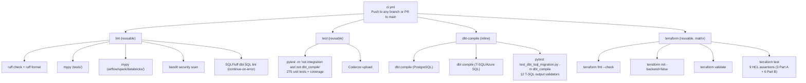
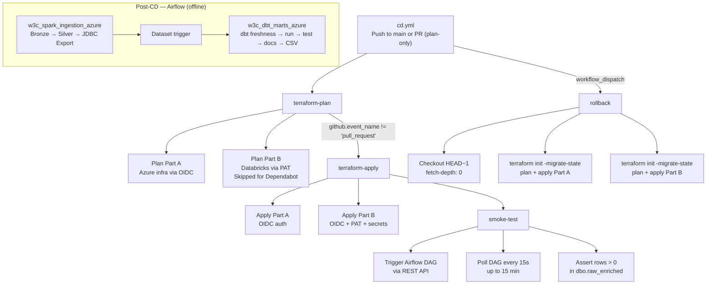
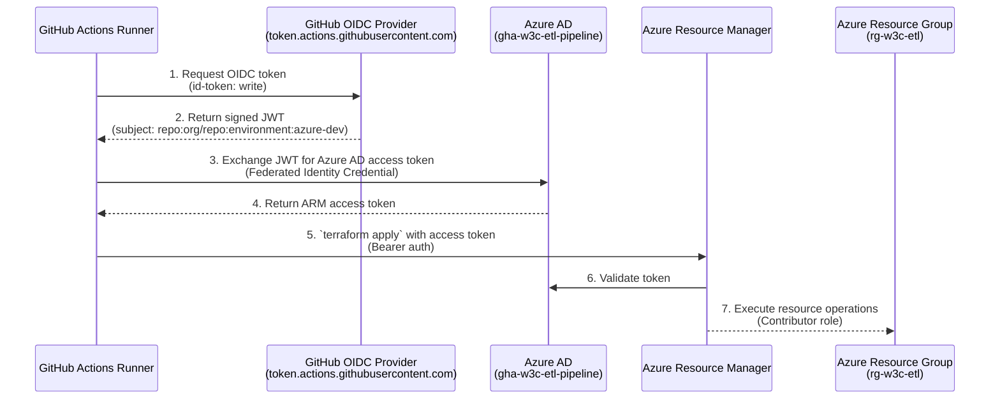

# CI/CD Pipeline Reference

> **Purpose:** Single source of truth for CI/CD architecture, pre-commit hooks, workflow definitions, OIDC federation, dependabot configuration, security scanning, post-deploy smoke testing, and rollback procedures.

---

## 1. CI/CD Architecture Overview

The pipeline uses a **split-tier** approach that separates fast code-quality feedback from credential-scoped production deployment:

### CI — Every Push to Any Branch

Runs **4 parallel jobs** as quality gates. Zero cloud credentials required — all services (PostgreSQL, SQL Server) run as ephemeral GitHub-hosted containers. Catches lint, type, security, compilation, and infrastructure errors before they reach `main`.

- **lint** (reusable workflow): ruff, mypy, bandit, SQLFluff
- **test** (reusable workflow): pytest + coverage + Codecov
- **dbt-compile** (inline): dbt compile (PostgreSQL + T-SQL) + 12 T-SQL output validators
- **terraform** (reusable workflow, matrix across `part_a`/`part_b`): fmt, init, validate, test

### CD — Merge to Main

Runs **2 deployment jobs** (3-job file includes rollback) that deploy to Azure with OIDC-scoped credentials. Uses GitHub Environments as a gating boundary. The `azure-dev` environment is auto-approved on merge to main. Pull requests run `terraform-plan` only (read-only, no apply). Uses `concurrency: group: cd-terraform` with `cancel-in-progress: true` to prevent state lock collisions.

- `terraform-plan` → `terraform-apply` → `smoke-test`
- dbt model execution is **not** in CD — it runs as the `w3c_dbt_marts_azure` Airflow DAG, dataset-triggered after `w3c_spark_ingestion_azure` completes its JDBC export
- Rollback via `workflow_dispatch`

### Zero Static Secrets

All Azure authentication uses **OIDC Workload Identity Federation** — no `ARM_CLIENT_SECRET`, no long-lived credentials. The runner exchanges its GitHub OIDC token for an Azure AD access token at runtime.

---

## 2. Pre-commit Hooks (15 local quality gates)

Runs automatically on every `git commit` via `.pre-commit-config.yaml`. Catches formatting, secrets, syntax, and type errors **before code leaves the workstation**. These are local-only — CI runs equivalent checks via its own staged tools in the `lint` job.

| Hook | Source | What It Does |
|------|--------|-------------|
| `ruff` | astral-sh/ruff-pre-commit | Python lint: unused imports, PEP8, naming — auto-fixes |
| `ruff-format` | astral-sh/ruff-pre-commit | Python formatting consistency |
| `mypy` | pre-commit/mirrors-mypy | Static type checking |
| `check-yaml` | pre-commit/pre-commit-hooks | YAML syntax validation |
| `check-json` | pre-commit/pre-commit-hooks | JSON syntax validation |
| `check-toml` | pre-commit/pre-commit-hooks | TOML syntax validation |
| `check-ast` | pre-commit/pre-commit-hooks | Python AST validation (syntax errors) |
| `check-added-large-files` | pre-commit/pre-commit-hooks | Rejects accidentally committed large files |
| `detect-private-key` | pre-commit/pre-commit-hooks | Blocks committed private keys |
| `debug-statements` | pre-commit/pre-commit-hooks | Catches leftover `pdb.set_trace()` / `breakpoint()` |
| `name-tests-test` | pre-commit/pre-commit-hooks | Enforces `test_*.py` naming convention |
| `requirements-txt-fixer` | pre-commit/pre-commit-hooks | Sorts requirement entries |
| `trailing-whitespace` | pre-commit/pre-commit-hooks | Strips trailing whitespace |
| `end-of-file-fixer` | pre-commit/pre-commit-hooks | Ensures files end with newline |
| `check-merge-conflict` | pre-commit/pre-commit-hooks | Blocks `<<<<<<<` conflict markers |

> **Pre-commit is the first quality gate:** Issues caught here never reach CI, never block a teammate's PR, and never create a failed workflow run. Combined with CI's `lint` job (ruff, mypy, bandit, SQLFluff), this gives a **two-layer defense** — instant local feedback + authoritative CI enforcement.

---

## 3. Total Workflow Inventory

| File | Trigger | Purpose |
|---|---|---|
| `ci.yml` | Push to any branch, PR to main | CI quality gates: lint, test, dbt-compile, terraform |
| `cd.yml` | Push to main, PR (plan-only), `workflow_dispatch` | Production deployment: terraform → smoke-test (dbt runs in Airflow) |
| `codeql.yml` | Push to any branch, PR to main, schedule (Mon 06:00 UTC) | SAST security analysis (Python + GitHub Actions) |
| `.github/dependabot.yml` | Scheduled (daily/weekly) | Automated dependency updates across 5 ecosystems |
| `.github/workflows/dependabot-auto-merge.yml` | Dependabot PRs | Auto-approve + squash-merge patch updates |
| `_reusable-lint.yml` | Called by `ci.yml` | Shared lint workflow (ruff, mypy, bandit, SQLFluff) |
| `_reusable-test.yml` | Called by `ci.yml` | Shared test workflow (pytest + coverage + Codecov) |
| `_reusable-terraform.yml` | Called by `ci.yml` | Shared terraform validation (fmt, init, validate, test) |

---

## 4. CI Pipeline — Every Push



### Job: `lint` (reusable — `_reusable-lint.yml`)

| Attribute | Value |
|---|---|
| **Runner** | `ubuntu-latest` |
| **Python** | 3.12 (via `actions/setup-python@v5`, pip cache) |
| **Tools** | `ruff`, `mypy`, `bandit`, `sqlfluff` |

| Step | Command | What It Validates |
|---|---|---|
| Install dependencies | `pip install ruff mypy types-requests types-python-dateutil bandit "sqlfluff>=3.0,<4.0"` | Tool installation |
| Ruff lint | `ruff check --output-format=github .` | PEP8, unused imports, naming conventions |
| Ruff format | `ruff format --check .` | Code formatting consistency (120 chars) |
| MyPy (tests) | `mypy --ignore-missing-imports tests/` | Type errors in test code |
| MyPy (Databricks) | `mypy --ignore-missing-imports airflow/spark/databricks/` | Type errors in DLT scripts |
| Bandit | `bandit -r airflow/ -c pyproject.toml` | Security hotspots: hardcoded secrets, SQL injection, shell injection |
| SQLFluff | `sqlfluff lint airflow/dbt/w3c/models/ --dialect postgres` | SQL style and dialect compliance (PostgreSQL dialect) |

> SQLFluff uses `continue-on-error: true` — non-blocking advisory check.

### Job: `test` (reusable — `_reusable-test.yml`)

| Attribute | Value |
|---|---|
| **Runner** | `ubuntu-latest` |
| **Python** | 3.12 (via `actions/setup-python@v5`, pip cache) |
| **Services** | PostgreSQL 16 (port 5432, health check via `pg_isready`) |
| **Test count** | 275 (excludes 18 integration + 12 dbt_compile via marker filtering) |

| Step | Command | What It Validates |
|---|---|---|
| Create Airflow dir structure | `mkdir -p /opt/airflow/{dags,spark/jobs,plugins}` + symlinks | Simulates Airflow filesystem layout |
| Install dependencies | `pip install -r tests/requirements-test.txt pytest apache-airflow-providers-databricks` | Test environment |
| Run tests with coverage | `pytest tests/ -v --tb=short -m "not integration and not dbt_compile" --cov=airflow --cov-report=xml --cov-report=term-missing` | 275 unit tests across all pipeline layers (bronze DLT, silver DLT, JDBC export, dimension export, W3C parser, transformations, DAG integrity, terraform configs) |
| Upload coverage to Codecov | `codecov/codecov-action@v5` with `./coverage.xml` | Coverage tracking (`fail_ci_if_error: false`) |

### Job: `dbt-compile` (inline — `ci.yml`)

| Attribute | Value |
|---|---|
| **Runner** | `ubuntu-latest`, timeout 15 min |
| **Services** | PostgreSQL 13 (port 5432) + SQL Server 2022 (port 1433) |
| **Python** | 3.12 (via `actions/setup-python@v5`, pip cache) |

| Step | Command | What It Validates |
|---|---|---|
| Install dbt | `pip install "dbt-postgres==1.8.2" "dbt-core==1.8.9" "dbt-common==1.27.1" "protobuf>=5.27,<6"` | dbt toolchain for PostgreSQL target |
| dbt deps | `dbt deps --project-dir airflow/dbt/w3c` | Package resolution succeeds |
| dbt compile (PostgreSQL) | `dbt compile --project-dir airflow/dbt/w3c --profiles-dir airflow/dbt` | All 16 models compile against PostgreSQL dialect |
| Install dbt-sqlserver | `pip install "dbt-sqlserver==1.8.4" "dbt-fabric<1.8.8"` | dbt toolchain for Azure SQL target |
| Install ODBC Driver 18 | apt-get + Microsoft repo + `msodbcsql18 mssql-tools18` | Native SQL Server connectivity |
| Create test database | `sqlcmd -Q 'CREATE DATABASE [w3c-etl-db]'` | Ephemeral SQL Server instance |
| dbt compile (T-SQL) | `dbt compile --project-dir airflow/dbt/w3c --profiles-dir airflow/dbt --profile w3c_azure --target azure_sql_ci` | All 16 models compile against T-SQL dialect |
| Validate T-SQL output | `pytest tests/test_dbt_tsql_migration.py -v --tb=short -m dbt_compile` | 12 compiled-output validators: FK columns exist, T-SQL datatypes correct, staging CTE patterns match |

> The dual-service container pattern (PostgreSQL + SQL Server side-by-side) validates **both** dbt dialects in a single CI job, ensuring the inline `` T-SQL macros produce correct output for both Postgres and Azure SQL targets.

### Job: `terraform` (reusable — `_reusable-terraform.yml`)

| Attribute | Value |
|---|---|
| **Runner** | `ubuntu-latest`, timeout 20 min |
| **Matrix** | `terraform/part_a`, `terraform/part_b` (runs in parallel) |
| **Terraform** | `1.10.5` (via `hashicorp/setup-terraform@v3`) |

| Step | Command | What It Validates |
|---|---|---|
| Terraform fmt | `cd ${{ matrix.dir }} && terraform fmt --check` | HCL formatting consistency |
| Terraform init | `cd ${{ matrix.dir }} && terraform init -backend=false` | Module download + provider resolution |
| Terraform validate | `cd ${{ matrix.dir }} && terraform validate` | Configuration validity |
| Terraform test | `cd ${{ matrix.dir }} && terraform test` | 9 HCL assertions (3 Part A: creds exist, names non-empty, alerts configured; 6 Part B: pipelines exist, workflow exists, UC schemas exist, secret scope exists, outputs defined) |

---

## 5. CD Pipeline — Merge to Main



### Job: `terraform-plan` (always runs — PR + merge)

| Attribute | Value |
|---|---|
| **Runner** | `ubuntu-latest` |
| **Environment** | `azure-dev` (provides OIDC vars) |
| **Permissions** | `id-token: write`, `contents: read` |
| **Tools** | Terraform `1.10.5` |
| **Auth** | Azure OIDC (`ARM_USE_OIDC: true`, `ARM_CLIENT_ID`/`ARM_TENANT_ID`/`ARM_SUBSCRIPTION_ID` from env vars), Databricks PAT for Part B |

| Step | Command | What It Does |
|---|---|---|
| Checkout | `actions/checkout@v4` | Clone repo |
| Setup Terraform | `hashicorp/setup-terraform@v3` with `1.10.5` | Install pinned TF version |
| Plan Part A | `terraform plan -no-color -lock=false -input=false -var-file=environments/dev/terraform.tfvars` | Read-only plan for Azure infra (VNet, ADLS, SQL Server, monitoring). `-lock=false` avoids state lock contention with concurrent applies. |
| Upload Part A plan | `actions/upload-artifact@v4` → `tfplan-part-a` | Store plan log for review |
| Plan Part B | `terraform plan -no-color -input=false -var-file=environments/dev/terraform.tfvars` | Read-only plan for Databricks pipelines, workflows, UC schemas. **Skipped for `dependabot[bot]`** (GitHub secrets are unavailable to Dependabot PRs). Requires `DATABRICKS_TOKEN`, `AZURE_SQL_PASSWORD`, `STORAGE_ACCESS_KEY` secrets. |
| Upload Part B plan | `actions/upload-artifact@v4` → `tfplan-part-b` | Store plan log for review. Guarded by `if: steps.plan_b.conclusion == 'success'` to avoid upload failure when Part B is skipped. |

Outputs: `plan_a_exitcode`, `plan_b_exitcode`.

### Job: `terraform-apply` (push to main only)

| Attribute | Value |
|---|---|
| **Condition** | `github.event_name != 'pull_request'` |
| **Needs** | `terraform-plan` |
| **Runner** | `ubuntu-latest`, timeout 30 min |
| **Environment** | `azure-dev` |
| **Permissions** | `id-token: write`, `contents: read` |
| **Tools** | Terraform `1.10.5` |

| Step | Command | What It Does |
|---|---|---|
| Checkout | `actions/checkout@v4` | Clone repo |
| Setup Terraform | `hashicorp/setup-terraform@v3` with `1.10.5` | Install pinned TF version |
| Apply Part A | `terraform init -input=false -migrate-state && terraform apply -auto-approve -input=false -var-file=environments/dev/terraform.tfvars` | Deploy/modify Azure infra via OIDC auth |
| Apply Part B | `terraform init -input=false && terraform apply -auto-approve -input=false -var-file=environments/dev/terraform.tfvars` | Deploy/modify Databricks pipelines, workflows, UC schemas. Uses PAT + secrets for Databricks API. |

> dbt docs generation is handled by the `w3c_dbt_marts_azure` Airflow DAG, which runs `dbt docs generate` against the live Azure SQL database (producing a real `catalog.json`) and exports artifacts to the Airflow worker.

### Job: `smoke-test` (post-deploy verification)

| Attribute | Value |
|---|---|
| **Needs** | `terraform-apply` |
| **Runner** | `ubuntu-latest`, timeout 20 min |
| **Environment** | `azure-dev` |

| Step | Command | What It Does |
|---|---|---|
| Trigger Airflow DAG | `curl -X POST $AIRFLOW_URL/api/v1/dags/w3c_spark_ingestion_azure/dagRuns` with basic auth and `{"conf": {"trigger_source": "cd_smoke_test"}}` | Start the full ingestion pipeline via Airflow REST API |
| Poll DAG until complete | Loop 60 times (15s intervals = 15 min max): `curl $AIRFLOW_URL/api/v1/dags/w3c_spark_ingestion_azure/dagRuns/$DAG_RUN_ID` → parse `.state` | Wait for pipeline completion. States: `"success"` → exit 0, `"failed"` or `"upstream_failed"` → exit 1, others → sleep and retry. Timeout after 15 minutes. |
| Assert Azure SQL row count | `sqlcmd -S $AZURE_SQL_SERVER -d $AZURE_SQL_DATABASE -U $AZURE_SQL_USER -P $AZURE_SQL_PASSWORD -Q "SELECT COUNT(*) FROM dbo.raw_enriched"` | Verify data landed. Fails if `ROWS == 0`. |

> **What makes this meaningful:** The smoke test exercises the **entire production path** end-to-end — DAG orchestration, Databricks Workflows, DLT Bronze ingestion, DLT Silver enrichment, JDBC export to Azure SQL, and dimension export — triggered by actual code deployed in the same CD run. This is not a synthetic health check; it's a real pipeline execution with real data.

### Job: `rollback` (manual — `workflow_dispatch` only)

| Attribute | Value |
|---|---|
| **Condition** | `github.event_name == 'workflow_dispatch'` |
| **Needs** | `terraform-plan` |
| **Runner** | `ubuntu-latest` |
| **Environment** | `azure-dev` |
| **Permissions** | `id-token: write`, `contents: read` |
| **Tools** | Terraform `1.10.5` |

| Step | Command | What It Does |
|---|---|---|
| Checkout with full history | `actions/checkout@v4` with `fetch-depth: 0` | Clone repo with full git history needed to traverse commits |
| Checkout previous commit | `git checkout HEAD~1` | Roll back to the commit before the current `main` HEAD |
| Setup Terraform | `hashicorp/setup-terraform@v3` with `1.10.5` | Install pinned TF version |
| Rollback Part A (plan) | `terraform init -input=false -migrate-state && terraform plan -no-color -input=false -var-file=environments/dev/terraform.tfvars -out=tfplan_rollback` | Init with state migration to handle backend config changes, then plan the rollback for Azure infra |
| Rollback Part A (apply) | `terraform apply -auto-approve -input=false tfplan_rollback` | Execute the rollback for Azure infra |
| Rollback Part B (plan) | `terraform init -input=false -migrate-state && terraform plan -no-color -input=false -var-file=environments/dev/terraform.tfvars -out=tfplan_rollback` | Init with state migration, then plan the rollback for Databricks (uses PAT + secrets) |
| Rollback Part B (apply) | `terraform apply -auto-approve -input=false tfplan_rollback` | Execute the rollback for Databricks |

> **Note:** The rollback is a **terraform-only** operation. After rollback, a manual smoke test is required to verify the system is operational. dbt models and Airflow DAGs are **not** automatically reverted — the previous commit's Terraform state is applied but the DAG files and dbt state remain at the current version. A complete rollback may require manually redeploying the prior commit's DAGs and dbt state.

---

## 6. OIDC Workload Identity Federation

### Architecture

All Azure authentication in the CD pipeline uses **Workload Identity Federation** (OIDC) — no client secrets, no long-lived credentials. The entire OIDC configuration is managed as Terraform code in `terraform/part_a/github_oidc.tf`.



### Terraform-Managed Resources (`github_oidc.tf`)

| Resource | Name | Details |
|---|---|---|
| `azuread_application` | `gha-w3c-etl-pipeline` | Azure AD application for GitHub Actions. Sign-in audience: `AzureADMyOrg`. |
| `azuread_service_principal` | `gha-w3c-etl-pipeline` | Service principal linked to the app. `use_existing = true`. |
| `azuread_application_federated_identity_credential` | `gha-azure-dev` (one per environment) | Maps GitHub environment to Azure AD subject: `repo:AhmedIkram05/w3c-etl-pipeline:environment:azure-dev`. Issuer: `https://token.actions.githubusercontent.com`. Audience: `api://AzureADTokenExchange`. |
| `azurerm_role_assignment` | `github_actions` | Assigns **Contributor** role on the resource group scope to the service principal. `skip_service_principal_aad_check = true` to avoid timing issues on first deploy. |

### GitHub Environment Variables

The `azure-dev` GitHub Environment must be configured with:

| Variable | Source |
|---|---|
| `AZURE_CLIENT_ID` | `azuread_application.github_actions[0].application_id` (Terraform output) |
| `AZURE_TENANT_ID` | `var.tenant_id` |
| `AZURE_SUBSCRIPTION_ID` | `var.subscription_id` |
| `AZURE_SQL_SERVER` | SQL server FQDN |
| `AZURE_SQL_DATABASE` | Database name |
| `AZURE_SQL_USER` | SQL admin username |
| `STORAGE_ACCOUNT_NAME` | ADLS Gen2 storage account |
| `AIRFLOW_URL` | Airflow webserver URL |
| `AIRFLOW_USERNAME` | Airflow API username |

### GitHub Environment Secrets

| Secret | Source |
|---|---|
| `AZURE_SQL_PASSWORD` | SQL admin password |
| `AIRFLOW_PASSWORD` | Airflow API password |
| `DATABRICKS_TOKEN` | Databricks PAT (for Part B — Terraform + sync) |
| `STORAGE_ACCESS_KEY` | ADLS Gen2 storage account key |

### Key Properties

- **Scope:** `repo:AhmedIkram05/w3c-etl-pipeline:environment:azure-dev` — only runs triggered from the `azure-dev` environment can exchange tokens
- **No client secret:** The workflow sets `ARM_USE_OIDC: true` instead of `ARM_CLIENT_SECRET`
- **Zero static secrets:** The runner never stores or retrieves Azure credentials — it assumes an Azure AD identity via token exchange at runtime

---

## 7. Dependabot Configuration

| Ecosystem | Directory | Schedule | Labels | PR Limit | Auto-merge | Reviewer |
|---|---|---|---|---|---|---|
| pip | `/` (finds `requirements.txt`) | Daily 09:00 UTC | `dependencies`, `python` | 10 | ✅ Patch only (`semver-patch`) | `ahmedikram` |
| GitHub Actions | `.github/workflows/` | Weekly Mon 09:00 UTC | `dependencies`, `github-actions` | 5 | ❌ | `ahmedikram` |
| Terraform Part A | `/terraform/part_a` | Weekly Mon 09:00 UTC | `dependencies`, `terraform` | 5 | ❌ | `ahmedikram` |
| Terraform Part B | `/terraform/part_b` | Weekly Mon 09:00 UTC | `dependencies`, `terraform` | 5 | ❌ | `ahmedikram` |
| Docker | `/airflow` (finds `Dockerfile`) | Weekly Mon 09:00 UTC | `dependencies`, `docker` | 3 | ❌ | `ahmedikram` |

### Auto-Merge Workflow (`dependabot-auto-merge.yml`)

- **Trigger:** Any `pull_request` event
- **Guard:** `github.actor == 'dependabot[bot]'`
- **Metadata:** Uses `dependabot/fetch-metadata@v2` to determine `update-type`
- **Action:** If `update-type == 'version-update:semver-patch'`, runs `gh pr merge --auto --squash`
- **Permissions:** `contents: write`, `pull-requests: write` (via `GITHUB_TOKEN`)

---

## 8. Security Scanning

| Tool | Scope | Schedule | What It Catches |
|---|---|---|---|
| **bandit** | `airflow/` source code (excludes tests, databricks) | Every push (CI `lint` job) | Hardcoded passwords, SQL injection, shell injection, unsafe `yaml.load` |
| **CodeQL (Python)** | Entire repo — `python` language, `none` build mode | Every push + PR + weekly Mon 06:00 UTC | SAST: code vulnerabilities, injection flaws, insecure patterns |
| **CodeQL (Actions)** | `.github/workflows/` — `actions` language, `none` build mode | Every push + PR + weekly Mon 06:00 UTC | Workflow injection, credential leaks, misconfigured actions |
| **GitGuardian** | Entire repo | Every push (GitHub org-level, external) | Secret scanning: API keys, tokens, credentials committed to git |

### CodeQL Configuration (`codeql.yml`)

- **Concurrency:** `codeql-${{ github.ref }}` with `cancel-in-progress: true`
- **Permissions:** `security-events: write`, `actions: read`, `contents: read`
- **Matrix:** `python` + `actions` — both with `build-mode: none` (interpreted languages)
- **Steps:** `github/codeql-action/init@v3` → `github/codeql-action/analyze@v3`
- **Schedule:** `0 6 * * 1` (every Monday 06:00 UTC)

---

## 9. Post-Deploy Smoke Test Details

The `smoke-test` job in `cd.yml` is the **final gating step** before a deployment is considered successful. It validates that the entire pipeline works end-to-end after all artifacts have been deployed.

### Trigger Phase

```bash
curl -s -X POST "$AIRFLOW_URL/api/v1/dags/w3c_spark_ingestion_azure/dagRuns" \
  -u "$AIRFLOW_USERNAME:$AIRFLOW_PASSWORD" \
  -H "Content-Type: application/json" \
  -d '{"conf": {"trigger_source": "cd_smoke_test"}}' | jq -r '.dag_run_id // empty'
```

Triggers the `w3c_spark_ingestion_azure` DAG (not `spark_ingestion_azure` — the full namespace is required). The DAG run ID is captured for polling.

### Poll Phase

| Parameter | Value |
|---|---|
| Poll interval | 15 seconds |
| Max attempts | 60 |
| Max duration | 15 minutes |
| Poll URL | `$AIRFLOW_URL/api/v1/dags/w3c_spark_ingestion_azure/dagRuns/$DAG_RUN_ID` |

State handling:
- `"success"` → exit 0 (proceed)
- `"failed"` → exit 1 (fail pipeline)
- `"upstream_failed"` → exit 1 (fail pipeline)
- All other states (including `"running"`, `"queued"`, `"unknown"`) → sleep 15s and retry

After 60 attempts without a terminal state → exit 1 (timeout).

### Assert Phase

```bash
ROWS=$(sqlcmd -S "$AZURE_SQL_SERVER" -d "$AZURE_SQL_DATABASE" \
  -U "$AZURE_SQL_USER" -P "$AZURE_SQL_PASSWORD" \
  -Q "SET NOCOUNT ON; SELECT COUNT(*) FROM dbo.raw_enriched" -h -1 | tr -d ' ')
if [ "$ROWS" -gt 0 ]; then
  echo "Smoke test PASSED — $ROWS rows found"
else
  echo "Smoke test FAILED — no rows in dbo.raw_enriched"
  exit 1
fi
```

Verifies that the full pipeline (Bronze → Silver → Azure SQL export → dimension export) completed and produced data. The minimum acceptance criterion is `ROWS > 0` in `dbo.raw_enriched` (expected ~153,000+ rows from 93 real IIS log files).

### Failure Notification

If the smoke test fails, GitHub Actions reports the job as failed in the CD workflow run. No additional notification integration is configured — the standard GitHub Actions failure alert (email from GitHub) notifies the repository owner.

---

## 10. Rollback Procedure

### Trigger

Manual `workflow_dispatch` on the `cd.yml` workflow — must be triggered by a user with write access to the repository.

### Steps

1. **Checkout HEAD~1** — The workflow checks out the previous commit from `main` using `git checkout HEAD~1` (requires `fetch-depth: 0` for full git history).
2. **Terraform Rollback — Part A (plan + apply)** — Plans and applies the infrastructure from the previous commit, reverting Azure resource changes (VNet, ADLS, SQL Server, monitoring).
3. **Terraform Rollback — Part B (plan + apply)** — Plans and applies the Databricks resources from the previous commit, reverting pipeline configurations, workflow definitions, and UC schemas.

### What Rollback Does NOT Cover

| Component | Rolled Back? | Reason |
|---|---|---|
| Terraform-managed Azure infra | ✅ Yes | Terraform reverts to prior state |
| Terraform-managed Databricks resources | ✅ Yes | Terraform reverts to prior state |
| dbt models in Azure SQL | ❌ No (CD) | dbt runs in Airflow, not CD — no CD revert needed. Airflow re-runs dbt on next Dataset trigger. |
| dbt Docs | ❌ No | Docs are generated by Airflow `w3c_dbt_marts_azure` — no Pages deployment to revert. |
| Data in Azure SQL | ❌ No | Data is not reverted; rollback only affects infrastructure |
| Smoke test | ❌ Manual | Must be run manually after rollback to verify system health |

### Post-Rollback Verification

After the rollback completes, a human operator should:
1. Run a manual smoke test (trigger Airflow DAG and verify row counts)
2. Confirm Grafana dashboards show healthy metrics
3. Check that the deployed DAGs match the rolled-back infrastructure

---

## Appendix: Key Design Decisions

| Decision | Rationale |
|---|---|
| **Split CI/CD** | CI runs without cloud credentials — fast feedback for every push. CD only deploys on merge to main with full OIDC auth. |
| **Single environment (`azure-dev`)** | Staging/prod adds complexity without portfolio value for a CV project. Auto-approve on merge to main. |
| **3 reusable workflows** | Avoids duplication across CI jobs. Each workflow has a single responsibility: lint, test, or terraform validation. |
| **dbt runs in Airflow, not CD** | CD deploys infra and DAGs only. dbt runs as the `w3c_dbt_marts_azure` Airflow DAG on Databricks serverless, dataset-triggered after ingestion completes. Decouples infra deploy from data transformation. |
| **Post-deploy smoke test** | Not a synthetic health check — it runs the actual ETL pipeline with real data and validates row counts in Azure SQL. Only gating step that proves the system works. |
| **Terraform-managed OIDC** | The Azure AD application, federated credential, and role assignment are created by Terraform — not manual CLI commands. One `terraform apply` sets up the entire auth chain. |
| **`-lock=false` in terraform-plan** | Read-only plans shouldn't wait for state locks. Avoids contention when a concurrent apply holds the lock. |
| **No standalone nightly integration tests** | The CD smoke test covers integration on every deploy. A separate nightly suite would run against stale data with no code changes to validate. |
